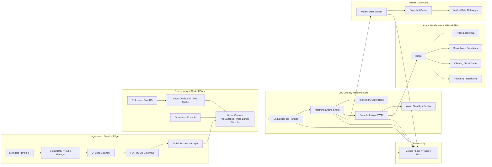
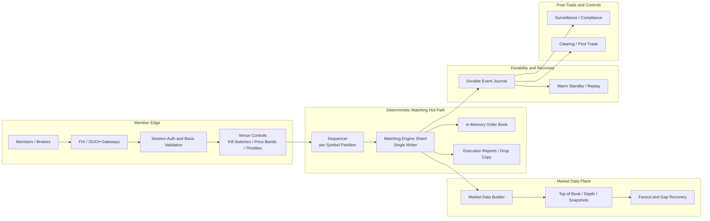

---
categories:
- Distributed Systems
- Architecture
- Backend
date: 2026-03-21
seo_title: Designing a Stock Exchange System - Matching Engine, Order Book, and Scalability
seo_description: Deep dive into stock exchange system design covering order entry,
  sequencing, matching engine architecture, market data, failure recovery, and
  low-latency scalability trade-offs.
tags:
- distributed-systems
- architecture
- backend
- low-latency
- trading
- matching-engine
- order-book
- scalability
title: Designing a Stock Exchange System
toc: true
toc_icon: cog
toc_label: In This Article
header:
  overlay_image: "/assets/images/java-advanced-generic-banner.svg"
  overlay_filter: 0.35
  show_overlay_excerpt: false
  caption: Low-Latency Architecture and Market Integrity
---
Designing a stock exchange is not "build an order API and add Kafka."

The hard part is preserving deterministic market behavior under bursty load while keeping fairness, auditability, recovery, and latency credible at the same time.

Most weak system design answers focus too much on horizontal scale and too little on sequencing, hot-path ownership, and failure fences.
In an exchange, those are the design.

---

## Start With the Boundary

A stock exchange is not the whole trading stack.
If that boundary is blurry, the design usually becomes slower and more coupled than it needs to be.

Exchange responsibilities:

- accept orders from members or brokers
- apply venue rules
- maintain the order book
- match orders with deterministic priority
- publish executions and market data
- keep an auditable event trail

Broker responsibilities:

- customer onboarding and authentication
- account balances, credit, and margin
- portfolio-level exposure checks
- smart order routing across venues

Clearing and settlement responsibilities:

- novation, netting, and settlement workflows
- post-trade reconciliation
- downstream money and securities movement

Senior architect rule:
do not drag broker or clearing workflows into the matching hot path.
Every extra dependency adds latency variance, failure coupling, and operational ambiguity.

---

## The Non-Negotiable Invariants

An exchange is not primarily a throughput system.
It is a correctness system under latency pressure.

The invariants that matter most are:

1. For a given symbol partition, there must be one authoritative processing order.
2. Matching results must be deterministic and replayable.
3. Price-time priority must be enforceable without ambiguity.
4. Market data must be derived from the same committed state transitions as trades.
5. Recovery must rebuild the exact book state, not an approximation.
6. Safety controls must be able to stop damage faster than the market can amplify it.

That list should drive the architecture more than any database or messaging choice.

---

## What Makes This System Hard

The exchange hot path combines design pressures that normally fight each other:

- very low latency
- deterministic ordering
- bursty traffic
- skewed symbol popularity
- strict audit requirements
- expensive failure recovery if you get sequencing wrong

The hottest symbol matters more than average venue traffic.
That is one of the first places generic scaling advice breaks down.

If one symbol experiences a sudden spike because of earnings, a rumor, or index rebalancing, the system does not care that your average load is comfortable.
The hottest book becomes the architecture test.

---

## Capacity Thinking That Does Not Lie

A good estimate for an exchange is not just "messages per second."
It is at least these four numbers:

- peak inbound order events per second
- cancel or replace ratio
- hottest-symbol concentration
- outbound market data fan-out

Illustrative pressure model:

- inbound order events peak at `1M/s`
- cancels and replaces dominate during volatile periods
- top symbols can consume a disproportionate share of one partition
- outbound market data can exceed inbound volume by an order of magnitude once fan-out begins

That last point matters.
Many teams design the matcher carefully and then under-design market data distribution.
In reality, slow consumers, replay storms, and gap recovery can hurt you just as much as raw order ingress.

Architectural consequence:
size the platform for hot partitions and market data amplification, not just for average API throughput.

---

## Component Map

The exchange should be described as explicit components with explicit roles.
That is what makes architecture review useful instead of diagram theater.

| Component | Responsibility | In hot path | Notes |
| --- | --- | --- | --- |
| Global DNS or traffic manager | route members to the active region or site | no | failover and traffic steering |
| L4 load balancer | distribute TCP sessions across gateway nodes | edge only | keep long-lived trading sessions stable |
| FIX / OUCH gateways | terminate protocol sessions and normalize commands | yes | keep parsing fast and predictable |
| Auth and session manager | authenticate member sessions and session recovery | yes, lightweight only | avoid remote lookups on every order |
| Reference data store | symbols, members, venue config, static limits | no | usually replicated into local caches |
| Local config or limit cache | fast access to venue rules, member state, symbol metadata | yes | cache is for reference, not truth |
| Venue controls service | kill switches, price bands, throttles, cancel-on-disconnect | yes | must fail safe |
| Sequencer per partition | assign authoritative event order | yes | the heart of fairness and replay |
| Matching engine shard | apply state transitions and generate fills | yes | single-writer by design |
| In-memory order book | resident state for one symbol or partition | yes | optimized for mutation, not SQL |
| Durable journal or WAL | committed event boundary and replay source | yes, but minimal | feeds standby and downstream systems |
| Warm standby | replay journal and take over after failover | no in steady state | promoted only with sequence fencing |
| Market data builder | turn committed engine output into book deltas and snapshots | off matcher thread | never let fan-out stall matching |
| Snapshot cache | serve market-data snapshots and recovery bootstrap | no | cache for distribution, not for matching |
| Kafka or event bus | downstream distribution for analytics, read models, and integrations | no | not the fairness-critical sequencer |
| Trade ledger store | reporting, historical queries, reconciled trade views | no | built from ordered truth |
| Surveillance and analytics | abuse detection, compliance, operational analytics | no | subscribe from committed stream |
| Clearing adapter | post-trade handoff to clearing and settlement workflows | no | asynchronous from matcher |
| Observability stack | metrics, logs, traces, alerts | no | make replay and failover visible |
| Operations console | kill switches, partition ownership, canary and failover controls | no | must be auditable and permissioned |

Two intentional choices in that table matter:

- `Kafka` exists, but off the matcher hot path
- caches exist, but they are reference or distribution layers, not the source of truth for matching

---

## High-Level System Design Diagram

If you want the full component picture, it should look closer to this:



What this diagram is saying:

- the load balancer and gateways handle connection scale, not matching correctness
- caches sit next to control and market data, not as the live book authority
- Kafka is a downstream distribution backbone, not the primary fairness mechanism
- the durable journal is the bridge between low-latency matching and the rest of the platform

---

## Hot Path Architecture

The hot path itself should still stay much smaller than the full platform:



The important thing here is not the boxes.
It is the ordering of responsibility.

The diagram also shows the architectural separation that matters most:

- the matching hot path stays short and single-writer
- market data fan-out is isolated so slow consumers cannot stall matching
- durability and replay are explicit instead of being implied by logs
- surveillance and clearing consume the same ordered truth, but off the hot path

The hot path should do as little as possible before the event reaches the sequencer and matching shard:

1. terminate session and protocol
2. authenticate member
3. apply lightweight structural validation
4. enforce venue-level emergency controls
5. sequence the event
6. apply it to the in-memory book
7. emit deterministic results

Everything else should be pushed out of the critical path unless correctness absolutely requires it there.

---

## The Matching Engine Should Be a Deterministic State Machine

The safest mental model is not "service."
It is "single-writer state machine over a sequenced event stream."

For each symbol or symbol partition:

- one engine instance owns the authoritative mutable book
- events enter in one total order
- the engine mutates in-memory state
- outputs are generated from those state transitions

That is why many serious trading systems still prefer a single-writer design per book.
Not because parallelism is unknown, but because parallelizing one order book usually creates more ambiguity than value.

Minimal engine loop:

```text
for each sequenced event:
  validate against current venue rules
  apply new/cancel/replace logic
  generate fills if crossing exists
  update top-of-book and depth state
  emit execution reports and book deltas
  persist or replicate the committed event boundary
```

If you cannot replay that loop and get the same state, your design is not ready.

---

## Order Book Design

For a basic cash equities venue, a practical in-memory order book usually needs:

- bid side ordered by descending price
- ask side ordered by ascending price
- FIFO queue at each price level for time priority
- order-id index for fast cancel lookup
- compact metadata for member, side, quantity, and flags

The key is not the exact container type.
The key is keeping the mutation path short, predictable, and allocation-light.

Design instinct:

- match in memory
- keep the hot book resident
- avoid remote lookups
- avoid per-event heap churn if you are on the JVM

If this is implemented on Java, low-allocation discipline is not optional.
Object-heavy models and stop-the-world surprises are expensive in a latency-sensitive matcher.
Java can work, but only if the team treats memory layout, allocation rate, and GC behavior as first-class design concerns.

---

## Why Microservices Are Usually the Wrong Shape for the Hot Path

Microservices are good for ownership boundaries.
They are often terrible for one sub-millisecond deterministic loop.

A naive microservice breakdown like this:

- order service
- risk service
- book service
- trade service
- market data service

looks modular on a whiteboard, but it creates:

- more network hops
- more serialization
- more retry complexity
- more tail-latency variance
- more places where sequencing can drift

Opinionated rule:
the matching path should look more like a tightly integrated appliance than a chatty service mesh.

You can still have service boundaries around:

- onboarding
- reporting
- surveillance
- clearing integration
- analytics

Just do not turn the matcher into a distributed workflow engine.

---

## Sequencing Is the Real Heart of the System

Most interviews talk about the matching engine.
Senior architects talk about sequencing.

Without a clear sequencing strategy, everything downstream becomes suspect:

- fairness
- replay
- cancel races
- market data consistency
- standby recovery

You need a clear answer to this question:

Who assigns the authoritative order of events for a symbol partition?

Good default answer:

- one sequencer per partition
- one monotonically increasing sequence space
- one primary writer at a time

The sequencer does not need to know finance.
It needs to establish undeniable order.

That is what lets the matcher stay deterministic and what lets standbys replay correctly.

---

## Timestamps Are Not a Sequencing Strategy

Teams sometimes say, "We will use synchronized clocks and order by timestamp."
That is not strong enough for a fairness-critical matching system.

Why not:

- two gateways can still observe arrivals in different moments
- network jitter changes when messages become visible
- clock sync is good, but not perfect enough to be your final authority
- replay is much cleaner with explicit sequence numbers than with inferred time ordering

Use timestamps for:

- audit trails
- latency measurement
- surveillance analysis
- cross-system correlation

Use sequence numbers for:

- authoritative ordering
- replay
- failover fencing
- deterministic market data derivation

That distinction is easy to say and surprisingly important in design reviews.

---

## Scale Out by Symbol, Not by Shared Locking

The natural way to scale an exchange is horizontal partitioning by symbol or instrument group.

That means:

- each partition gets its own sequencer and matching shard
- symbols are mapped to partitions
- partitions can move across machines during planned rebalance
- one symbol belongs to one active shard at a time

Why this works:

- price-time priority is preserved within a partition
- the hottest books are isolated
- recovery and failover stay local to a shard

Why a global shared book service is bad:

- one lock or one queue becomes the bottleneck
- contention collapse appears under burst traffic
- every symbol starts paying for every other symbol's load

Related instinct on this site:
- [Contention Collapse Under Load in Java Services](/java/concurrency/contention-collapse-under-load-in-java-services/)

---

## The Hard Problem: One Hot Symbol

Partitioning by symbol solves average scale.
It does not magically solve the hottest symbol on the venue.

That is where many designs become unrealistic.

You cannot arbitrarily split one order book across many active writers without paying for coordination that damages either:

- latency
- simplicity
- determinism
- fairness

For one hot symbol, serious options are usually:

1. scale the single shard vertically and keep the book local
2. simplify order types or controls in the hottest path
3. move some non-critical downstream work off the engine thread
4. apply venue mechanisms like auctioning, throttling, or trading halts when market integrity matters more than raw throughput

What is usually a bad answer:
"Let us make one symbol active-active across regions with distributed consensus."

That is academically interesting and operationally dangerous for a low-latency venue.

---

## Active-Active for One Book Is Usually the Wrong Trade-Off

For a stock exchange, active-active on the same symbol looks attractive in a slide deck because it promises availability.
In practice, it often injects exactly the wrong kind of coupling into the hottest path.

Costs:

- extra coordination latency
- more complicated failure semantics
- harder replay and reconciliation
- more ambiguity during network partitions

Safer default:

- active-primary per partition
- warm or hot standby following the same event journal
- explicit failover with sequence fencing

This gives you a clean answer to "who owns the book right now?"
That answer is worth more than theoretical multi-writer elegance.

---

## Failure Recovery Must Be Designed Before Scale

Recovery is where immature exchange designs usually reveal themselves.

You need to answer these questions early:

- where is the authoritative event journal
- how does a standby know what was committed
- how do sessions recover after failover
- how are duplicate client retries handled
- how do you guarantee that replay rebuilds the same book

Healthy recovery model:

1. sequenced input is durably captured
2. matching results are derived deterministically
3. standby replays the same sequence
4. failover promotes only after a clear sequence boundary
5. clients resynchronize using last-seen sequence numbers or session recovery rules

Design trade-off:
synchronous durability on every event improves safety but increases latency.
Asynchronous durability improves latency but expands the failure window.

There is no free answer here.
You choose explicitly based on market integrity, regulatory expectations, and tolerated data-loss window.

---

## Market Data Is a System of Its Own

A matching engine without a strong market data design is incomplete.

Market data usually needs:

- top-of-book and depth updates
- snapshots plus incremental feeds
- replay for missed gaps
- slow-consumer isolation
- different products for internal and external consumers

The crucial rule is simple:
market data consumers must never be allowed to backpressure the matcher.

That means:

- the engine emits to an internal builder or ring buffer
- downstream fan-out is isolated from the core matcher
- slow sessions are dropped or resynchronized, not allowed to stall core processing
- replay and gap-fill are handled by dedicated recovery infrastructure

This is exactly the kind of boundary where unbounded queues become dishonest.
If the fan-out path is overloaded, the design should make that visible quickly instead of storing overload as memory growth and latency.

Related reading:
- [Bounded Queues and Backpressure in Java Systems](/java/concurrency/bounded-queues-and-backpressure-in-java-systems/)
- [Work Queue Design Mistakes in Backend Systems](/java/concurrency/work-queue-design-mistakes-in-backend-systems/)

---

## Pre-Trade Controls Without Polluting the Hot Path

Not every risk check belongs inside the exchange core.

Broker-side checks usually include:

- client credit
- margin
- account permissions
- portfolio exposure

Exchange-side controls usually include:

- price collars and fat-finger checks
- cancel-on-disconnect
- throttling and kill switches
- self-trade prevention policies
- venue state transitions such as halt and auction modes

Architectural principle:
keep the exchange hot path focused on venue-owned controls and deterministic matching.
Do not make one new order depend on slow external account logic.

If you must consult external state in the hot path, you have already accepted a much slower and more failure-prone system.

---

## Audit, Surveillance, and Post-Trade Should Be Fed From the Same Truth

A common bad pattern is rebuilding audit trails by stitching together logs from multiple services after the fact.

That is not good enough for an exchange.

Instead:

- audit should consume the same sequenced event stream or committed engine outputs
- surveillance should operate off durable, ordered market events
- clearing adapters should subscribe from the same post-trade truth

This reduces one of the nastiest operational problems:
two teams arguing during an incident about which log is authoritative.

Senior architect instinct:
make truth explicit at the architecture level, not just in incident documentation.

---

## Performance Bottlenecks That Actually Matter

Exchange systems do not usually fail first because of raw CPU shortage.
They fail because one of these becomes dominant:

- one sequencer or book becomes too hot
- lock contention appears in what should have been a single-writer path
- market data fan-out backlogs
- per-event allocations create GC turbulence
- retries or reconnect storms amplify load during an incident
- storage or replication jitter increases tail latency

That is why average latency is not enough.
The metrics that matter more are:

- p99 and p999 order acknowledgment latency
- queue depth before sequencer and market data fan-out
- per-partition throughput
- cancel latency under burst
- replay catch-up time
- failover recovery time to known-good sequence

This is one of the clearest differences between CRUD thinking and market-infrastructure thinking.

---

## What Serious Trading Venues Do Differently

The strongest real-world systems usually make a few disciplined choices:

1. They keep the matching path short and deterministic.
2. They use single-writer ownership per book or partition.
3. They treat sequencing as a first-class subsystem, not a side effect.
4. They separate market data distribution from core matching.
5. They prefer explicit failover over ambiguous multi-writer coordination.
6. They optimize for worst-case symbol pressure and tail latency, not only aggregate throughput.
7. They drill replay, failover, and disconnect scenarios repeatedly.

This is also where "big tech thinking" can mislead people.
A stock exchange is not a social feed.
You do not win by casually making every component eventually consistent and massively parallel.
You win by keeping the hot path precise, deterministic, and operationally understandable.

---

## Common Bad Designs

These designs sound modern and still fail review:

### Using a database transaction as the matching engine

The database is useful for durability and downstream views.
It is usually too slow and too variable to be the core matching loop.

### Putting Kafka or a general event bus directly in the fairness-critical hot path

General messaging platforms are excellent for many things.
They are not automatically the right primitive for the lowest-latency authoritative matcher boundary.

### Letting slow consumers back up the matcher

This turns external fan-out into internal market integrity risk.

### Splitting one order book across many chatty services

That moves the hardest correctness problem into the network.

### Designing for average traffic instead of hot-symbol bursts

The average will not be what breaks you on the bad day.

---

## If I Had to Build Version 1

I would start with these choices:

- one region, not multi-region active-active
- cash equities only, not all asset classes
- limit, market, cancel, replace first; add complex order types later
- partition by symbol
- single primary sequencer and matcher per partition
- in-memory resident books
- deterministic event journal
- warm standby replaying the same partition stream
- dedicated market data builder and fan-out tier
- asynchronous downstream integration for surveillance and clearing

That is not because the system is "simple."
It is because version 1 should preserve the hardest invariants with the fewest moving parts.

The wrong ambition in an exchange is feature breadth before sequencing clarity.

---

## Interview-Ready Answer Shape

If this comes up in a system design interview, I would structure the answer like this:

1. Define the boundary: exchange, broker, and clearing are separate systems.
2. State the invariant: one authoritative event order per symbol partition.
3. Describe the hot path: gateway -> validation -> sequencer -> matching engine -> journal -> market data and execution outputs.
4. Explain scale: partition by symbol, not by shared locking.
5. Explain recovery: deterministic replay with primary-standby failover.
6. Call out the real trade-off: active-active for one book hurts latency and determinism more than it helps.
7. Close with market data isolation and operational controls.

That answer is stronger than listing caches, load balancers, and databases without saying who owns order.

---

## Design Review Questions I Would Ask

Before approving this architecture, I would ask:

1. Where is the single source of truth for event order?
2. Can a cancel and a fill race produce ambiguity?
3. What is the failover fence that prevents split-brain on one partition?
4. Can market data lag or replay without ever slowing the matcher?
5. What happens when one symbol becomes 20 times hotter than the rest?
6. Which controls can stop damage immediately, and who owns them?
7. Can we replay one day of traffic and reproduce the same book and trades?

If those answers are weak, the design is not mature yet.

---

## Related Reading on This Site

- [Shared Memory vs Message Passing in Java Applications](/java/concurrency/shared-memory-vs-message-passing-java-applications/)
- [Contention Collapse Under Load in Java Services](/java/concurrency/contention-collapse-under-load-in-java-services/)
- [Bounded Queues and Backpressure in Java Systems](/java/concurrency/bounded-queues-and-backpressure-in-java-systems/)
- [Work Queue Design Mistakes in Backend Systems](/java/concurrency/work-queue-design-mistakes-in-backend-systems/)

---

## Key Takeaways

- A stock exchange is a deterministic sequencing problem under latency pressure, not a generic CRUD platform.
- The core architecture should preserve one authoritative event order per symbol partition.
- Single-writer matching per book is usually a better trade-off than fancy multi-writer coordination.
- Market data fan-out, replay, and failover deserve first-class design attention, not leftover infrastructure.
- The most senior design choice is often deciding what not to put in the hot path.
