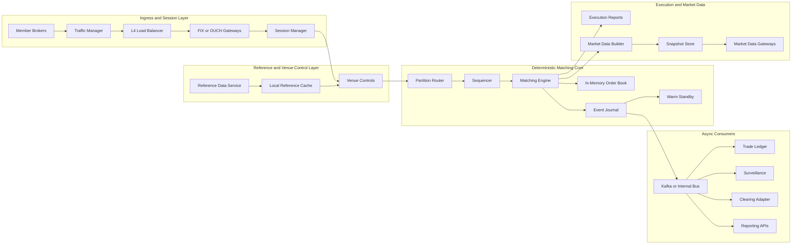
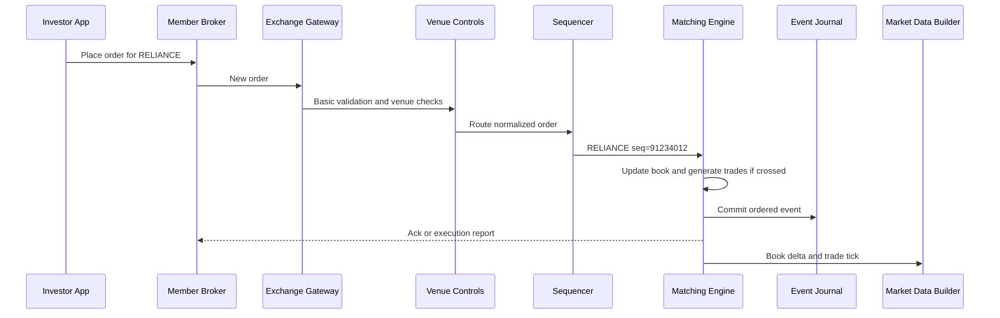
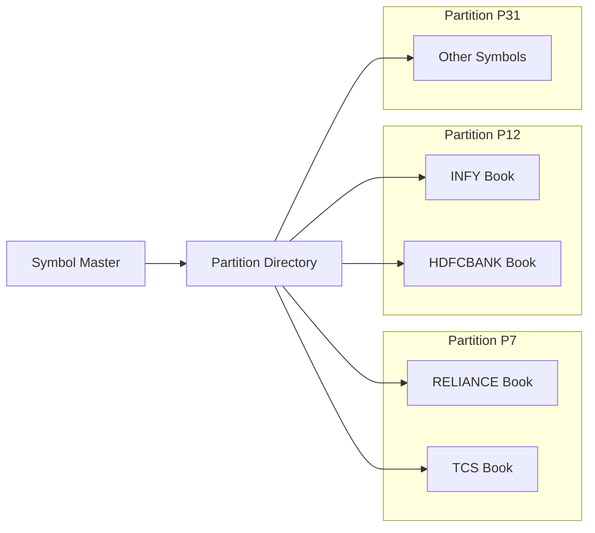
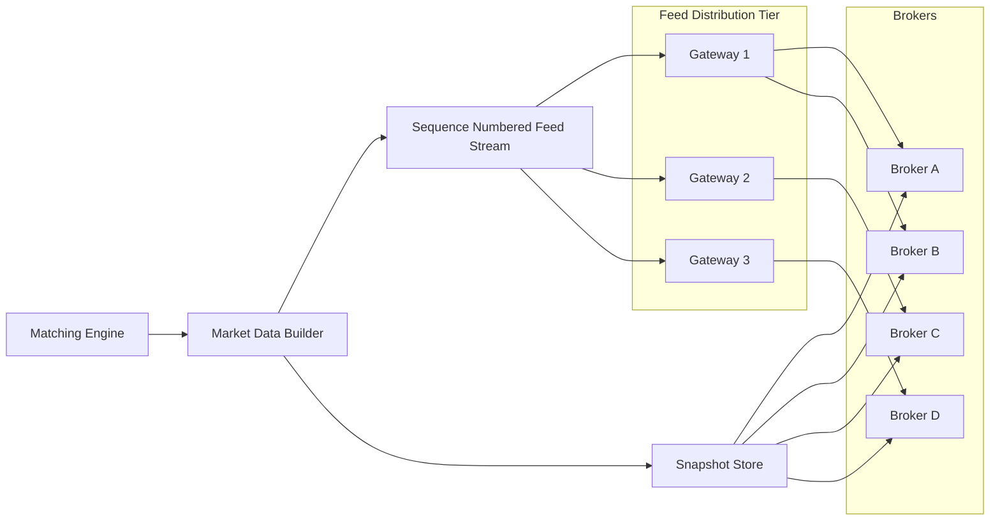

---
categories:
- Distributed Systems
- Architecture
- Backend
date: 2026-03-21
seo_title: Designing a Stock Exchange System - Matching Engine, Market Data, and Scale
seo_description: Step-by-step stock exchange system design covering problem
  statement, functional requirements, NFRs, high-level architecture, matching
  engine, market data, scalability, and low-latency design trade-offs.
tags:
- distributed-systems
- architecture
- backend
- low-latency
- trading
- matching-engine
- order-book
- scalability
title: Designing a Stock Exchange System
toc: true
toc_icon: cog
toc_label: In This Article
header:
  overlay_image: "/assets/images/java-advanced-generic-banner.svg"
  overlay_filter: 0.35
  show_overlay_excerpt: false
  caption: Low-Latency Architecture and Market Integrity
---
Designing a stock exchange is one of the best system-design exercises because it forces you to care about correctness, scale, recovery, and latency at the same time.

This is not a CRUD system with a trading theme.
It is a fairness-critical system where one wrong design decision can break sequencing, replay, or market data under load.

In this article, I will walk through the design step by step as if we are learning system design from scratch:

1. what we are building
2. functional requirements
3. non-functional requirements
4. high-level architecture
5. detailed component design
6. how the system scales and handles huge traffic
7. why the system is so fast

To keep the discussion concrete, I will use Indian cash-equity examples like `RELIANCE`, `TCS`, `INFY`, and `HDFCBANK`.
Treat the examples as architectural illustrations, not as official NSE or BSE protocol documentation.

> [!NOTE] Scope of the examples
> The symbols and scenarios in this article are teaching devices to make sequencing, matching, and recovery easier to reason about.
> They should not be read as venue-specific protocol or regulatory guidance.

---

## Problem Statement

We want to design a stock exchange for cash equities.

The exchange should accept orders from member brokers, maintain live order books, match buy and sell orders using price-time priority, publish trade confirmations, and send market data to many brokers at the same time.

If you want to think about it in practical terms, imagine:

- thousands of listed stocks
- some symbols like `RELIANCE` or `INFY` becoming extremely hot at market open or on news
- heavy cancel and replace traffic during volatility
- brokers expecting live acknowledgments and tick-by-tick market data
- regulators expecting clean audit and replay

So the real problem is not just "place orders."
The real problem is:

- preserve one clear ordering of events
- match deterministically
- recover cleanly after failure
- distribute market data at scale
- do all of this with very low latency

---

## What Exactly Are We Building

Before drawing boxes, define the system boundary clearly.

We are building the exchange core, not the entire trading ecosystem.

The exchange is responsible for:

- accepting orders from brokers
- validating venue-owned rules
- sequencing orders
- maintaining the order book
- matching orders
- publishing execution reports
- publishing market data
- storing an auditable event trail

The broker is responsible for:

- client onboarding and KYC
- margin and portfolio checks
- user-facing app and APIs
- routing customer orders to the exchange

The clearing and settlement system is responsible for:

- post-trade processing
- obligations, netting, and settlement
- money and securities movement

This boundary matters because weak designs push broker logic or clearing logic into the exchange hot path.
That makes the system slower and harder to reason about.

---

## Functional Requirements

At high level, the exchange should support these behaviors:

1. Accept new, cancel, and replace orders from brokers.
2. Maintain a live order book for each stock.
3. Match orders using deterministic price-time priority.
4. Send order acknowledgments and execution reports back to brokers.
5. Publish tick-by-tick market data and depth updates.
6. Support snapshot plus incremental feed recovery for market-data consumers.
7. Support audit, replay, and operational recovery.

To keep the first version realistic, I would start with:

- cash equities only
- limit, market, cancel, and replace first
- no attempt to solve every asset class in version 1

> [!TIP] Version-1 design discipline
> A strong exchange design usually becomes clearer when version 1 is intentionally narrow.
> If we try to solve equities, derivatives, auctions, complex order types, and cross-venue routing all at once, the core invariants get blurry.

---

## Non-Functional Requirements

This is where the design really gets shaped.

The most important NFRs are:

### 1. Correctness

For one symbol, there must be one authoritative processing order.
If two components disagree about order, the design is broken.

### 2. Determinism

If we replay the same event stream, we must rebuild the same book and the same trades.

### 3. Low latency

The hot path must stay extremely short and avoid remote dependencies.

### 4. High throughput

The exchange must handle very large inbound order volume, especially during bursts.

### 5. Hot-symbol isolation

One extremely active stock should not degrade unrelated symbols.

### 6. Market-data fan-out

The system must deliver the same committed feed to many brokers without allowing slow consumers to block matching.

### 7. Recovery

Failover, replay, and session recovery must be explicit and reliable.

The key design lesson is this:
the exchange is not primarily a throughput system.
It is a correctness system under latency pressure.

---

## High-Level Design

At high level, the system needs four layers:

1. ingress and session management
2. deterministic matching core
3. market-data distribution
4. asynchronous downstream systems

Here is the high-level architecture:

This diagram already tells us a lot:

- gateways handle connectivity, not matching
- the sequencer establishes authoritative order
- the matching engine owns book mutation
- the journal defines the recovery boundary
- market-data distribution is isolated from the matcher
- Kafka and other async systems are downstream, not in the fairness-critical path

---

## Step-by-Step Order Flow

Now let us walk one order through the system.

Suppose a broker sends this order:

- symbol: `RELIANCE`
- side: buy
- price: `INR 2,845.10`
- quantity: `100`

The sequence looks like this:

That is the full design in miniature.
Everything else in the article exists to make these steps safe and fast.

---

## Component Design in Detail

Now we can go deeper, component by component, in the same order in which an order flows.

For each component, the useful design question is not just "what does it do?"
It is:

- what state does it own
- what decisions can it make locally
- what does it emit downstream
- what failure must it isolate from the rest of the exchange

### 1. Gateways and Session Manager

The gateway terminates exchange protocols like FIX or a lower-latency binary protocol.
It is the exchange's network edge, but it should not become a mini trading system.

A good gateway usually owns these pieces of state:

- authenticated session table keyed by member and session id
- inbound message sequence tracking
- resend and replay windows for reconnect recovery
- per-session outbound queue for acknowledgments and execution reports
- connection-level throttles and heartbeat timers

Its hot-path work should look like this:

1. parse the incoming frame
2. authenticate the session
3. validate protocol syntax and required fields
4. detect duplicate or out-of-sequence client messages
5. normalize the order into a canonical internal envelope
6. attach session metadata like member id, receive timestamp, and protocol sequence number
7. hand the request to venue controls

That canonical envelope matters a lot.
If the matcher later needs to care about FIX tags, binary packet layout, or session recovery details, the layering is already broken.

This is also the right place to separate client identity from exchange identity.
In practice an order often carries:

- a client-provided order id used by the broker session
- an exchange-assigned internal order id used inside the venue
- a transport sequence number used for resend and recovery

Those are not the same thing, and mixing them leads to very confusing recovery bugs.
The gateway should preserve the client id for reporting, but internal components should rely on stable exchange ids after normalization.

What the gateway should not do:

- call a remote database
- invoke a portfolio service
- run slow customer workflows
- wait on downstream consumers to flush

The first important rule of exchange design is:
the gateway must be boring, fast, and predictable.
If one broker is slow, its outbound session queue can back up or disconnect, but that must not stall the rest of the venue.

### 2. Reference Data Service and Local Cache

The system needs static or semi-static data like:

- stock metadata
- tick-size rules
- trading session state
- member permissions
- venue-level limits

That data should come from a source of truth, but hot-path components should use local in-memory caches.

A complete design usually has three layers:

- an authoritative control-plane store where operators publish changes
- a change-distribution mechanism such as snapshots plus versioned deltas
- local in-memory caches inside gateways, controls, routers, and matchers

The cache design matters almost as much as the data itself.
You want atomic reads of a coherent snapshot, not half-updated maps.
In practice this often means:

- immutable snapshot objects
- version numbers or epochs on configuration updates
- copy-on-write refresh when new reference data arrives

Why this design is important:

- a network lookup per order destroys latency consistency
- reference data changes much more slowly than order traffic
- venue controls need local decisions
- failover logic needs the same routing and rule view across components

Typical fields in reference data include:

- symbol to partition ownership
- lot-size rules
- tick-size bands
- daily price collars
- session state such as open, halt, or auction
- member entitlements for instruments or order types

If a cache is stale or unavailable, the venue should fail safely.
It is usually better to reject or pause a symbol than to silently make decisions using uncertain rules.

### 3. Venue Controls

Before an order reaches the sequencer, the exchange should apply venue-owned controls such as:

- price collars
- fat-finger checks
- throttles
- cancel-on-disconnect
- trading halts or auction mode

These checks belong to the exchange because they protect the market itself.
They must be local and deterministic.

A good venue-controls module typically owns:

- per-member throttle counters
- per-symbol trading status
- per-session disconnect policy flags
- local views of price bands and venue rules

Just as important as the rules is the evaluation order.
For example, a new order might be checked in this sequence:

1. is the symbol tradable right now
2. is the member allowed to send this order type
3. is the price inside the allowed collar
4. is the quantity inside maximum order size
5. is the member already beyond rate limits

That ordering should be stable so the same bad input always fails for the same reason.
This makes support, audit, replay, and testing much easier.

Notice that venue controls are not the same thing as a broker's full portfolio risk engine.
A broker may still do its own margin and position checks before sending an order.
The exchange only enforces market-owned protections that must apply uniformly to everyone.

Even then, the matcher should still recheck a small set of invariants that directly affect correctness, such as session state or price validity.
Early rejection is good for latency, but the final correctness guard still belongs near commit.

Some venues also place self-trade prevention here if it can be evaluated deterministically from local state.
Others keep final self-trade prevention inside the matcher because it depends on the exact resting order selected for match.
The main rule is consistency:
wherever the rule lives, it must behave the same on replay.

### 4. Partition Router

The exchange cannot process all stocks through one giant matching thread.
It needs to partition work.

The partition router maps each stock to one active owner.

Example:

- `RELIANCE` and `TCS` may be on partition `P7`
- `INFY` and `HDFCBANK` may be on partition `P12`
- colder symbols may be grouped on lighter partitions

The important invariant is:
one symbol belongs to exactly one active partition at a time.

That sounds simple, but the router is really an ownership directory.
It should answer:

- which partition currently owns this symbol
- which epoch or ownership version is active
- where should traffic go after failover or rebalance

So the router usually keeps a local mapping like:

- symbol -> partition id
- partition id -> active endpoint
- symbol -> ownership epoch

That epoch matters during failover.
If a gateway still believes `RELIANCE` belongs to old owner `P7@epoch=41` but the control plane has moved it to `P19@epoch=42`, stale traffic must be rejected or rerouted explicitly.

For hot-symbol migration, a safe transfer usually looks like:

1. stop accepting new traffic for the symbol on the old owner
2. drain and commit all already sequenced events
3. publish the new ownership epoch
4. activate the new owner
5. let gateways route future traffic only to the new epoch

The router should not "discover" ownership by trial and error on live traffic.
Ownership is a control-plane decision, not a runtime guess.

Behind this router there is usually a small control-plane ownership manager responsible for:

- planned symbol migration
- failover promotion
- fencing an old owner
- publishing the next valid ownership epoch

That control-plane path is not latency critical, but it is correctness critical.
It should be small, explicit, and heavily audited.

### 5. Sequencer

The sequencer is the heart of fairness.

Its job is simple but extremely important:

- accept normalized events
- assign monotonically increasing sequence numbers
- create one authoritative order of events for a partition

Without a sequencer, two gateways may disagree about which order arrived first.
With a sequencer, replay and failover become understandable.

Internally, the sequencer is usually a very small component with very strict discipline.
It typically owns:

- the next sequence number for a partition
- an ingress queue of normalized commands
- the current ownership epoch
- optional ingress timestamps and checksums

The sequencer may batch work for efficiency, but it must not reorder it.
That means:

- it can pull 32 pending orders at once
- it can stamp them with sequence numbers in a batch
- it cannot let a later cancel jump ahead of an earlier new order

In many real systems, the sequencer is co-located with the matcher or implemented as the first stage of the same single-thread event loop.
That is often a good trade-off because it reduces hops while still preserving the logical boundary:
first establish order, then mutate state.

One subtle but important point:
the sequencer defines the intended processing order, but the journal defines the committed truth boundary.
So if the active owner crashes after stamping sequence `91234012` but before that event is durably committed, recovery resumes from the last committed sequence, not from whatever number happened to be in RAM.

> [!IMPORTANT] Sequencing is the fairness boundary
> Once the partition order is established, every downstream consumer should derive truth from that same order.
> Acknowledgments, replay, standby rebuild, and market data should all agree on it.

### 6. Matching Engine and In-Memory Order Book

The matching engine should be treated as a single-writer state machine.

For each sequenced event, it:

- checks current book state
- applies new, cancel, or replace logic
- matches against opposite-side liquidity if the order crosses
- updates the in-memory book
- emits execution results and market-data deltas

The order book usually needs:

- bids ordered by best price first
- asks ordered by best price first
- FIFO queue at each price level
- order-id index for fast cancel lookup

In practice, the engine owns much more than just two sorted sides.
For each live symbol book it usually maintains:

- bid price levels
- ask price levels
- a queue of resting orders per price level
- an order-id index for direct lookup
- aggregate quantities per level
- symbol-level metadata like trading mode or auction state

The hot path for a new limit order looks like this:

1. load the book for the symbol
2. validate final book-level invariants
3. if the order crosses, match against the best opposite price level
4. consume resting liquidity in strict price-time order
5. generate one or more trade events
6. remove empty levels or reduce partially filled orders
7. if quantity remains, rest the residual on the book
8. emit the final order-state transition and book delta

Cancel and replace need equally precise semantics.
For example:

- cancel must find the order by id in O(1) or close to it
- replace often behaves like cancel-plus-new from a priority perspective
- quantity reduction may or may not retain priority depending on venue rules

You also need clear semantics for order types and identifiers:

- market orders usually execute immediately against the book and must not rest unpriced unless the venue explicitly supports that model
- IOC or FOK orders should be resolved entirely inside one deterministic pass
- self-trade prevention must define whether to cancel the resting order, the aggressing order, or both
- trade ids should be generated deterministically from the committed matching path, not by some later async consumer

Timestamps need similar discipline.
Many systems capture several of them:

- gateway receive timestamp
- sequence assignment timestamp
- commit timestamp
- trade publication timestamp

For fairness, sequence order wins.
Timestamps help with audit and latency measurement, but they should not override committed ordering.

This is why the system can stay fast:
the book is memory-resident and mutated by one owner.
There is no database in the decision loop, no shared lock between writers, and no distributed coordination between matchers for one symbol.

This single-writer model also makes correctness testing much easier.
Given the same ordered input stream, the engine should produce the same trades, book state, and outbound events every time.

### 7. Event Journal

The journal is the committed truth boundary.

It answers these questions:

- what exactly was accepted
- what exact event order must a standby replay
- from which point can recovery resume

This should be an ordered committed log, not a vague debug trace.

A robust journal record usually includes at least:

- partition id
- ownership epoch
- sequence number
- normalized input command
- resulting order state transition
- generated fills or trades
- timestamps and checksums

Some designs persist only commands and rely on deterministic replay to regenerate the outputs.
Other designs also persist normalized outcomes for audit and faster downstream consumption.
Either approach can work, but the rule is the same:
the journal must contain enough information to reconstruct committed truth exactly.

Operationally, the journal is also where durability policy lives.
You may batch appends for throughput, but the external acknowledgment boundary should still be tied to a committed journal point.

The journal also needs boring engineering details that matter in production:

- segment rotation
- checksums
- corruption detection
- truncation rules
- retention and archival policy

Without that discipline, replay looks nice in a whiteboard interview and painful in a real incident.

### 8. Recovery Snapshots and Replay

The journal is the source of truth, but replaying an entire trading day from the first event every time is not operationally pleasant.
So most serious designs combine the journal with periodic recovery snapshots.

A recovery snapshot is different from a market-data snapshot.
It is not for subscribers.
It is for restoring internal matching state quickly.

A good recovery snapshot typically contains:

- partition id and ownership epoch
- last included committed sequence number
- full in-memory book state for owned symbols
- order-id index
- level aggregates and symbol metadata
- checksum of the serialized state

The recovery rule is straightforward:

1. load the latest valid snapshot
2. verify its checksum and included sequence
3. replay journal events after that sequence
4. resume only when book state is caught up to the desired commit point

This does two important things:

- reduces restart time for cold recovery
- gives standby promotion and disaster recovery a bounded replay window

The snapshot cadence is a trade-off.
Very frequent snapshots cost more write bandwidth and CPU.
Very infrequent snapshots increase recovery time.
Production systems usually tune this by partition heat, memory size, and recovery objectives.

### 9. Warm Standby

The standby is not another active writer.
It is a follower that replays the same committed events and stays ready for takeover.

Good standby design means:

- it consumes the same ordered journal
- it builds the same in-memory state
- it can take over only after ownership is explicitly transferred

In a stronger design, the standby does more than just "listen."
It should actively verify:

- sequence continuity
- current journal offset
- periodic book checksum or state hash
- readiness to serve the next epoch

That gives operations a way to know whether the standby is truly hot or only "probably fine."

Promotion should also be explicit.
A safe failover sequence is typically:

1. fence the old primary so it cannot accept more writes
2. find the last committed sequence in the journal
3. let the standby replay to that exact point
4. publish a new ownership epoch
5. route all future traffic to the promoted node

This is how we avoid split brain.
The standby is not there to increase write parallelism.
It is there to reduce recovery time while preserving one-writer ownership.

In strong designs, the standby may restore from the latest recovery snapshot first and then tail the journal.
That avoids forcing every follower to rebuild only from the first event of the day.

### 10. Execution Reports

Once an event is committed, the exchange must send the right outcome back to the broker:

- accepted
- rejected
- partially filled
- fully filled
- canceled

These reports must come from the same committed engine output that feeds replay and market data.

The execution-report path usually owns:

- mapping from internal order id back to broker session and client order id
- per-session outbound message sequence numbers
- resend history for reconnect recovery
- outbound queues isolated per broker session

This is important because the exchange is not replying to "the system" in general.
It is replying to one particular member session using that protocol's sequencing rules.

A good flow looks like this:

1. committed engine result is produced
2. session mapper resolves the destination broker session
3. protocol-specific encoder builds the proper response
4. response is queued on that broker's outbound session
5. reconnect and resend logic can replay the same committed outcome if needed

The subtle but critical design point is:
the matcher decides order outcome, but the session layer decides delivery mechanics.
That separation keeps correctness independent from network recovery behavior.

### 11. Market Data Builder and Feed Gateways

The market-data builder consumes committed engine outputs and creates:

- trade ticks
- top-of-book updates
- depth updates
- snapshots for recovery

Then a separate feed-distribution tier fans this out to many brokers.

This separation is extremely important:
market-data distribution must not slow matching.

The builder is a derived-state component.
It should not inspect the live mutable book directly from inside the matcher thread.
Instead it should consume committed engine events and maintain its own derived view such as:

- best bid and ask
- top-of-book state
- depth ladders
- last trade
- traded volume and turnover

One committed match event may expand into several feed events:

- a trade tick
- best bid changed
- best ask changed
- depth level changed
- session statistics updated

That is exactly why feed generation should be decoupled.
Fan-out is amplification, and amplification belongs outside the matcher.

Feed gateways then own subscriber-facing concerns such as:

- per-subscriber entitlements
- protocol encoding
- multicast or unicast delivery mode
- per-consumer buffer management
- gap detection and recovery

Sequence numbers are critical here.
A subscriber should be able to say:
"I have market-data sequence `48190021`; give me everything after that or give me a fresh snapshot."

That leads to the standard repair model:

1. client detects a gap
2. fetch snapshot
3. replay deltas after snapshot sequence
4. resume live stream

> [!NOTE] The builder is allowed to be expensive in ways the matcher is not
> The market-data path can maintain derived statistics, prebuilt snapshots, and replay buffers because it is downstream of the fairness-critical path.
> The matcher should only emit the minimal committed deltas needed to derive them.

### 12. Async Downstream Systems

Once the exchange commits an event, many other systems may consume it:

- trade ledger
- surveillance and compliance
- reporting
- clearing adapter

This is where Kafka or another event bus can be very useful.
But this is downstream.
It is not where fairness is decided.

These systems are usually interested in different projections of the same committed truth:

- the ledger cares about economic events like trades, fees, and adjustments
- surveillance cares about the full lifecycle of orders, cancels, and replaces
- clearing adapters care about settlement-facing trade records
- reporting APIs care about queryable history and analytics

The clean design is to publish a committed event stream with stable identifiers such as:

- partition id
- sequence number
- order id
- trade id
- event type

That lets downstream consumers be replayable and idempotent.
If the ledger sees trade `T-884192` twice, it should deduplicate safely.
If surveillance is offline for ten minutes, it should catch up from the bus or journal without involving the matcher at all.

This is also the right place for enrichments that would be harmful in the hot path:

- user-facing metadata joins
- analytical projections
- warehouse exports
- regulatory packaging

Kafka or an internal bus is excellent here because we want decoupling, fan-out, and replay.
It is the wrong abstraction for the fairness-critical matching loop, but a very strong abstraction for everything after commit.

---

## How the Exchange Handles Thousands of Stocks

This is a common confusion point in interviews and blog posts.

The exchange does not maintain one huge shared structure for all stocks.
It maintains many independent books with explicit ownership.

The model looks like this:

The exchange uses a symbol master that contains:

- symbol code
- instrument type
- tick-size rule
- session state
- price bands
- partition ownership

That symbol master feeds local caches used by gateways, venue controls, and the router.

This is how we support many stocks while keeping deterministic ownership for each one.

---

## How Tick-by-Tick Market Data Is Maintained

When people say "how are so many stock ticks maintained," they usually mean:

1. how the system maintains live order books for many stocks
2. how the system publishes tick-by-tick market-data updates

These are related, but not identical.

### Tick-Size Rules

Each instrument may have a minimum price increment rule.
That rule belongs in reference data and should be enforced by the venue.

Architecturally:

- gateway and controls can reject obviously invalid prices early
- the matcher still enforces the final rule before commit

### Tick-by-Tick Feed

The engine does not scan every possible price for every stock on every event.
It updates only the book state that changed.

For a committed change in `RELIANCE`, the system may publish:

- best bid changed
- best ask changed
- last traded price changed
- traded volume changed
- depth changed

That is the key to scale:
the feed is incremental.
It is derived from committed state transitions, not by polling a database or recomputing the world.

---

## How the Same Feed Reaches Many Brokers

This is another place where many designs stay too shallow.

The exchange is not sending one update to one consumer.
It is sending the same committed market event to many brokers at once.

The right flow looks like this:

Important design details:

- feed messages should be sequence numbered
- brokers should detect gaps
- missed data should be repaired by snapshot plus replay
- slow consumers should be isolated from fast ones

The most important rule is simple:
the matching engine must never wait for a slow broker feed.

> [!WARNING] Feed fan-out is a hidden failure path
> Many weak designs keep matching correct in isolation but accidentally let feed backpressure leak into the core.
> Recovery, replay, and slow-consumer handling should stay in the distribution tier, not in the matcher thread.

---

## Scalability: How the System Handles Huge Volume

Now let us address the most important scale question:
how does this system handle too much volume?

### 1. Partition by Symbol

The exchange scales horizontally by distributing symbols across partitions.

That means:

- each partition has its own sequencer and matcher
- symbols are processed independently
- one hot stock does not automatically block unrelated stocks

### 2. Keep One Active Owner Per Symbol

We do not scale one book using many active writers.
That creates coordination overhead and ambiguity.

For one symbol, single-writer ownership is usually the better trade-off.

### 3. Isolate Hot Symbols

Not all stocks are equally active.

At market open or during major events:

- `RELIANCE` may get heavy order flow
- `INFY` may see extreme cancel or replace volume
- smaller symbols may remain relatively quiet

So capacity planning should focus on:

- hot-symbol concentration
- cancel and replace ratio
- outbound market-data amplification

### 4. Scale the Feed Tier Separately

Inbound order traffic and outbound market-data traffic are different scaling problems.

The matching engine must stay small.
The fan-out tier can scale independently with more gateways, more replay capacity, and more snapshot infrastructure.

### 5. Keep Replay and Recovery Off the Matcher

After outages or disconnect storms, many brokers may reconnect at once.
That recovery load should hit the snapshot and replay tier, not the live matching thread.

---

## Why the System Is So Fast

The exchange is fast because it refuses to do expensive things in the hot path.

The main reasons are:

1. one active writer per book or partition
2. in-memory order books
3. local caches for reference data
4. no database round-trip to decide a match
5. no distributed transaction in the matching loop
6. market-data fan-out moved off the matcher
7. bounded, predictable handoff between stages

The hot path should look like this:

- gateway
- lightweight validation
- venue controls
- sequencer
- single-writer matcher
- commit boundary
- ack

That is why the system can stay fast even when overall platform complexity is large.

If we turned this into a chain like:

- order service
- risk service
- book service
- trade service

we would add network hops, serialization, retries, and latency variance right where determinism matters most.

Related reading:

- [Shared Memory vs Message Passing in Java Applications](/java/concurrency/shared-memory-vs-message-passing-java-applications/)
- [Contention Collapse Under Load in Java Services](/java/concurrency/contention-collapse-under-load-in-java-services/)
- [Bounded Queues and Backpressure in Java Systems](/java/concurrency/bounded-queues-and-backpressure-in-java-systems/)

---

## Failure and Recovery

A stock exchange design is incomplete without failure handling.

The most important scenarios are:

### 1. One Symbol Becomes Extremely Hot

If `INFY` suddenly becomes 20 times hotter than the average stock:

- only its owning partition should be stressed
- other symbols should keep moving normally
- venue controls should still be able to throttle or halt if required

### 2. A Broker Feed Falls Behind

If one broker cannot keep up with tick processing:

- that broker's feed path should lag or disconnect
- the matcher should continue normally
- recovery should happen through snapshot plus replay

### 3. Gateway Reconnect Storm

If many sessions reconnect after a network event:

- session recovery should be explicit
- reconnect handling should be rate limited
- cancel-on-disconnect rules should be deterministic

### 4. Primary Matcher Failure

If the active owner of `RELIANCE` fails:

- the standby should know the last committed sequence
- partition ownership should move explicitly
- the new primary should continue from the next safe sequence number

The critical recovery rule is:
there must be one unambiguous owner of the next event.

> [!CAUTION] Active-active sounds safer than it is
> For one order book, multi-writer ownership usually increases coordination cost, ambiguity, and split-brain risk.
> In low-latency exchange systems, single-writer ownership is often the simpler and safer default.

That is also why active-active multi-writer ownership for one book is usually the wrong trade-off in a low-latency exchange.

---

## Final Design Summary

If I had to explain the design in one short flow, I would say this:

1. brokers connect through gateways
2. the exchange applies local venue controls
3. orders are routed by symbol to one active partition
4. the sequencer defines authoritative order
5. the matching engine updates the in-memory book
6. the journal records committed truth
7. execution reports go back to brokers
8. market-data builders and feed gateways distribute the committed feed
9. downstream systems consume the same truth asynchronously

That is the clean mental model a learner should keep.

If that model is clear, the detailed implementation choices become much easier to understand.

---

## Key Takeaways

- A stock exchange is a deterministic sequencing problem under latency pressure.
- The design should begin with requirements and invariants, not with random infrastructure boxes.
- One active owner per symbol or partition is the simplest scalable model.
- Matching should stay memory-resident, single-writer, and isolated from slow dependencies.
- Tick-by-tick market data should be derived incrementally from committed events.
- The system scales by partitioning symbols, isolating hot books, and scaling market-data fan-out separately.
