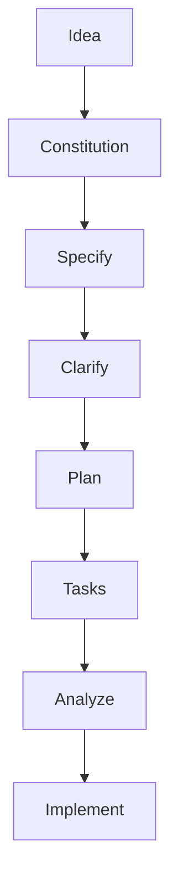

Most AI coding workflows fail in the same way:

- the prompt sounds clear
- the generated code looks impressive
- the hidden assumptions show up too late
- the team ends up debugging intent, not just implementation

You ask for a feature.
The model fills in missing product decisions silently.
Then the codebase starts growing around guesses nobody explicitly approved.

That is the real problem Spec Kit is trying to solve.

Spec Kit is not mainly about one more AI command.
It is about changing the order of work:

- first define intent
- then remove ambiguity
- then turn intent into a plan
- then break the plan into tasks
- then implement

That sounds obvious, but in practice it is a major shift.
Most AI-assisted development still skips from idea straight to code.
Spec Kit forces a middle layer of thinking that teams usually agree with in theory and skip under delivery pressure in reality.

This article explains what Spec Kit is, why the workflow matters, and how to use it end to end.
The centerpiece is one concrete example so the process feels real rather than theoretical.

---

## What Spec Kit Actually Is

Spec Kit is GitHub's open source toolkit for specification-driven development.
Its core idea is simple:

- requirements should not be disposable notes
- specifications should become durable execution artifacts
- implementation should follow a structured chain from intent to plan to tasks to code

In the official workflow, you initialize a project with the `specify` CLI, define project principles with `/speckit.constitution`, write requirements with `/speckit.specify`, refine ambiguity with `/speckit.clarify`, create a technical approach with `/speckit.plan`, turn that into execution steps with `/speckit.tasks`, optionally validate with `/speckit.analyze`, and finally implement with `/speckit.implement`.

The key mental model is this:

- `constitution` defines how your team wants work to be done
- `specify` defines what should exist and why
- `clarify` removes ambiguity before architecture locks in
- `plan` translates the product spec into technical decisions
- `tasks` creates an implementation roadmap
- `implement` executes against that roadmap

If you only remember one sentence from this article, make it this one:

**Spec Kit is less about "generate code for me" and more about "make intent executable in stages."**

That difference is exactly why the workflow can feel slower at the beginning and dramatically cleaner later.

---

## Why This Feels Different from Normal AI Coding

A lot of AI coding today is really prompt-driven improvisation.
You ask for a feature, the model fills in missing assumptions on its own, and by the time you notice the wrong assumptions, a large volume of code already exists around them.

That creates three recurring problems.

### 1) The system answers questions nobody explicitly asked

If your prompt says:

```text
Build a leave management app for internal teams.
```

the model has to invent many things:

- who can approve leave?
- do half-days exist?
- can overlapping leave requests happen?
- what happens on public holidays?
- what audit history is required?
- what roles are allowed to edit a request after submission?

Traditional AI coding tends to answer those silently.
Spec Kit tries to surface them before implementation.

### 2) Requirements and implementation drift apart quickly

Once code is generated, the team starts discussing behavior by reading routes, DTOs, React state, migrations, and test failures.
That is backwards.

The team should be able to say:

- this is the rule
- this is the acceptance behavior
- this is the chosen technical interpretation
- this is where it is implemented

Spec Kit is trying to preserve that chain.

### 3) Teams lose the "why"

The most valuable information in product work is often not code.
It is intent:

- why the feature exists
- which tradeoffs are deliberate
- what must never regress
- what is intentionally out of scope

Spec Kit keeps that intent closer to the implementation path.

That is the "aha" moment for many people.
The magic is not the slash commands.
The magic is that the workflow gives the model less room to freestyle on the wrong problem.

---

## The Core Workflow

At a high level, the Spec Kit workflow looks like this:

1. initialize the project and agent integration
2. define the constitution
3. write the product specification
4. clarify missing decisions
5. generate the technical plan
6. generate tasks
7. analyze gaps if needed
8. implement

Here is the workflow in one visual:



Why this diagram matters:

- `Idea` is still vague product intent
- `Constitution` defines how your team wants software built
- `Specify` and `Clarify` reduce product ambiguity before architecture hardens
- `Plan` and `Tasks` turn intent into executable engineering work
- `Analyze` catches gaps before expensive implementation drift
- `Implement` happens last, not first

That ordering is the entire point.
Spec Kit is trying to stop teams from using code generation as the place where product decisions accidentally get made.

In practice, it often produces a structure like this:

```text
.specify/
  memory/
    constitution.md
  templates/
  scripts/

specs/
  001-leave-approval-workflow/
    spec.md
    plan.md
    tasks.md
```

That structure matters because it separates three things that usually get blurred together:

- enduring team principles
- feature-specific product intent
- execution detail

Once you see this separation clearly, a lot of messy AI-assisted work starts to look avoidable.

---

## What the Constitution Is Really Doing

Many people underestimate `/speckit.constitution`.
It sounds like a fancy setup step.
It is actually one of the highest-leverage parts of the workflow.

The constitution is where you encode rules that should apply to every future feature:

- testing expectations
- architecture boundaries
- performance principles
- API consistency standards
- security rules
- accessibility requirements
- logging and observability rules

Without this layer, every feature prompt has to restate the same standards.
And in real projects, that repetition never stays perfect.

A useful constitution might say things like:

- every business rule must be covered by automated tests
- external side effects must be isolated behind explicit adapters
- API write operations must be idempotent where feasible
- user-visible workflows require clear empty, loading, and error states
- all timestamps are stored in UTC and rendered in user locale
- audit-sensitive actions must be logged with actor and reason

That means the AI is not starting from a blank cultural slate for every feature.
It starts from your engineering values.

That is a much stronger foundation than repeating "write clean code and add tests" in random prompts.

---

## End-to-End Example: Build an Employee Leave Approval Feature

Now let us walk through one realistic feature from start to finish.

I am intentionally choosing something business-oriented instead of a toy demo because this is where Spec Kit becomes most useful.
Simple CRUD apps do not expose much ambiguity.
Workflow software does.

### The product idea

We want to build an internal leave approval workflow for a company.

The feature should allow:

- employees to submit leave requests
- managers to approve or reject them
- employees to see request status
- HR to see an audit trail

That sounds clear.
But it is not nearly clear enough to implement well.

This is exactly where Spec Kit helps.

---

## Step 1) Initialize Spec Kit

From the official docs, you start by initializing with the `specify` CLI.

The cleanest follow-along sequence looks like this.

### `Terminal` Create the project folder

```bash
mkdir leave-approval-demo
cd leave-approval-demo
```

### `Terminal` Install the CLI

```bash
uv tool install specify-cli --from git+https://github.com/github/spec-kit.git
```

### `Terminal` Initialize Spec Kit in the current directory

```bash
specify init .
```

If you already know the agent you want to target, the official docs show examples like:

```bash
specify init . --ai claude
specify init . --ai gemini
specify init . --ai copilot
```

If you prefer one-shot usage instead of installing the CLI globally, use:

```bash
uvx --from git+https://github.com/github/spec-kit.git specify init .
```

### `Terminal` Verify the installation

```bash
specify check
```

### `Terminal` Create the feature branch

Spec Kit's quick start guide notes that feature context is detected from the active Git branch.
For this example, create the branch first:

```bash
git checkout -b 001-leave-approval-workflow
```

> [!IMPORTANT]
> The feature branch name matters because Spec Kit uses Git branch context to anchor the active feature.
> If the branch name and the feature folder drift apart, the workflow becomes harder to follow and easier to misapply.

At this point, the project directory is ready and the feature branch name matches the folder we want under `specs/`.

### `Agent` Open the project in your AI tool

Now open `leave-approval-demo/` in your supported agent environment.
After `specify init`, the project should expose commands like:

- `/speckit.constitution`
- `/speckit.specify`
- `/speckit.plan`
- `/speckit.tasks`
- `/speckit.implement`

If those commands do not appear, restart the IDE or reopen the project folder after initialization.

> [!TIP]
> Treat missing slash commands as an environment issue first, not a product-spec problem.
> Reopening the project after `specify init` is often enough.

This step sets up the project files and agent command scaffolding.

At this point, nothing important about the product has been decided yet.
That is good.
Tooling comes first.
Requirements come next.

### What the example project looks like on disk

To make the example genuinely followable, it helps to anchor it in a concrete project layout:

- initialize the project with Spec Kit
- create one feature folder
- keep the constitution in shared memory
- keep the feature-specific artifacts in `specs/<feature-name>/`

In this article, the example project looks like this:

```text
leave-approval-demo/
  .specify/
    memory/
      constitution.md
    scripts/
    templates/
  specs/
    001-leave-approval-workflow/
      spec.md
      plan.md
      tasks.md
```

The important split is:

- `.specify/memory/constitution.md` is shared guidance for the whole project
- `spec.md` describes the feature in product language
- `plan.md` translates the feature into technical design
- `tasks.md` breaks the work into execution steps

### `Terminal` Create the example file tree

To mirror the walkthrough exactly, create the directories and files up front:

```bash
mkdir -p .specify/memory
mkdir -p specs/001-leave-approval-workflow

touch .specify/memory/constitution.md
touch specs/001-leave-approval-workflow/spec.md
touch specs/001-leave-approval-workflow/plan.md
touch specs/001-leave-approval-workflow/tasks.md
```

Now the rest of the article becomes straightforward:

- paste the constitution block into `.specify/memory/constitution.md`
- paste the specification block into `specs/001-leave-approval-workflow/spec.md`
- paste the plan block into `specs/001-leave-approval-workflow/plan.md`
- paste the task list into `specs/001-leave-approval-workflow/tasks.md`

Some of these files may be generated or refined through the Spec Kit workflow in a real project, but showing them explicitly makes the process much easier to follow and gives us a concrete baseline for what "good" looks like.

> [!NOTE]
> In a real run, some of these files may be created or improved by Spec Kit rather than handwritten from scratch.
> The reference versions in this article are there to make the workflow concrete and to show what strong artifacts look like.

### Copy-paste starter pack

These are the core files to create or review for the leave approval example.

#### `File` `.specify/memory/constitution.md`

```md
# Project Constitution

## Engineering Principles

1. Business rules must be explicit and covered by automated tests.
2. Role-based access rules must be enforced on the server, not only in the UI.
3. All audit-sensitive actions must record actor, timestamp, and reason.
4. API contracts should be stable, JSON-based, and validation-first.
5. The UI must handle loading, empty, error, and permission-denied states clearly.
6. Time handling must be UTC in storage and locale-aware in display.
7. Prefer simple architecture over framework-heavy abstraction unless complexity is justified.

## Delivery Expectations

- Favor a modular monolith unless there is a clear reason to split services.
- Keep business workflow logic in explicit domain/application services.
- Make invalid state transitions impossible through service-layer rules.
- Add integration tests for permission checks and workflow transitions.
- Every user-visible workflow must have clear error messages and auditability.
```

#### `File` `specs/001-leave-approval-workflow/spec.md`

```md
# Leave Approval Workflow

## Problem Statement

The company currently manages leave approvals through email and chat.
This creates poor visibility, inconsistent approvals, and no reliable audit trail.

## Goal

Create a trackable leave approval workflow where employees can submit requests,
managers can approve or reject them, and HR can inspect the full history.

## Non-Goals

- leave balance calculation
- half-day requests
- multi-step approvals
- HR override of manager decisions

## Roles

- Employee
- Manager
- HR Viewer

## Core User Stories

- As an employee, I can submit a leave request with start date, end date, leave type, and reason.
- As an employee, I can view all my leave requests and their current statuses.
- As a manager, I can approve or reject leave requests for my direct reports.
- As an HR user, I can view leave requests and approval history across the company.

## Business Rules

- End date must be on or after start date.
- A request can only be submitted if the employee has an assigned manager.
- A request cannot overlap an already approved request for the same employee.
- Only the assigned manager can approve or reject a request.
- A rejection must include a reason.
- Employees may cancel only pending requests.
- Managers cannot approve or reject their own leave requests.

## Acceptance Criteria

- Employee can submit a valid leave request successfully.
- Invalid date ranges are rejected with a validation error.
- Overlapping approved leave is blocked.
- Manager can approve a direct report request.
- Manager cannot approve a request outside their reporting chain.
- Rejection requires a reason.
- HR can view full request and decision history.
- Submit, approve, reject, and cancel actions create audit entries.
```

#### `File` `specs/001-leave-approval-workflow/plan.md`

```md
# Technical Plan

## Architecture

- Spring Boot backend
- PostgreSQL database
- React frontend
- REST API between frontend and backend
- Modular monolith structure

## Key Modules

- leave-request domain
- approval workflow service
- authorization layer
- audit trail module
- employee hierarchy lookup

## Domain Model

- LeaveRequest
- LeaveStatus
- LeaveDecision
- AuditEvent
- EmployeeHierarchy

## API Endpoints

- POST /leave-requests
- GET /leave-requests/my
- GET /leave-requests/pending-approvals
- POST /leave-requests/{id}/approve
- POST /leave-requests/{id}/reject
- POST /leave-requests/{id}/cancel
- GET /audit/leave-requests

## Validation and Authorization

- validate date ranges at request boundary
- enforce overlap checks before approval
- enforce server-side role checks
- ensure only direct managers can approve or reject
- require rejection reason

## Testing Strategy

- unit tests for workflow transition rules
- integration tests for submit, approve, reject, cancel
- authorization tests for employee, manager, and HR access
- frontend tests for submit and approval flows
```

#### `File` `specs/001-leave-approval-workflow/tasks.md`

```md
# Tasks

## Phase 1: Project Setup

- initialize backend module
- initialize frontend module
- configure database connection and migrations

## Phase 2: Domain and Persistence

- create LeaveRequest entity
- create LeaveStatus enum
- create AuditEvent entity
- add repository methods for overlap and manager lookups

## Phase 3: Backend Workflow Logic

- implement submit request service
- implement approve request service
- implement reject request service
- implement cancel request service
- generate audit events for all workflow actions

## Phase 4: API Layer

- add request and response DTOs
- add validation annotations and error mapping
- add controller endpoints
- enforce authorization checks

## Phase 5: Frontend

- add employee request form
- add employee request list
- add manager approval queue
- add rejection reason dialog
- add HR audit history view

## Phase 6: Tests

- add unit tests for transition rules
- add integration tests for overlap and manager authorization
- add frontend tests for submit and approval flows
```

Once these four files are visible, the workflow becomes much less abstract.
Two important questions get answered immediately:

- what should I write myself?
- what should Spec Kit help me refine or generate?

That shift matters because many first-time users do not struggle with the commands first.
They struggle with the shape and quality of the artifacts the commands are supposed to produce.

### Line-by-line execution flow

With the folder initialized and the feature branch created, the rest of the example can be executed in this order.

#### 1. In the agent chat, create the constitution

Paste:

```text
/speckit.constitution Create principles focused on business rule correctness, server-side authorization, auditability, validation-first APIs, clear UI states, UTC time handling, and simple maintainable architecture.
```

This should create or update:

```text
.specify/memory/constitution.md
```

If the generated content is too generic, replace it with the stronger reference version shown above.

> [!TIP]
> The quickest way to get value from Spec Kit is not to accept weak generated artifacts politely.
> Tighten them early, because every later stage depends on their quality.

#### 2. In the agent chat, create the feature specification

Paste:

```text
/speckit.specify Build an internal employee leave approval workflow. Employees can submit leave requests with start date, end date, leave type, and reason. Managers can approve or reject requests for direct reports. Employees can see current request status. HR users can inspect the full history of requests and decisions. The goal is to replace email-based leave approval with a trackable workflow.
```

This should create a feature folder like:

```text
specs/001-leave-approval-workflow/
  spec.md
```

Again, if the generated `spec.md` is weaker than the reference in this article, use the reference version as the working baseline.

#### 3. In the agent chat, clarify missing product decisions

Paste:

```text
/speckit.clarify Focus on approval rules, overlapping leave, rejection reason requirements, self-approval prevention, cancellation rules, missing manager assignments, and what is explicitly out of scope for v1.
```

At this point, review `spec.md` and make sure the clarified decisions are reflected there.

> [!WARNING]
> Do not skip the clarification step for a workflow feature like this.
> This is the point where silent assumptions get surfaced before they harden into controllers, database schema, and tests.

#### 4. In the agent chat, generate the technical plan

Paste:

```text
/speckit.plan Implement this with a Spring Boot backend, PostgreSQL, and a React frontend. Use REST APIs, server-side validation, role-based authorization, a modular monolith structure, and integration tests for workflow and permission rules.
```

This should create:

```text
specs/001-leave-approval-workflow/plan.md
```

Compare it against the reference `plan.md` in this article and strengthen any weak areas before continuing.

#### 5. In the agent chat, generate tasks

Paste:

```text
/speckit.tasks
```

This should create:

```text
specs/001-leave-approval-workflow/tasks.md
```

Review it and make sure the tasks still align with the business rules in `spec.md` and the architecture choices in `plan.md`.

#### 6. Optional: run analysis before implementation

Paste:

```text
/speckit.analyze
```

Use this to catch missing coverage between the spec, plan, and tasks before implementation starts.

#### 7. In the agent chat, execute implementation

Paste:

```text
/speckit.implement
```

At this stage, the agent should be implementing against a much stronger artifact chain:

- constitution
- clarified spec
- reviewed plan
- reviewed tasks

That is the whole point of the workflow.
The system is no longer building from one vague prompt.
It is building from progressively refined intent.

---

## Step 2) Define the Constitution

Here is a strong constitution prompt for this kind of business app:

```text
/speckit.constitution
This project follows these principles:

1. Business rules must be explicit and covered by automated tests.
2. Role-based access rules must be enforced on the server, not only in the UI.
3. All audit-sensitive actions must record actor, timestamp, and reason.
4. API contracts should be stable, JSON-based, and validation-first.
5. The UI must handle loading, empty, error, and permission-denied states clearly.
6. Time handling must be UTC in storage and locale-aware in display.
7. Prefer simple architecture over framework-heavy abstraction unless complexity is justified.
```

Why this matters:

- it creates a stable quality bar before a single endpoint exists
- it ensures future generated work respects security and audit concerns
- it prevents the feature from becoming "just a screen and a table"

This is the first place the workflow starts feeling different.
We are not telling the model what files to write.
We are telling it what kind of system is acceptable.

---

## Step 3) Create the Product Specification

Now we describe the feature in product language, not framework language.

Example:

```text
/speckit.specify
Build an internal employee leave approval workflow.

Employees can submit leave requests with start date, end date, leave type, and reason.
Managers can approve or reject requests for people who report to them.
Employees can see pending, approved, and rejected requests.
HR users can view the full history of requests and decisions.

The system should prevent invalid date ranges and should make approval decisions visible to the employee.
The main goal is to replace email-based leave approval with a trackable workflow.
```

Notice what is missing:

- no database choice
- no frontend framework
- no API design
- no event bus
- no authentication library

That is deliberate.

At this phase, the job is to capture:

- user roles
- user actions
- business outcomes
- visible system behavior

That separation is one of the most important habits in specification-driven development.

If you blend product requirements and implementation choices too early, you reduce the quality of both.

---

## Step 4) Clarify What the First Prompt Missed

This is where the "aha" usually begins.

The initial request sounded complete.
But a good clarification pass exposes all the places where the team would otherwise make accidental decisions during coding.

Example:

```text
/speckit.clarify
Focus on approval rules, date validation, and audit requirements.
```

Strong clarification questions for this feature would include:

1. Can employees cancel a pending request after submission?
2. Can managers edit a request, or only approve or reject it?
3. Are half-day requests supported?
4. Can a leave request overlap with an already approved request?
5. Can a manager approve their own leave request?
6. Is a rejection reason mandatory?
7. Should public holidays count against leave balance?
8. Can HR override a manager decision?
9. What should employees see if approval hierarchy is missing?
10. Is leave balance calculation part of this feature or out of scope?

This is exactly the kind of thinking that traditional AI coding often skips.
But these questions are not edge polish.
They are the feature.

Let us answer them deliberately.

### Clarified decisions

For this first version:

- employees can cancel requests only while status is `PENDING`
- managers cannot edit request details; they can only approve or reject
- half-day requests are out of scope
- overlapping approved leave for the same employee is not allowed
- managers cannot approve their own requests
- rejection reason is mandatory
- holiday balance logic is out of scope for this version
- HR can view all records but cannot override decisions yet
- if no manager is assigned, submission is blocked with a clear error
- leave balance tracking is explicitly out of scope

Now the feature is much more implementable.

More importantly, the system has fewer hidden assumptions.

That is the real benefit.
Spec Kit is helping the team move ambiguity from runtime to design time.

---

## What a Good Spec Starts to Look Like

After `specify` plus `clarify`, the resulting `spec.md` should feel like a serious product artifact, not a long prompt.

A healthy spec usually contains:

- problem statement
- goals and non-goals
- user roles
- user stories
- business rules
- constraints
- acceptance criteria
- out-of-scope decisions

For our feature, a condensed version might look like this:

```md
# Leave Approval Workflow

## Goal
Replace email-based leave approval with a trackable workflow for employees, managers, and HR.

## Roles
- Employee
- Manager
- HR Viewer

## Core User Stories
- As an employee, I can submit a leave request with dates, type, and reason.
- As a manager, I can approve or reject requests for my direct reports.
- As an employee, I can see the current status and decision details of my request.
- As an HR user, I can inspect the full history of requests and decisions.

## Business Rules
- End date must be on or after start date.
- A request cannot overlap an already approved request for the same employee.
- Only the assigned manager can approve or reject.
- Rejection must include a reason.
- Employees may cancel only pending requests.
- Managers cannot approve their own requests.

## Out of Scope
- Leave balance calculations
- Half-day requests
- HR override of manager decisions
- Multi-step approvals
```

At this stage, you already have something valuable even before implementation.

Why?

Because:

- product can review it
- engineering can review it
- QA can derive tests from it
- architecture can spot constraints early

That alone is more structured than many real-world feature starts.

---

## Step 5) Generate the Technical Plan

Now we are finally ready to talk about the how.

Example:

```text
/speckit.plan
Implement this as a Spring Boot backend with PostgreSQL and a React frontend.

Use REST APIs.
Server-side validation must enforce all business rules.
The system should expose endpoints for submit, list, approve, reject, cancel, and audit-history retrieval.
Use role-based authorization for employee, manager, and HR.
Prefer a simple modular monolith structure.
Add integration tests for approval and rejection rules.
```

This is where the plan becomes technical, but it should still remain traceable to the specification.

A good `plan.md` does not just say:

- use Spring Boot
- use React
- use Postgres

It should explain why the structure supports the spec.

For example:

- modular monolith is enough because this is one bounded workflow, not a distributed domain
- approval rules belong in a domain service because they are business invariants
- audit trail should be explicit because the constitution requires auditability
- authorization checks must happen server-side because UI-only role gating is not sufficient

That rationale is important.
Otherwise the plan becomes a shopping list of technologies instead of an implementation argument.

---

## What a Useful Technical Plan Looks Like

A strong plan for this feature might create sections like:

### Domain model

- `LeaveRequest`
- `LeaveStatus`
- `LeaveDecision`
- `EmployeeHierarchy`
- `AuditEvent`

### API surface

- `POST /leave-requests`
- `GET /leave-requests/my`
- `POST /leave-requests/{id}/approve`
- `POST /leave-requests/{id}/reject`
- `POST /leave-requests/{id}/cancel`
- `GET /audit/leave-requests`

### Validation rules

- invalid date ranges rejected at API boundary
- overlap detection enforced before approval
- rejection reason required
- only pending requests can transition to approved, rejected, or cancelled

### Authorization rules

- employee can submit and view own requests
- manager can act only on direct-report requests
- HR can read all requests and audits

### Testing strategy

- unit tests for transition rules
- integration tests for authorization and API validation
- UI tests for employee and manager flows

Notice how every technical item traces back to a user-facing requirement or constitution rule.

That traceability is one of the biggest reasons the workflow feels calmer than ad hoc prompting.

---

## Step 6) Generate Tasks

Now we ask Spec Kit to turn the plan into executable work.

Example:

```text
/speckit.tasks
```

This stage is underrated.
People often think once the plan exists, tasks are obvious.
They usually are not.

A good `tasks.md` does several important things:

- separates independent phases
- preserves dependency ordering
- identifies parallelizable work
- ties work items to files or modules
- keeps implementation aligned with user stories

For our feature, a good task list might look like this:

```md
# Tasks

## Phase 1: Domain and persistence
- Create LeaveRequest entity and status enum
- Create audit event entity
- Add database migrations
- Add repository methods for overlap checks and manager lookup

## Phase 2: Backend workflow rules
- Implement submit request service
- Implement approve request service with manager authorization
- Implement reject request service with mandatory reason
- Implement cancel request service for pending requests only
- Add audit event generation for submit, approve, reject, cancel

## Phase 3: API layer
- Add REST endpoints
- Add DTO validation
- Add role-based access checks
- Add error mapping for business rule failures

## Phase 4: Frontend
- Add employee request submission form
- Add employee request list with statuses
- Add manager approval queue
- Add rejection reason dialog
- Add HR audit history screen

## Phase 5: Tests
- Add unit tests for workflow transitions
- Add integration tests for overlap and authorization
- Add frontend tests for approval and cancellation flows
```

This is where the feature stops being "an idea with architecture notes" and becomes operationally implementable.

That transition is the heart of Spec Kit.

---

## Step 7) Optionally Analyze Before Implementing

The official docs also include `/speckit.analyze` as a validation step.

Example:

```text
/speckit.analyze
```

Why might this matter?

Because before implementation starts, you may want to catch things like:

- a user story with no corresponding tasks
- a business rule that never appears in the plan
- an audit requirement with no implementation path
- a role with unclear permission boundaries

This is the closest thing to "linting your design" before you spend hours generating code around a weak assumption.

That is a very valuable capability.
It shifts review earlier, where changes are cheaper.

---

## Step 8) Implement

Now comes the part people usually jump to first.

Example:

```text
/speckit.implement
```

By this point, the AI is not implementing from one vague request.
It is implementing from:

- team principles
- a clarified product spec
- a technical plan
- a task roadmap

This is the structural reason the output quality often feels different.

The model is no longer guessing the product while writing the code.
It is executing a staged chain of intent.

That does not guarantee perfection.
But it dramatically improves the odds that generated code reflects the system you meant to build.

---

## What the End-to-End Example Produces Conceptually

If the workflow is working well, the final system for our leave approval feature should have:

### User-facing behavior

- employee can submit leave request
- manager sees pending requests for direct reports
- manager can approve or reject with clear validation
- employee can see status and decision reason
- HR can inspect an audit timeline

### Technical behavior

- invalid transitions blocked
- overlap rules enforced centrally
- authorization handled server-side
- audit events captured consistently
- tests cover the main business invariants

### Team-level behavior

- spec explains the feature clearly
- plan explains why the architecture exists
- tasks explain implementation sequencing
- code is easier to review against intent

This is the complete "aha."

Spec Kit is not just generating code.
It is trying to generate alignment.

That is much rarer, and much more useful.

---

## When Spec Kit Works Best

Spec Kit is especially strong when:

- the feature has workflow rules
- multiple roles are involved
- product ambiguity is expensive
- auditability matters
- you want durable artifacts, not just generated code
- the team needs repeatability across features

Great fits include:

- internal business tools
- approval workflows
- admin systems
- structured CRUD plus business rules
- brownfield feature additions where discipline matters

It is less magical for:

- tiny throwaway scripts
- one-file experiments
- highly exploratory prototypes where requirements are intentionally fluid
- cases where the team will not maintain spec artifacts after generation

Spec Kit does not remove the need for engineering judgment.
It makes that judgment more visible and more reusable.

---

## Common Mistakes When Using Spec Kit

### Mistake 1: Turning `/specify` into a tech stack prompt

If the specification phase is filled with framework choices, you lose the clean separation between product intent and implementation.

Bad:

```text
Build a Next.js app with Prisma, shadcn, PostgreSQL, server actions, and Redis.
```

Better:

```text
Build a workflow that lets employees submit leave requests and managers approve them with an audit trail.
```

### Mistake 2: Skipping clarification because the feature "sounds simple"

Simple-sounding features often hide the most expensive ambiguity.

### Mistake 3: Treating the plan as a formality

The plan is not filler between prompt and code.
It is where technical accountability appears.

### Mistake 4: Letting tasks become generic

If `tasks.md` only says "build backend" and "build frontend," the execution phase loses a lot of value.

### Mistake 5: Assuming generated implementation means design is finished

Spec Kit improves structure.
It does not eliminate the need to review:

- security
- runtime behavior
- migrations
- tests
- UX edge cases

Think of it as disciplined acceleration, not autopilot.

---

## A Practical Adoption Pattern for Real Teams

If a team wants to adopt Spec Kit without overhauling everything, this is a strong rollout path.

### Phase 1: Use it for one new feature

Pick something medium-sized:

- not a trivial script
- not a business-critical platform rewrite

Ideal examples:

- approval workflow
- dashboard module
- admin settings feature
- onboarding flow

### Phase 2: Standardize the constitution

Once the first run works, invest in a stronger shared constitution:

- architecture principles
- security defaults
- testing standards
- observability requirements

### Phase 3: Review specs the way you review design docs

Do not treat generated spec artifacts as private agent scratchpad.
Review them.
Version them.
Use them as real engineering assets.

### Phase 4: Measure whether downstream work got better

Look for signals like:

- fewer requirement misunderstandings
- cleaner code review discussions
- more complete tests
- fewer late design reversals

That is the right success metric.
Not "did the AI write a lot of code quickly?"

---

## The Real Payoff

The most important benefit of Spec Kit is not speed alone.
It is compression of ambiguity.

A good workflow reduces the distance between:

- what the business means
- what the spec says
- what the architecture supports
- what the tasks require
- what the code actually does

That distance is where many software problems are born.

Spec Kit is interesting because it treats that distance as a workflow problem, not just a coding problem.

That is why the toolkit matters.
It is not trying to make prompting more clever.
It is trying to make software intent more durable.

And once you feel that difference, it is hard to go back to "paste a giant prompt and hope the model guessed correctly."

---

## Practical Command Sequence Recap

For reference, the complete flow for a new feature looks like this:

```bash
# initialize project
specify init . --ai codex
```

```text
/speckit.constitution
/speckit.specify
/speckit.clarify
/speckit.plan
/speckit.tasks
/speckit.analyze
/speckit.implement
```

You will not always use every step with the same intensity.
But if the feature matters, skipping straight from idea to implementation usually means you are asking the model to invent too much of the system in silence.

That is exactly what Spec Kit is designed to reduce.

---

## Key Takeaways

- Spec Kit is best understood as a specification-driven workflow, not just an AI coding shortcut.
- The real value is in separating constitution, requirements, clarification, planning, tasks, and implementation.
- The biggest "aha" comes when you use it on a feature with real workflow ambiguity, not a toy app.
- End-to-end usage matters because the workflow only clicks when you see how each stage constrains the next.
- If your current AI coding process feels fast but chaotic, Spec Kit is worth learning because it optimizes for alignment, not just generation.
