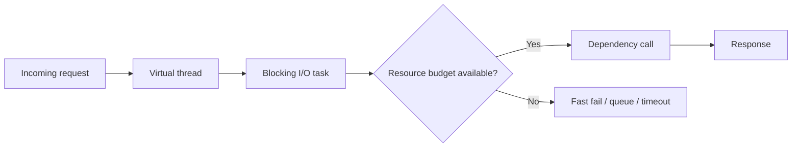

Virtual threads make blocking-style Java code viable at much higher concurrency, but they do not make the system unbounded.

That distinction matters. Virtual threads remove a lot of platform-thread scarcity. They do not remove the limits of databases, HTTP pools, downstream APIs, or CPU budgets.

The teams that get the most value from virtual threads are the ones that keep the simple programming model while remaining strict about resource control.

---

## Where Virtual Threads Fit Best

They are strongest when the work is:

- I/O-heavy
- easy to express in a request-per-task style
- previously burdened by callback complexity or oversized thread pools

Typical examples:

- endpoint fan-out to several downstream services
- background coordination tasks waiting on network or disk
- migration away from complicated asynchronous code that became hard to maintain

They are a weaker fit for CPU-bound work, where the bottleneck is not thread availability in the first place.

---

## The Real Architecture Rule

The useful mental model is:

- one virtual thread per request or subtask is fine
- one unbounded dependency flood is not

This is why virtual-thread adoption should always be paired with explicit dependency budgets.

If you do not cap scarce dependencies, the code may look beautifully simple while the system collapses under downstream saturation.

---

## A Good Starting Pattern: Readable Fan-Out

```java
try (var executor = Executors.newVirtualThreadPerTaskExecutor()) {
    Future<User> userFuture = executor.submit(() -> userClient.fetch(userId));
    Future<List<Order>> ordersFuture = executor.submit(() -> orderClient.fetchByUser(userId));

    User user = userFuture.get(400, TimeUnit.MILLISECONDS);
    List<Order> orders = ordersFuture.get(400, TimeUnit.MILLISECONDS);
    return new Dashboard(user, orders);
}
```

This is the kind of code virtual threads make attractive again:

- straightforward control flow
- parallel waiting
- no callback nesting
- timeouts still explicit

The readability win is real. Just do not confuse readable concurrency with infinite concurrency.

---

## Budget the Dependencies That Are Actually Scarce

If a service fans out to a dependency with a limited connection pool, a rate limit, or a fragile downstream SLO, that dependency still needs guarding.

```java
Semaphore inventoryBudget = new Semaphore(120);

public Inventory fetchInventory(String sku) throws Exception {
    inventoryBudget.acquire();
    try {
        return inventoryClient.fetch(sku);
    } finally {
        inventoryBudget.release();
    }
}
```

This matters because thousands of cheap virtual threads can still converge on one expensive bottleneck.

Without an explicit budget, virtual threads can make overload easier to trigger, not harder.

---

## Pinning Is the Subtle Failure Mode

Virtual threads can sometimes stay mounted to carrier threads longer than you expect.

Common causes include:

- broad `synchronized` blocks around blocking calls
- native or legacy code that prevents unmounting
- monitor-heavy libraries on hot paths

That means migration should include diagnostics, not just code changes.



This is the useful architecture picture: cheap concurrency at the caller, bounded capacity at the dependency.

---

## A Sensible Migration Path

Do not migrate the entire service in one go.

A better path is:

1. choose one read-heavy endpoint
2. keep the same downstream clients and timeout rules
3. add dependency budgets where needed
4. load test with JFR enabled
5. inspect latency, saturation, and pinning signals before broadening adoption

That keeps the migration empirical and reduces the risk of blaming or praising virtual threads for the wrong reason.

---

## What to Measure

The most important signals are usually not "how many virtual threads exist?"

They are:

- request latency under load
- downstream pool saturation
- timeout and rejection behavior
- pinned virtual thread events
- heap and memory behavior during bursts

If those are healthy, the migration is helping. If not, cheap thread creation is not the missing piece.

---

## When They Are the Wrong Optimization

Virtual threads are not a cure for:

- CPU-heavy computation
- unbounded retry storms
- poor timeout discipline
- under-sized or overloaded downstream resources

In those cases, the problem is usually capacity management or algorithmic cost, not the threading model.

> [!WARNING]
> If a service only becomes stable after adding semaphores, timeouts, and dependency budgets, that does not mean virtual threads failed. It means those controls were always necessary.

---

## Key Takeaways

- Virtual threads simplify blocking I/O concurrency, especially for request fan-out.
- They remove thread scarcity, not dependency scarcity.
- Resource budgets, timeouts, and pinning diagnostics should be part of every serious rollout.
- The best outcome is simpler code with the same or better operational control.
