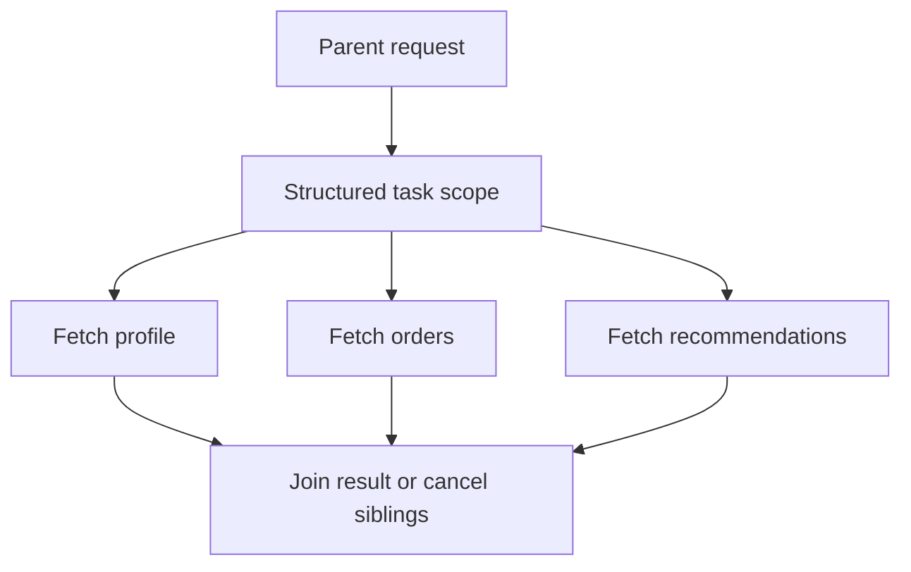

Structured concurrency matters because it turns "a few concurrent calls" into one owned unit of work.

Without that ownership, request handlers often leave behind exactly the kind of mess that is hard to observe in production:

- sibling tasks still running after the response is gone
- partial work completing after failure
- inconsistent cancellation behavior
- retries and timeouts that no longer share one budget

The real value of structured concurrency is not that it is newer concurrency syntax. It is that task lifetime becomes explicit.

---

## The Problem It Solves

Unstructured async code often grows like this:

1. fork several tasks
2. wait for some of them
3. one fails or times out
4. the request exits
5. other tasks continue anyway

That wastes capacity and makes debugging much harder because the work no longer has a clear owner.

Structured concurrency fixes that by saying: if the parent scope ends, the child work should also be resolved or cancelled within that same scope.

---

## Pattern 1: All Subtasks Are Mandatory

If the final response is only valid when every subtask succeeds, `ShutdownOnFailure` is a very strong fit.

```java
try (var scope = new StructuredTaskScope.ShutdownOnFailure()) {
    var profile = scope.fork(() -> profileClient.fetch(userId));
    var orders = scope.fork(() -> orderClient.fetchByUser(userId));
    var limits = scope.fork(() -> riskClient.fetchLimits(userId));

    scope.join();
    scope.throwIfFailed();

    return new Dashboard(profile.get(), orders.get(), limits.get());
}
```

This gives you a clean semantic boundary:

- one task fails
- sibling work is cancelled
- the caller sees one failure outcome

That is much easier to reason about than a collection of futures with ad hoc cancellation.

---

## Pattern 2: One Shared Deadline

Many request handlers quietly become unreliable because each downstream call has its own timeout policy and none of them reflect the real request budget.

Structured scopes make it easier to think in terms of one request deadline.

```java
Instant deadline = Instant.now().plusMillis(350);

try (var scope = new StructuredTaskScope.ShutdownOnFailure()) {
    var a = scope.fork(() -> serviceA.fetch(userId));
    var b = scope.fork(() -> serviceB.fetch(userId));

    scope.joinUntil(deadline);
    scope.throwIfFailed();

    return new Combined(a.get(), b.get());
}
```

That is not just cleaner code. It is a better operational contract: the subtasks live inside the same time budget as the request.

---

## Pattern 3: Partial Results Must Be a Policy, Not an Accident

Sometimes one dependency is optional. That is fine, but the rule should be designed explicitly.

Examples:

- profile and orders are mandatory
- recommendations are optional
- fraud decision is mandatory for checkout, optional for a preview screen

Once that policy is clear, the code can reflect it with separate scopes or fallback handling. What you want to avoid is accidental partial success caused by one branch failing quietly while the rest of the request keeps moving.

---

## A Useful Example: Aggregator Endpoints

An endpoint calls:

- `profile`
- `orders`
- `recommendations`

If all three are mandatory, one failed call should invalidate the combined result and cancel the siblings quickly.

If recommendations are optional, keep that policy visible in the code rather than burying it in exception handling.

This is where structured concurrency improves architecture clarity. It forces you to decide whether sibling tasks belong to the same lifecycle.



---

## Cancellation Only Helps if Dependencies Cooperate

One subtle point: scoped cancellation is only fully useful when downstream clients and libraries respect interruption, timeout, or cancellation signals.

If a child task keeps blocking despite scope cancellation, you have gained ownership semantics in the code but not yet in the runtime behavior.

That is why production rollout should verify:

- HTTP clients honor cancellation or short timeouts
- database calls have bounded wait behavior
- retry logic does not keep running after the parent request is already done

---

## What to Measure in Production

Good signals include:

- subtask latency by dependency
- cancellation counts
- timeout rates inside the scope
- orphan work reduction after migration
- downstream saturation during failures

The big win is not "more concurrency." It is cleaner failure behavior under concurrency.

> [!TIP]
> If you cannot explain which child tasks are mandatory, optional, or cancel-on-failure, the concurrency model is still underdesigned.

---

## When Structured Concurrency Is the Wrong Shape

Avoid forcing it where the tasks do not actually share one lifecycle.

For example:

- fire-and-forget work that should be explicitly handed to a queue
- background processing owned by a different subsystem
- tasks whose retry policy outlives the request by design

If the parent request does not own the outcome, it probably should not own the scope either.

---

## Key Takeaways

- Structured concurrency is mainly about task ownership and lifecycle correctness.
- It works best when related subtasks truly belong to one request or workflow.
- Shared deadlines and cancellation policy should be visible at the scope boundary.
- Partial results are fine when they are explicit policy, not accidental behavior.
