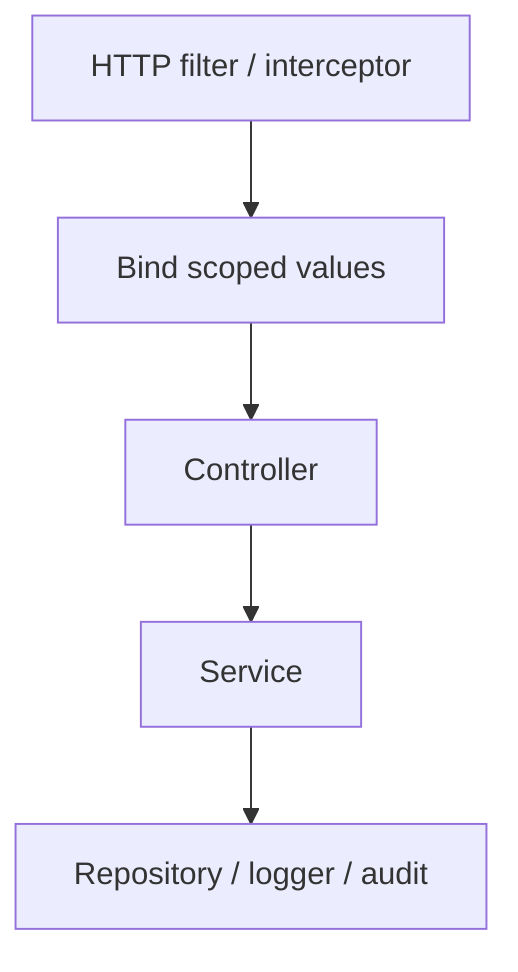

Scoped values are useful because they make request context feel like scoped input instead of hidden thread state.

That is the real improvement over many `ThreadLocal` usages. The problem with request context was rarely "we need a place to put the request ID." The problem was that the lifetime and ownership of that context were easy to get wrong.

---

## Why `ThreadLocal` Starts to Hurt

`ThreadLocal` is often acceptable in small code paths, but it becomes fragile in larger concurrent systems because it encourages:

- implicit state instead of explicit boundaries
- cleanup mistakes on pooled threads
- confusing behavior at async boundaries
- context that outlives the request that created it

Scoped values improve this by making context lifetime lexical and visible in the code.

---

## The Right Use Case: Cross-Cutting Metadata

Good candidates for scoped values are things that are:

- request-scoped
- immutable for the duration of the request
- needed across many layers

Examples:

- request ID
- trace or correlation ID
- tenant ID
- authenticated principal identifier

What does not belong there:

- mutable domain state
- large request payloads
- objects that should be passed as ordinary parameters

If the data is business input rather than cross-cutting metadata, pass it explicitly.

---

## The Basic Pattern Is Intentionally Simple

```java
static final ScopedValue<String> REQUEST_ID = ScopedValue.newInstance();

void handle(Request req) {
    String requestId = req.header("X-Request-Id");
    ScopedValue.where(REQUEST_ID, requestId).run(() -> {
        serviceA();
        serviceB();
    });
}

void serviceA() {
    logger.info("requestId={}", REQUEST_ID.get());
}
```

The important part is not the syntax. It is that the context is only valid inside the bound scope.

That makes it much harder for one request to accidentally leak state into another.

---

## This Works Especially Well With Virtual Threads

Scoped values fit naturally with modern request-per-task designs because they preserve the idea that request context belongs to one bounded unit of work.

```java
static final ScopedValue<String> TENANT = ScopedValue.newInstance();

try (var exec = Executors.newVirtualThreadPerTaskExecutor()) {
    exec.submit(() -> ScopedValue.where(TENANT, "tenant-a").run(() -> {
        billingService.charge();
        auditService.record();
    }));
}
```

That keeps context propagation readable without pushing metadata through every method signature.

---

## Keep Bindings at Entry Points

The best place to bind scoped values is usually at a protocol boundary:

- HTTP filter
- gRPC interceptor
- message listener entry point

That is where request context is first known and where its lifetime should begin.

Deep business code should mostly consume scoped metadata, not decide when it starts existing.

---

## A Practical Request Flow

For an HTTP request:

1. extract `X-Request-Id` and tenant information
2. bind scoped values in the filter or entry layer
3. let controllers and services read them where needed
4. return the response
5. allow the scope to end automatically

That is a much healthier model than "set some thread locals and hope cleanup always happens."



---

## Fail Fast When Context Is Required

If a method truly requires context, do not silently default it away.

For example, a missing request ID or tenant binding in a path that depends on it should be treated as a programming error or boundary bug, not as an invitation to invent fallback values.

That keeps context propagation honest.

---

## Test for Isolation, Not Just Happy Path Access

The strongest tests are not "can I read the request ID?"

They are:

- two concurrent requests do not see each other's values
- reused threads do not carry old context
- missing scoped bindings fail predictably

That is the class of bug scoped values are best at preventing.

> [!TIP]
> Scoped values are a good fit when the data is truly metadata. If reviewers start seeing business decisions depend on hidden scoped objects, the design is drifting.

---

## Key Takeaways

- Scoped values make request context lifetime explicit and bounded.
- They are best for immutable cross-cutting metadata, not business payload transport.
- Bind them at request entry points and let scope end automatically.
- Their biggest win is isolation and clarity, especially in concurrent code.
