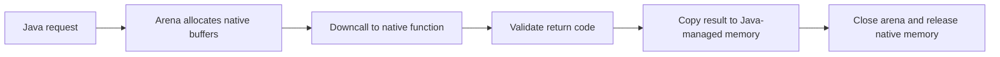

The Foreign Function and Memory API is most interesting when you already know why you need a native boundary and you want that boundary to be smaller, safer, and easier to reason about than JNI glue.

It is not a reason to start using native code casually. It is a better way to manage native interop when the interop is already justified.

---

## When FFM Is Actually the Right Tool

FFM is a strong fit when:

- you need to call a focused native C API from Java
- JNI glue is becoming expensive to maintain
- off-heap memory ownership needs to be explicit

It is a weak fit when the system does not truly need native interop. If a pure Java library solves the problem well enough, that is usually still the simpler and safer choice.

---

## The Important Mental Model: Ownership

Most FFM mistakes are not about syntax. They are about memory lifetime and boundary discipline.

The key pieces matter because they describe ownership:

- `Linker` creates downcall handles
- `SymbolLookup` resolves native symbols
- `FunctionDescriptor` declares the native signature
- `Arena` defines memory lifetime
- `MemorySegment` represents native memory with bounds and scope checks

If you remember only one thing, remember this: ownership is the design, not an implementation detail.

---

## A Small Example: Calling `strlen`

```java
import java.lang.foreign.*;
import java.lang.invoke.MethodHandle;

import static java.lang.foreign.ValueLayout.*;

public final class NativeStringLength {

    private static final Linker LINKER = Linker.nativeLinker();
    private static final SymbolLookup LOOKUP = LINKER.defaultLookup();
    private static final MethodHandle STRLEN;

    static {
        try {
            MemorySegment symbol = LOOKUP.find("strlen")
                    .orElseThrow(() -> new IllegalStateException("strlen symbol not found"));

            STRLEN = LINKER.downcallHandle(
                    symbol,
                    FunctionDescriptor.of(JAVA_LONG, ADDRESS)
            );
        } catch (Throwable t) {
            throw new ExceptionInInitializerError(t);
        }
    }

    public static long length(String s) throws Throwable {
        try (Arena arena = Arena.ofConfined()) {
            MemorySegment cString = arena.allocateUtf8String(s);
            return (long) STRLEN.invokeExact(cString);
        }
    }
}
```

The call itself is not the interesting part. The interesting part is that the native memory has a clear scope and is reclaimed when the arena closes.

---

## Keep Native Scopes Small

A good FFM rule is to allocate native memory in the smallest practical scope.

That means:

- do not return `MemorySegment` instances backed by closed arenas
- avoid sharing confined memory across threads casually
- copy data back to safer Java structures when the boundary ends

This is the kind of ownership discipline JNI often obscures.

---

## A Better Production Use Case: Narrow Gateways

The cleanest architecture is usually:

- one Java-facing interface
- one small native gateway implementation
- explicit translation between Java types and native memory
- immediate mapping of native errors into typed Java failures

That keeps the native surface narrow and makes rollback or replacement realistic.

For example, a native compression or hashing library can sit behind one boundary instead of spreading native assumptions throughout the codebase.

---

## JNI to FFM Migration Should Be Incremental

If the system already uses JNI, do not migrate by scattering FFM calls everywhere.

A safer path is:

1. isolate the existing native boundary behind an interface
2. build an FFM implementation with the same contract
3. validate correctness with compatibility tests
4. benchmark both paths under realistic load
5. rollout behind a feature flag

That turns migration into a boundary swap instead of an application-wide rewrite.

---

## A Practical Runtime Flow

Imagine a service calling a native compression library:

1. request arrives with `byte[]` input
2. Java allocates input and output segments inside an arena
3. a downcall invokes native `compress(...)`
4. the return code is checked immediately
5. compressed bytes are copied back to heap-managed Java memory
6. the arena closes and native buffers are released

That is a good model because success and cleanup stay close together.



---

## What to Be Careful About

FFM deserves extra care around:

- signature mismatches
- buffer sizes and length validation
- thread ownership of confined memory
- crash behavior when native code misbehaves
- native dependency packaging and rollout

The API improves Java-side safety, but it does not make native code magically harmless.

> [!WARNING]
> If the native library can crash the process, the safest Java wrapper in the world still needs a rollout and fallback story.

---

## Key Takeaways

- FFM is a better native boundary tool, not a reason to add native dependencies casually.
- The core design concern is memory and ownership lifetime.
- Keep native interop narrow, well-wrapped, and easy to test.
- Migrate from JNI gradually, with interface-level validation and rollback options.
