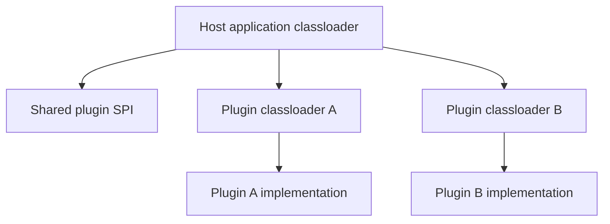

A Java plugin system is rarely limited by how quickly it can load a JAR. The real challenge is whether the host can isolate plugin dependencies, control lifecycle cleanly, and unload plugins without leaving half the runtime behind.

That is why plugin architecture is mainly a classloader problem and a resource-ownership problem.

---

## Start With the Boundary Model

A practical plugin design usually has three layers:

- the host application classloader
- a small shared SPI loaded by the host
- one dedicated classloader per plugin implementation

Only the SPI should cross that boundary.

If implementation classes, plugin-private dependencies, or host internals start leaking across layers, the system stops being meaningfully isolated even if the word "plugin" still appears in the code.



---

## The Shared API Must Be Small and Stable

This is the most important design choice.

If the shared plugin API grows too broad, plugins become tightly coupled to host internals and classloader isolation becomes harder to maintain.

A good SPI is:

- narrow
- versioned intentionally
- stable across plugin upgrades
- free of implementation-specific host types

That makes it possible for the host to load, start, stop, and replace plugins without turning every release into a coordination event.

---

## Loading Is Easy; Correct Loading Is Harder

```java
URL jarUrl = pluginJar.toUri().toURL();
try (URLClassLoader loader = new URLClassLoader(new URL[]{jarUrl}, hostApiClassLoader)) {
    Class<?> implClass = Class.forName("com.example.plugins.InvoicePlugin", true, loader);
    Plugin plugin = (Plugin) implClass.getDeclaredConstructor().newInstance();
    plugin.start(context);
}
```

The critical rule here is that `Plugin` must come from the shared parent API loader, not from a plugin-private copy.

If that boundary is wrong, you can get `ClassCastException` even when the class names appear identical.

---

## Parent-First or Child-First Is a Policy Choice

There is no universal answer, but the trade-off should be deliberate.

### Parent-first

Usually simpler and safer when:

- JDK types and shared platform libraries should be consistent
- the host owns more of the runtime surface
- plugin dependency conflicts are controlled with shading

### Child-first

Useful when:

- plugins need stronger library isolation
- the host should not accidentally dominate plugin dependencies

But it increases surprise and conflict risk.

For many enterprise plugin systems, parent-first plus carefully shaded plugin dependencies is the more predictable option.

---

## Lifecycle Is Not Optional

A plugin should not just be loadable. It should be governable.

```java
public interface Plugin {
    void start(PluginContext context) throws Exception;
    void stop() throws Exception;
}
```

The host also needs to own plugin-associated resources:

- executors
- scheduler tasks
- network clients
- file watchers
- caches

If a plugin can create long-lived resources without the host being able to track and stop them, unload safety is already compromised.

---

## Safe Reload Is Mostly About Draining

A realistic reload sequence looks like this:

1. mark the plugin as draining
2. stop routing new work to it
3. call `stop()` with a timeout
4. verify plugin-owned threads and resources are gone
5. close the plugin classloader
6. load the new version in a fresh classloader

If step 4 fails, the correct response is often to leave the plugin disabled rather than pretending unload succeeded.

---

## The Real Failure Modes

The nastiest plugin incidents are usually:

- `ClassCastException` due to duplicated shared types
- metaspace growth from classloader leaks
- static caches holding plugin classes or classloaders
- non-daemon or forgotten threads preventing clean unload
- library conflicts between plugins and host

These are not edge cases. They are what plugin systems tend to fail on when the architecture is only load-path deep.

> [!WARNING]
> If you cannot repeatedly reload a plugin in staging without metaspace growth or lingering threads, the system is not yet safe to call dynamically extensible.

---

## What to Observe in Production

Useful operational signals include:

- plugin state transitions such as `LOADED`, `STARTED`, `DRAINING`, `STOPPED`, `FAILED`
- per-plugin health and error counts
- number of live plugin classloaders
- metaspace trend over repeated reloads
- plugin-owned thread count

A plugin platform should be observable as a platform, not just as a bag of loaded code.

---

## Key Takeaways

- Plugin architecture is fundamentally about classloader boundaries and lifecycle ownership.
- The shared SPI should stay narrow and stable.
- Safe unload requires explicit control over plugin-created resources.
- A design is only truly extensible if reload, conflict isolation, and failure containment work in practice.
