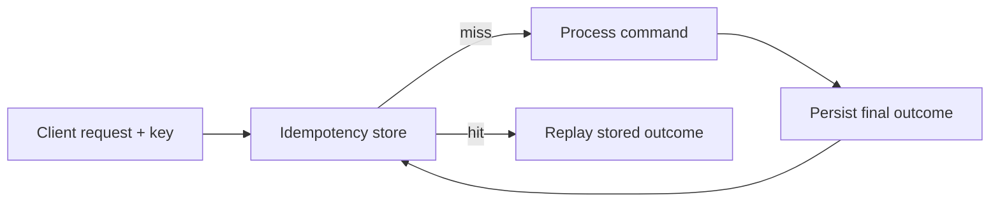

Retries are normal in distributed systems. The network times out, clients retry, load balancers replay, and users press submit again.

That is why "exactly once" is usually not a transport property you can simply switch on. In practice, the safer and more useful goal is an effectively-once business outcome built from:

- at-least-once delivery or retries
- idempotent processing
- durable deduplication at the right boundary

---

## What Exactly-Once Usually Means in Practice

End-to-end global exactly-once behavior is rarely the real thing systems achieve.

What they usually achieve is:

- duplicates may arrive
- replays may happen
- the system recognizes them and produces the same final business result

That distinction matters because it shifts the design away from wishful messaging semantics and toward explicit deduplication.

---

## The API Boundary Is the Best Place to Start

For create-like endpoints such as payments, orders, or bookings, the normal pattern is:

- client sends an `Idempotency-Key`
- server stores the key, payload identity, and final response
- a retry with the same key and same payload replays the original result
- a retry with the same key but different payload is rejected

```java
public Response createPayment(String idemKey, PaymentCommand cmd) {
    String payloadHash = hash(cmd);

    IdempotencyRecord existing = idemRepository.find(idemKey);
    if (existing != null) {
        if (!existing.payloadHash().equals(payloadHash)) {
            return Response.status(409).body("Idempotency key reused with different payload");
        }
        return Response.fromStored(existing.responseCode(), existing.responseBody());
    }

    PaymentResult result = paymentService.process(cmd);
    idemRepository.insert(idemKey, payloadHash, result.statusCode(), result.body());
    return Response.status(result.statusCode()).body(result.body());
}
```

The important design choice here is that the stored result is not just "seen." It is the prior decision that should be replayed.

---

## Store Enough to Replay Deterministically

An idempotency table should usually capture:

- the key
- a canonical payload hash
- the response status
- the response body or equivalent outcome
- the creation timestamp

```sql
create table idempotency_record (
  idem_key varchar(128) primary key,
  payload_hash char(64) not null,
  status_code int not null,
  response_body text not null,
  created_at timestamp not null
);
```

This lets retries get the same result instead of re-running the business logic and hoping everything lines up the same way.

---

## Scope the Key Correctly

One of the easiest design mistakes is making the key too global or too vague.

Usually the scope should reflect something like:

- endpoint
- tenant
- client
- key

That prevents collisions and makes the business meaning of replay much clearer.

---

## Payload Equality Must Be Canonical

If the same key appears with different payload meaning, that should be rejected.

This only works well if the payload hash is based on canonicalized content rather than formatting differences such as:

- JSON field order
- whitespace
- equivalent but differently ordered lists where order is not semantic

The point is to compare business intent, not wire-format trivia.

---

## The Same Thinking Applies to Consumers

For Kafka or queue consumers, the equivalent pattern is:

- stable event ID
- processed-event store
- idempotent application of the side effect

If the same message is replayed, the consumer should no-op safely instead of assuming the broker somehow prevented all duplication.

---

## Side Effects Must Be Part of the Same Conversation

An endpoint is not truly idempotent if the database write is deduplicated but the webhook, email, or ledger write is not.

That is why idempotency design should include:

- external side effects
- downstream calls
- observable response replay behavior

If a retry can still send a second email or trigger a second external call, the user-visible outcome is not actually repeat-safe.



---

## Retention Should Match Business Reality

Very short retention windows often create false confidence.

If clients can retry for hours or external workflows can replay later, the deduplication record should live long enough to protect the business operation through that window.

This is why key expiry should be based on retry behavior and business risk, not on arbitrary cleanup convenience.

> [!TIP]
> If the cost of a duplicate action is high, the idempotency retention window should be conservative rather than minimal.

---

## Key Takeaways

- "Exactly once" in practice usually means effectively-once business behavior through idempotency.
- The API or state boundary should own deduplication explicitly.
- Store enough information to replay the original decision, not just to mark a key as seen.
- Include side effects and retention policy in the idempotency design, not just the request row.
