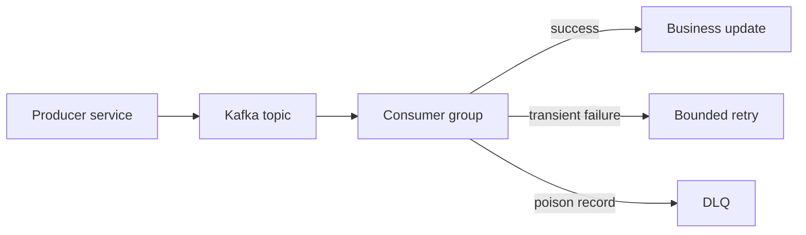

---
categories:
- Java
- Backend
date: 2026-05-28
seo_title: Event-Driven Architecture with Kafka Java Guide
seo_description: Build event-driven Java systems with contract-first topics and scalable
  consumers.
tags:
- java
- kafka
- event-driven
- microservices
title: Event-Driven Architecture with Kafka and Java
toc: true
toc_icon: cog
toc_label: In This Article
header:
  overlay_image: "/assets/images/java-advanced-generic-banner.svg"
  overlay_filter: 0.35
  show_overlay_excerpt: false
  caption: Asynchronous Contract-Driven Service Communication
---
Kafka makes asynchronous integration easier to scale, but it does not make event-driven architecture automatically clean.

That cleanliness comes from treating topics as owned contracts with explicit replay, versioning, and failure behavior. Without that, Kafka can become a high-throughput way to spread ambiguity.

---

## Topics Are Product Interfaces

For each topic, someone should be able to answer:

- what business fact this event represents
- who owns publishing it
- what the schema compatibility rules are
- what keying and ordering guarantees consumers may rely on
- how replay is expected to behave

That is what makes a topic a contract instead of just a transport channel.

---

## Events Should Be Facts, Not Wishful Read Models

The strongest events usually describe something that happened:

- `OrderCreated`
- `PaymentCaptured`
- `InventoryReserved`

They are weaker when they behave more like unstable read models or commands disguised as events.

Consumers tolerate replay and delayed delivery much better when the event represents a durable domain fact rather than a mutable projection.

---

## Partition Keys Define Real Behavior

Key choice is not a minor producer detail. It defines ordering and scaling behavior.

Examples:

- key by `orderId` if per-order ordering matters
- key by `customerId` if customer-level ordering matters
- avoid random keys if consumers depend on sequence

The trade-off is that low-cardinality or skewed keys can create hot partitions, so keying is always both a correctness and capacity decision.

---

## Producers Need a Reliability Story

```java
ProducerRecord<String, byte[]> record =
        new ProducerRecord<>("orders.events.v1", orderId, payloadBytes);

producer.send(record, (metadata, ex) -> {
    if (ex != null) {
        // persist failure signal, trigger retry pipeline or alert
    }
});
```

For critical flows, a send callback alone is not the whole story. The producer side should also answer:

- what happens if the publish fails after local state changes
- whether an outbox or equivalent pattern is needed
- how publish failure is surfaced operationally

That is why event-driven design often pairs naturally with the outbox pattern.

---

## Consumers Must Be Replay-Tolerant

Even with ordering guarantees, consumers should expect:

- duplicate delivery
- delayed delivery
- replay from an older offset

That means consumer logic should usually be idempotent:

```java
if (processedEventStore.exists(eventId)) {
    return;
}

applyBusinessUpdate(event);
processedEventStore.markProcessed(eventId);
```

Kafka can help with durability and ordering. It does not remove the need for safe reprocessing.

---

## Retry, DLQ, and Replay Need Explicit Rules

Different failure types deserve different handling:

- transient dependency problems: bounded retry with backoff
- malformed payload or schema mismatch: fail fast to DLQ
- repeated business-rule failure: DLQ plus alert and investigation

Infinite retry on poison messages is one of the fastest ways to turn a topic into a stalled partition with mounting lag.



---

## A Better Incident Drill

If `inventory-service` becomes slow and an order consumer depends on it:

- lag should rise visibly
- retries should stay bounded
- poison records should move to DLQ if they are not recoverable
- replay should remain possible after the dependency recovers

That is a healthier model than blocking the whole flow indefinitely while pretending the pipeline is still "real time."

---

## What to Measure

High-signal operational metrics include:

- consumer lag by topic and partition
- processing latency
- retry counts
- DLQ rate and top failure reasons
- producer error rate and publish latency
- rebalance frequency

These metrics tell you whether the event system is staying accountable under failure, not just whether bytes are still moving.

---

## Key Takeaways

- Kafka works best when topics are treated as owned, versioned contracts.
- Partition keys define both ordering guarantees and scaling trade-offs.
- Consumers should be replay-tolerant and idempotent by design.
- Retry, DLQ, and replay behavior are core architecture decisions, not operational afterthoughts.
