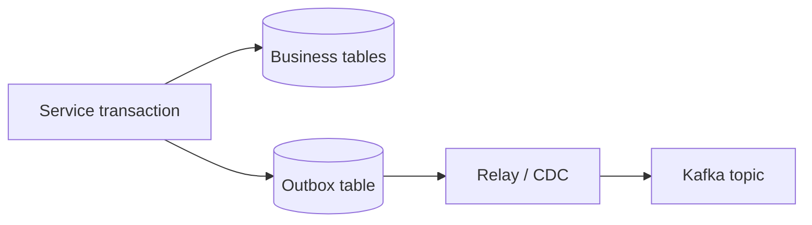

---
categories:
- Java
- Backend
date: 2026-05-29
seo_title: Outbox Pattern Java Microservices Guide
seo_description: Guarantee reliable event publication with transactional outbox architecture
  in Java.
tags:
- java
- outbox-pattern
- microservices
- kafka
title: Outbox Pattern in Java Microservices
toc: true
toc_icon: cog
toc_label: In This Article
header:
  overlay_image: "/assets/images/java-advanced-generic-banner.svg"
  overlay_filter: 0.35
  show_overlay_excerpt: false
  caption: Reliable Event Publication with Transactional Boundaries
---
The outbox pattern exists because dual writes fail in ordinary, boring ways.

If a service commits business state to the database and then separately publishes an event, there is always a gap where one succeeds and the other does not. The outbox turns that one hard cross-system problem into:

- one local transaction
- one replayable publication step

That is why it remains one of the most practical reliability patterns in microservices.

---

## The Real Problem Is the Gap

Without an outbox:

1. the order row commits
2. the process crashes before the Kafka publish succeeds
3. downstream services never hear about the order

Now the system has locally correct state and globally inconsistent behavior.

The outbox pattern closes that gap by making "intent to publish" part of the same database transaction as the business change.

---

## The Transaction Boundary Should Be Boring

Inside one transaction:

- write the domain state
- write the outbox row

```java
@Transactional
public void createOrder(CreateOrderCommand cmd) {
    Order order = orderRepository.save(Order.from(cmd));

    OutboxEvent event = OutboxEvent.create(
            UUID.randomUUID().toString(),
            "orders.events.v1",
            order.getId().toString(),
            "OrderCreated",
            serialize(new OrderCreated(order.getId(), order.getVersion()))
    );

    outboxRepository.save(event);
}
```

After that, a relay or CDC pipeline can publish the outbox rows independently.

That is the core simplification: publication becomes replayable because the intent is already durable.

---

## The Relay Is Supposed to Be At-Least-Once

The relay should be simple and replay-safe:

```java
List<OutboxEvent> batch = outboxRepository.fetchPending(limit);
for (OutboxEvent event : batch) {
    try {
        broker.publish(event.topic(), event.eventKey(), event.payload(), event.id());
        outboxRepository.markSent(event.id(), Instant.now());
    } catch (Exception ex) {
        outboxRepository.recordFailure(event.id(), ex.getMessage());
    }
}
```

This is intentionally at-least-once. If the relay crashes after publish but before marking the row sent, the event may be published again after restart.

That is normal, and it is why downstream idempotency is still part of the design.

---

## Outbox Schema Should Support Operations, Not Just Storage

An outbox row should usually include:

- event ID
- aggregate type and ID
- event type
- topic
- event key
- payload
- publication status
- creation and publication timestamps

```sql
create table outbox_event (
  id varchar(64) primary key,
  aggregate_type varchar(64) not null,
  aggregate_id varchar(128) not null,
  event_type varchar(128) not null,
  topic varchar(128) not null,
  event_key varchar(128) not null,
  payload jsonb not null,
  status varchar(16) not null,
  created_at timestamp not null,
  published_at timestamp null
);
```

That metadata is not just useful for code. It is how operators understand lag, retries, and publication drift.

---

## Ordering Still Needs Attention

If consumers need per-aggregate ordering:

- use the aggregate ID as the event key
- publish pending rows in created order
- keep retry behavior from scrambling the logical sequence

The outbox solves reliable publication intent. It does not remove the need to think about event ordering semantics.

---

## The Best Failure Drill

The most realistic drill is:

1. publish succeeds
2. relay crashes before marking the outbox row as sent
3. relay restarts and republishes
4. consumer deduplicates by event ID

If the consumer cannot tolerate that replay, the system is not actually complete yet. The outbox gives you reliable publication intent, but consumer idempotency still closes the loop.



---

## Lag Is a First-Class Incident Signal

Useful outbox metrics include:

- pending outbox count
- age of the oldest pending row
- relay publish failures
- relay throughput
- backlog by event type or topic

An outbox that is quietly accumulating lag is already a reliability incident, even if the main write path still looks healthy.

> [!TIP]
> Treat outbox backlog age the way you treat consumer lag. It is a delayed-integrity signal, not just an internal implementation detail.

---

## Key Takeaways

- The outbox pattern solves the dual-write gap by making publish intent transactional.
- The relay should be replay-safe and is normally at-least-once.
- Consumer idempotency is still required because republish after relay failure is expected behavior.
- Outbox lag and failure metrics are part of the architecture, not optional ops extras.
