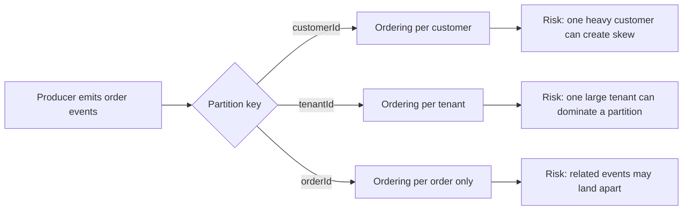

Part 1 is about getting honest about the trade-off. A Kafka partition key is not a minor producer detail. It decides where ordering exists, where load concentrates, and which customers will be first to feel pain when traffic becomes uneven.

In this first pass, we deliberately do not "fix" hotspots. We establish the baseline keying model, measure skew, and make the ordering requirement explicit. If you skip that step, every later mitigation becomes guesswork.

## The Real Design Question

Most teams start with a sentence like "we need ordering." That is too vague to guide key selection.

The useful question is narrower:

- do you need ordering per user, per tenant, per account, or per aggregate
- do you need strict ordering for every event, or only within a subset of lifecycle transitions
- what happens operationally if one high-volume key dominates one partition

If the key is too coarse, unrelated work gets serialized. If the key is too fine, you lose the ordering boundary the business actually depends on.

## A Concrete Failure Mode

Imagine a multi-tenant commerce platform:

- normal tenants create a few hundred order events per minute
- one enterprise tenant creates tens of thousands during a flash sale
- downstream consumers update inventory and customer-visible order status

If events are keyed by `tenantId`, all of that tenant's traffic is pinned to one partition. Ordering is preserved, but one partition now carries a disproportionate share of work. Lag for that tenant grows first, then retry storms and consumer backpressure follow.

That is why partition-key design is both a correctness decision and a capacity decision.

## What to Measure Before Changing Anything

For the baseline, you want evidence, not opinion. Capture:

- records produced per partition
- consumer lag per partition
- end-to-end latency for hot keys versus normal keys
- the percentage of total traffic owned by the busiest partition

One useful internal threshold is simple: if one partition consistently carries a multiple of the median partition load, you already have a distribution problem even if the cluster is not yet failing.

> [!important]
> A balanced cluster can still hide a bad key strategy during normal traffic. The key is only proven under skew, not under average load.

## Local Baseline Setup

### Prerequisites

- Docker Desktop
- Java 21
- Kafka CLI tools

### Local Stack

~~~yaml
services:
  zookeeper:
    image: confluentinc/cp-zookeeper:7.6.1
    environment:
      ZOOKEEPER_CLIENT_PORT: 2181

  kafka:
    image: confluentinc/cp-kafka:7.6.1
    depends_on: [zookeeper]
    ports: ["9092:9092"]
    environment:
      KAFKA_BROKER_ID: 1
      KAFKA_ZOOKEEPER_CONNECT: zookeeper:2181
      KAFKA_LISTENERS: PLAINTEXT://0.0.0.0:9092
      KAFKA_ADVERTISED_LISTENERS: PLAINTEXT://localhost:9092
      KAFKA_OFFSETS_TOPIC_REPLICATION_FACTOR: 1
~~~

~~~bash
docker compose up -d
kafka-topics --bootstrap-server localhost:9092 \
  --create \
  --topic orders.events \
  --partitions 6 \
  --replication-factor 1
~~~

## Producer Baseline

Start with the plain business key you think you need. Here we use `customerId` because the requirement is "preserve order within one customer's order lifecycle."

~~~java
public ProducerRecord<String, String> toRecord(OrderEvent event) {
    String payload = objectMapper.writeValueAsString(event);
    return new ProducerRecord<>("orders.events", event.customerId(), payload);
}
~~~

That is enough for Part 1. Do not jump to salted keys or custom partitioners yet. First prove whether the natural key is actually a problem.

## Simulate Skew Instead of Assuming It

Run a baseline workload with mostly even traffic, then a skewed workload where one customer dominates.

~~~java
for (int i = 0; i < 100_000; i++) {
    String customerId = (i % 10 == 0) ? "customer-hot" : "customer-" + (i % 500);
    OrderEvent event = new OrderEvent(customerId, "order-" + i, "CREATED");
    producer.send(toRecord(event));
}
producer.flush();
~~~

This does not model every production workload, but it is enough to expose whether one key can monopolize a partition.

## How to Observe Partition Skew

Kafka itself will not give you the whole story unless you look per partition. At minimum:

~~~bash
kafka-consumer-groups --bootstrap-server localhost:9092 \
  --group orders-cg \
  --describe
~~~

If you have application metrics, add partition-level counters or logs around record handling:

~~~java
for (ConsumerRecord<String, String> record : records) {
    metrics.counter(
        "orders.consumer.partition.records",
        "partition", Integer.toString(record.partition())
    ).increment();
}
~~~

That turns "we think partition 2 is hot" into something you can actually verify.

## What Healthy Looks Like

At this stage, success is not "no skew ever appears." Success is:

- the ordering boundary is explicit
- the hottest partition is identifiable
- the skew is measurable enough to compare against later mitigations
- the team can explain why the chosen key exists

If you cannot explain the business invariant behind the key, you are not ready to redesign it.

## Common Mistakes in This Phase

### Using a key nobody can defend

Teams often inherit a key because "that is what the first version used." When traffic changes, nobody remembers whether the key protects a real invariant or an accidental one.

### Looking only at total lag

Group lag can stay acceptable while one partition is already in trouble. Hotspot diagnosis starts with partition-level visibility.

### Jumping straight to mitigation

Salted keys, repartitioning, and custom partitioners all add cognitive and operational cost. They are justified only after the baseline shows a real imbalance.

## What This Part Should Leave You With

By the end of Part 1, you should be able to answer three questions confidently:

1. What exact unit of ordering do we require?
2. Which key currently enforces that ordering?
3. How uneven is the resulting partition distribution under skew?

That baseline is the foundation for every mitigation that comes next. Without it, hotspot work becomes folklore instead of engineering.
