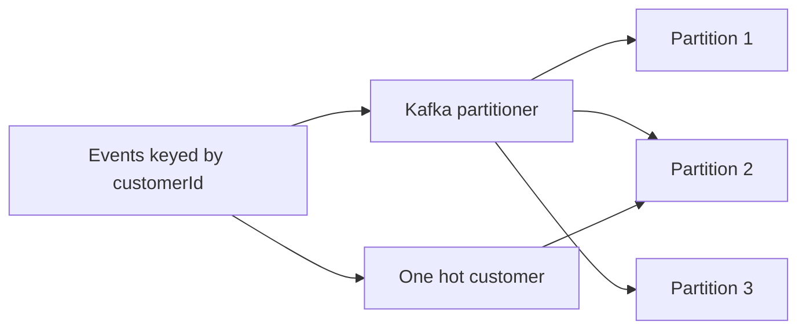

Part goal: **Build the baseline partition-key strategy and measure skew**.

---

## Problem 1: Keep Ordering Without Creating Hot Partitions

Problem description:
Kafka preserves ordering only within a partition, so key choice directly affects both correctness and load distribution.

What we are solving actually:
We are solving a trade-off between ordering guarantees and partition balance.
If we key too broadly, we lose useful ordering. If we key too narrowly, one hot tenant or customer can overload a single partition.

What we are doing actually:

1. Start with a business key that preserves the ordering we truly need.
2. Observe how that key maps traffic across partitions.
3. Measure whether a real hotspot appears before “optimizing” the strategy.

## Real-World Scenario

A single high-volume tenant overloads one partition, creating lag spikes and delayed processing for that key.

---

## Run It Locally

### Prerequisites

- Docker Desktop
- Java 21
- Kafka CLI tools

### Local Stack

~~~yaml
services:
  zookeeper:
    image: confluentinc/cp-zookeeper:7.6.1
    environment:
      ZOOKEEPER_CLIENT_PORT: 2181

  kafka:
    image: confluentinc/cp-kafka:7.6.1
    depends_on: [zookeeper]
    ports: ["9092:9092"]
    environment:
      KAFKA_BROKER_ID: 1
      KAFKA_ZOOKEEPER_CONNECT: zookeeper:2181
      KAFKA_LISTENERS: PLAINTEXT://0.0.0.0:9092
      KAFKA_ADVERTISED_LISTENERS: PLAINTEXT://localhost:9092
      KAFKA_OFFSETS_TOPIC_REPLICATION_FACTOR: 1
~~~

~~~bash
docker compose up -d
~~~

---

## Lab Steps

1. Create `orders.events` with 6 partitions.
2. Publish events keyed by `customerId`.
3. Consume with one group and capture lag per partition.

---

## Runnable Code Block

~~~java
String key = order.customerId();
ProducerRecord<String, String> rec =
    new ProducerRecord<>("orders.events", key, payload);
producer.send(rec);
~~~

---

## Verify

~~~bash
kafka-topics --bootstrap-server localhost:9092 --create --topic orders.events --partitions 6 --replication-factor 1
kafka-consumer-groups --bootstrap-server localhost:9092 --group orders-cg --describe
~~~

---

## Failure Drill

Send 70% traffic for one customerId. Verify one partition lags heavily.

---

## Debug Steps

Debug steps:

- record per-partition lag, not just total group lag
- confirm the chosen key actually matches the ordering requirement
- replay a skewed workload to see whether one tenant dominates one partition
- avoid changing key strategy before you have a measured baseline

## Operational Note

The baseline experiment is worth keeping around even after mitigation work starts.
Teams often forget what “normal skew” looked like before redesigning keys, which makes later tuning debates subjective instead of evidence-based.

## What You Should Learn

- partition-key design is a correctness and load-distribution decision at the same time
- a clean baseline measurement is necessary before applying mitigation strategies
- hotspot diagnosis starts with per-partition lag and skew visibility

---

## Operator Prompt

For kafka partition strategy for ordering and hotspot mitigation (part 1), keep one rollout question in the runbook: what metric tells us the topology is healthy, and what metric tells us to stop or roll back? Kafka systems usually fail operationally before they fail conceptually.

---

## Final Operations Note

One more practical rule helps this series topic stay useful in real systems: always pair the design with one rollback move and one "healthy again" signal. In Kafka, teams often know how to add topology complexity faster than they know how to back out safely, and that gap is exactly where routine changes turn into incidents.
