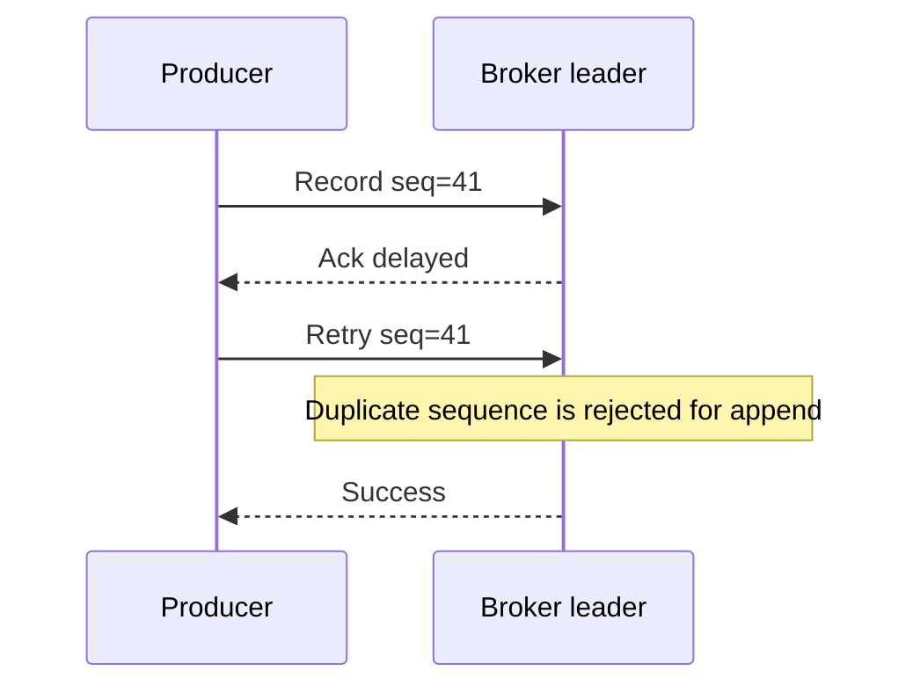

Part 1 is about drawing the first boundary correctly. Idempotent producers are extremely valuable, but they solve a narrower problem than many teams assume. They suppress duplicate appends caused by producer retries. They do not magically make a distributed workflow exactly-once.

That difference matters in production because the config is easy to enable, the guarantee is easy to overstate, and the resulting confusion usually shows up during incident review.

## What Idempotence Actually Protects

The classic failure looks like this:

1. the producer sends a record
2. the broker writes it
3. the acknowledgement is delayed, dropped, or times out
4. the producer retries
5. without idempotence, the same logical record can be appended twice

With idempotence enabled, Kafka tracks producer sequence information so the retry does not create a duplicate append on the broker.

That is a meaningful guarantee, but it lives at the producer-to-broker write path. It does not say anything yet about consumer retries, external side effects, or end-to-end deduplication.

## What It Does Not Protect

Idempotence does not fix:

- a consumer writing the same database row twice
- an HTTP side effect being retried downstream
- a producer sending a semantically duplicate business event with a new key
- application bugs that publish the same event twice before Kafka sees it

> [!warning]
> "We turned on `enable.idempotence=true`" should never be rewritten in team language as "duplicates are impossible now."

That sentence causes a surprising number of bad architectural assumptions.

## The Producer Settings That Belong Together

Idempotence works best when the producer settings are treated as one safety bundle instead of one isolated flag.

~~~java
Properties props = new Properties();
props.put(ProducerConfig.BOOTSTRAP_SERVERS_CONFIG, "localhost:9092");
props.put(ProducerConfig.KEY_SERIALIZER_CLASS_CONFIG, StringSerializer.class.getName());
props.put(ProducerConfig.VALUE_SERIALIZER_CLASS_CONFIG, StringSerializer.class.getName());

props.put(ProducerConfig.ENABLE_IDEMPOTENCE_CONFIG, "true");
props.put(ProducerConfig.ACKS_CONFIG, "all");
props.put(ProducerConfig.RETRIES_CONFIG, Integer.toString(Integer.MAX_VALUE));
props.put(ProducerConfig.MAX_IN_FLIGHT_REQUESTS_PER_CONNECTION, "5");
~~~

The key idea is operational, not ceremonial:

- `acks=all` keeps the producer from treating weak durability as success
- high retries let transient failures be retried instead of surfaced as immediate loss
- `max.in.flight.requests.per.connection` stays within the safe bound for ordering under retry

If different services set these inconsistently, you end up with a fleet where some producers are actually idempotent and some are only "close enough."

## A Better Real-World Example

Suppose an order service publishes `OrderCreated` after persisting an order. During a short broker hiccup:

- the broker leader accepts the record
- the ack times out
- the producer retries

Without idempotence, the topic may contain two identical logical order-created events. Downstream consumers now have to absorb duplicate work they did not ask for.

With idempotence, the broker suppresses the duplicate append. That immediately lowers pressure on downstream deduplication logic and reduces confusion during recovery.

## Run It Locally

### Prerequisites

- Docker Desktop
- Java 21
- Kafka CLI tools

### Local Stack

~~~yaml
services:
  zookeeper:
    image: confluentinc/cp-zookeeper:7.6.1
    environment:
      ZOOKEEPER_CLIENT_PORT: 2181

  kafka:
    image: confluentinc/cp-kafka:7.6.1
    depends_on: [zookeeper]
    ports: ["9092:9092"]
    environment:
      KAFKA_BROKER_ID: 1
      KAFKA_ZOOKEEPER_CONNECT: zookeeper:2181
      KAFKA_LISTENERS: PLAINTEXT://0.0.0.0:9092
      KAFKA_ADVERTISED_LISTENERS: PLAINTEXT://localhost:9092
      KAFKA_OFFSETS_TOPIC_REPLICATION_FACTOR: 1
~~~

~~~bash
docker compose up -d
kafka-topics --bootstrap-server localhost:9092 \
  --create \
  --topic orders.out \
  --partitions 3 \
  --replication-factor 1
~~~

## Minimal Producer Loop

Use one stable key so the output stays easy to inspect:

~~~java
try (KafkaProducer<String, String> producer = new KafkaProducer<>(props)) {
    ProducerRecord<String, String> record =
        new ProducerRecord<>("orders.out", "order-1001", "{\"event\":\"OrderCreated\"}");

    producer.send(record).get();
}
~~~

That is enough for the baseline. Part 1 is about verifying producer behavior, not yet introducing transactions or full consume-transform-produce flows.

## How to Test It Instead of Trusting It

The mistake here is to stop at configuration review. A better test is:

1. enable idempotence
2. produce under a condition that forces retries
3. inspect the committed records for duplicate appends

Even a crude local test is valuable because it proves the team understands where the guarantee lives.

~~~bash
kafka-console-consumer \
  --bootstrap-server localhost:9092 \
  --topic orders.out \
  --from-beginning \
  --property print.key=true
~~~

If you replay the same failure with idempotence disabled, the difference becomes very easy to explain to others.

## Operational Guidance

### Treat this as a platform default

If your organization has a shared producer library, idempotence should usually be the baseline rather than an opt-in per service.

### Document the guarantee boundary

Write down exactly what the team gets:

- duplicate append suppression caused by producer retries
- not consumer deduplication
- not business-level exactly-once
- not automatic external side-effect safety

That one paragraph prevents a lot of future misuse.

### Watch for false confidence during incidents

When a duplicate shows up downstream, the right question is not "why did Kafka idempotence fail?" It is "where in the pipeline does the guarantee stop?"

## What This Part Should Leave You With

After Part 1, the team should understand:

1. why producer retries create duplicates without idempotence
2. which settings make idempotence safe in practice
3. where this protection ends

That gives you the right foundation for transactions later, without pretending you already solved the full exactly-once problem.
