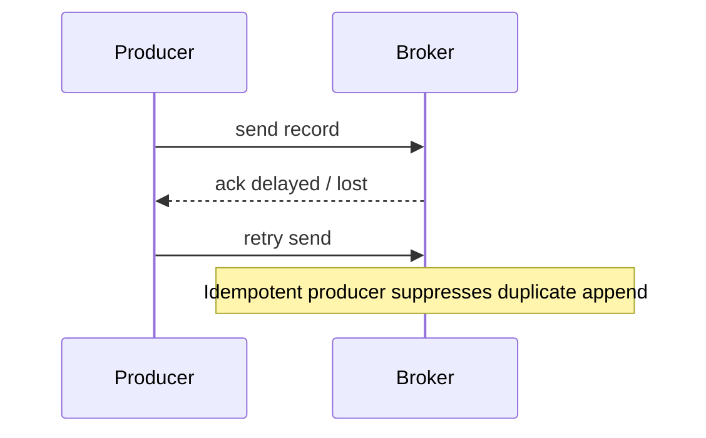

---
categories:
- Java
- Kafka
- Distributed Systems
date: 2026-06-02
seo_title: Idempotent Producers and Kafka Transactions in Practice (Part 1)
seo_description: 'Hands-on guide: Idempotent Producers and Kafka Transactions in Practice.
  Enable idempotent producer safely.'
tags:
- java
- kafka
- distributed-systems
- streaming
- backend
title: Idempotent Producers and Kafka Transactions in Practice (Part 1)
toc: true
toc_icon: cog
toc_label: In This Article
header:
  overlay_image: "/assets/images/java-advanced-generic-banner.svg"
  overlay_filter: 0.35
  show_overlay_excerpt: false
  caption: June Kafka Hands-On Series
---
Part goal: **Enable idempotent producer semantics safely and understand what they do not solve**.

---

## Problem 1: Prevent Duplicate Records Caused by Producer Retries

Problem description:
Producers retry under transient failures, but naive retries can duplicate records when acknowledgements are delayed or lost.

What we are solving actually:
We are solving duplicate writes caused by producer-side retry behavior.
This is narrower than full exactly-once processing, but it is still a critical first layer of correctness.

What we are doing actually:

1. Enable Kafka’s idempotent producer mode.
2. Pair it with the required producer settings.
3. Test retries under failure instead of trusting the config blindly.

## Real-World Scenario

Network retries during peak load can duplicate records unless producer semantics are configured correctly.

---

## Run It Locally

### Prerequisites

- Docker Desktop
- Java 21
- Kafka CLI tools

### Local Stack

~~~yaml
services:
  zookeeper:
    image: confluentinc/cp-zookeeper:7.6.1
    environment:
      ZOOKEEPER_CLIENT_PORT: 2181

  kafka:
    image: confluentinc/cp-kafka:7.6.1
    depends_on: [zookeeper]
    ports: ["9092:9092"]
    environment:
      KAFKA_BROKER_ID: 1
      KAFKA_ZOOKEEPER_CONNECT: zookeeper:2181
      KAFKA_LISTENERS: PLAINTEXT://0.0.0.0:9092
      KAFKA_ADVERTISED_LISTENERS: PLAINTEXT://localhost:9092
      KAFKA_OFFSETS_TOPIC_REPLICATION_FACTOR: 1
~~~

~~~bash
docker compose up -d
~~~

---

## Lab Steps

1. Configure idempotent producer.
2. Publish with simulated retries.
3. Verify no duplicate committed records.

---

## Runnable Code Block

~~~java
props.put("enable.idempotence", "true");
props.put("acks", "all");
props.put("retries", Integer.toString(Integer.MAX_VALUE));
props.put("max.in.flight.requests.per.connection", "5");
~~~

---

## Verify

~~~bash
kafka-console-consumer --bootstrap-server localhost:9092 --topic orders.out --from-beginning --property print.key=true
~~~

---

## Failure Drill

Introduce broker delay and force producer retries. Confirm single committed record per key.

---

## Debug Steps

Debug steps:

- verify all required producer properties are set together, not piecemeal
- test with forced retries so deduplication behavior actually occurs
- remember that producer idempotence alone does not make consumer-side processing exactly-once
- inspect duplicates by logical event key, not only raw message count

## Operational Note

Idempotent producer configuration should be treated as a guarded default in shared producer libraries.
That keeps individual services from “almost” enabling the feature while missing a supporting property that actually matters.

It is also worth documenting where the guarantee stops.
This avoids teams assuming duplicates are impossible everywhere just because the producer is configured correctly.

## What You Should Learn

- idempotent producers solve retry-induced duplicate writes at the producer layer
- correctness depends on the full property set, not only `enable.idempotence=true`
- this is a foundation, not the whole exactly-once story

---

## Operator Prompt

For idempotent producers and kafka transactions in practice (part 1), keep one rollout question in the runbook: what metric tells us the topology is healthy, and what metric tells us to stop or roll back? Kafka systems usually fail operationally before they fail conceptually.

---

## Final Operations Note

One more practical rule helps this series topic stay useful in real systems: always pair the design with one rollback move and one "healthy again" signal. In Kafka, teams often know how to add topology complexity faster than they know how to back out safely, and that gap is exactly where routine changes turn into incidents.
