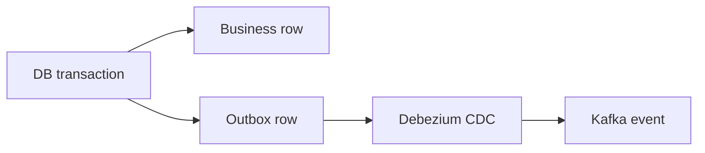

Part goal: **Establish the transactional outbox baseline and close the dual-write gap**.

---

## Problem 1: Persist Business State and Publish Events Reliably

Problem description:
An application often needs to update its database and publish an event about that change.
Doing those two writes separately creates a classic dual-write failure window.

What we are solving actually:
We are solving reliability between database commit and event publication.
The goal is to guarantee that once business state is committed, the corresponding event can still be emitted even if the application crashes immediately after the commit.

What we are doing actually:

1. Write business data and an outbox row in the same database transaction.
2. Use CDC to publish the outbox row to Kafka.
3. Verify that app crashes after commit do not lose the event.

## Real-World Scenario

An order write succeeds, but app crashes before publish; outbox+CDC is needed to close this dual-write gap.

---

## Run It Locally

### Prerequisites

- Docker Desktop
- Java 21
- Kafka CLI tools

### Local Stack

~~~yaml
services:
  zookeeper:
    image: confluentinc/cp-zookeeper:7.6.1
    environment:
      ZOOKEEPER_CLIENT_PORT: 2181

  kafka:
    image: confluentinc/cp-kafka:7.6.1
    depends_on: [zookeeper]
    ports: ["9092:9092"]
    environment:
      KAFKA_BROKER_ID: 1
      KAFKA_ZOOKEEPER_CONNECT: zookeeper:2181
      KAFKA_LISTENERS: PLAINTEXT://0.0.0.0:9092
      KAFKA_ADVERTISED_LISTENERS: PLAINTEXT://localhost:9092
      KAFKA_OFFSETS_TOPIC_REPLICATION_FACTOR: 1
~~~

~~~bash
docker compose up -d
~~~

---

## Lab Steps

1. Create `orders` and `outbox_event` tables.
2. Insert business row + outbox row in one transaction.
3. Register Debezium connector.
4. Consume emitted events.

---

## Runnable Code Block

~~~sql
begin;
insert into orders(id,amount_minor,status) values ('ord-1001',2500,'CREATED');
insert into outbox_event(id,aggregate_type,aggregate_id,event_type,payload)
values ('evt-1001','Order','ord-1001','OrderCreated','{"orderId":"ord-1001"}');
commit;
~~~

---

## Verify

~~~bash
curl -X POST http://localhost:8083/connectors -H "Content-Type: application/json" -d @connector-outbox.json
kafka-console-consumer --bootstrap-server localhost:9092 --topic ordersdb.public.outbox_event --from-beginning
~~~

---

## Failure Drill

Stop application after DB commit; Debezium should still publish the outbox event.

---

## Debug Steps

Debug steps:

- prove business-row and outbox-row insertion happen in the same transaction
- simulate app crash after commit to validate the whole reason for the pattern
- check connector offsets and topic output, not just database state
- treat outbox backlog growth as an operational health signal

## Operational Note

Outbox is easiest to defend when the write path stays boring and predictable.
Complex branching inside the transaction usually creates more reliability risk than the pattern removes.

## What You Should Learn

- the outbox pattern closes the gap between state change and event publication
- CDC is valuable because it moves publish reliability out of the application process
- correctness should be tested with crash timing, not only happy-path success

---

## Operator Prompt

For outbox plus cdc with debezium for reliable event publishing (part 1), keep one rollout question in the runbook: what metric tells us the topology is healthy, and what metric tells us to stop or roll back? Kafka systems usually fail operationally before they fail conceptually.

---

## Final Operations Note

One more practical rule helps this series topic stay useful in real systems: always pair the design with one rollback move and one "healthy again" signal. In Kafka, teams often know how to add topology complexity faster than they know how to back out safely, and that gap is exactly where routine changes turn into incidents.
