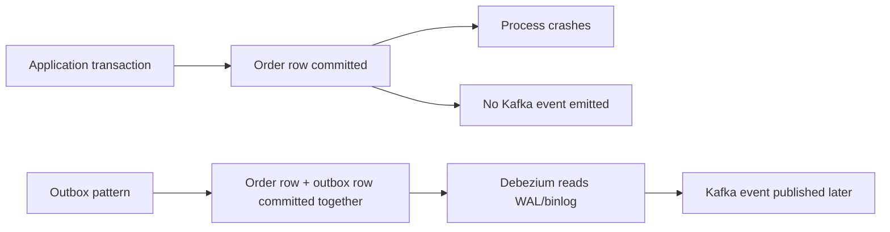

---
categories:
- Java
- Kafka
- Distributed Systems
date: 2026-06-03
seo_title: Outbox Plus CDC with Debezium for Reliable Event Publishing (Part 1)
seo_description: 'Hands-on guide: Outbox Plus CDC with Debezium for Reliable Event
  Publishing. Transactional outbox baseline.'
tags:
- java
- kafka
- distributed-systems
- streaming
- backend
title: Outbox Plus CDC with Debezium for Reliable Event Publishing (Part 1)
toc: true
toc_icon: cog
toc_label: In This Article
header:
  overlay_image: "/assets/images/java-advanced-generic-banner.svg"
  overlay_filter: 0.35
  show_overlay_excerpt: false
  caption: June Kafka Hands-On Series
---
The transactional outbox pattern exists because "write to the database, then publish to Kafka" is not one action. It is two actions with a crash window between them. If the application commits business state and dies before publishing, you now have data that says one thing and an event stream that says nothing.

Part 1 is about closing that gap with the simplest reliable shape: business row and outbox row in one transaction, then CDC moves the outbox row into Kafka.

## The Failure Window You Are Actually Removing

Without an outbox, a typical service flow looks harmless:

1. insert or update the business record
2. commit the database transaction
3. publish the event

The problem is that step 3 happens after the commit. A process crash in that gap does not roll anything back.

That is why this pattern is not mainly about convenience. It is about moving publish reliability out of the application process.

## Where This Pattern Fits Best

Transactional outbox is strongest when:

- the source of truth is a relational database
- the service already commits meaningful business state there
- event publication must reflect committed state, not best effort
- the team wants replayable, inspectable publication behavior

It is less compelling when there is no durable database write in the path, or when the outbox becomes an excuse to keep too much event-shaping logic inside the write transaction.

## A More Realistic Order-Service Example

Suppose an order service does three things:

- inserts the order row
- reserves some internal state such as payment intent linkage
- emits `OrderCreated`

If publishing is done directly after the commit, a crash can leave the order durable but invisible to every downstream consumer. Inventory, analytics, notifications, and orchestration pipelines now disagree about reality.

With an outbox table, the same transaction persists both:

- the business change
- the fact that an event must be published

CDC then turns that recorded intent into an actual Kafka event.

## Schema Baseline

Keep the outbox shape boring. Boring is good here.

~~~sql
create table orders (
  id varchar(64) primary key,
  amount_minor bigint not null,
  status varchar(32) not null,
  created_at timestamp not null default current_timestamp
);

create table outbox_event (
  id varchar(64) primary key,
  aggregate_type varchar(64) not null,
  aggregate_id varchar(64) not null,
  event_type varchar(128) not null,
  payload json not null,
  created_at timestamp not null default current_timestamp
);
~~~

The goal is not to recreate Kafka inside the database. The outbox should be just enough to express "this committed change needs to be published."

## Write Path in One Transaction

This is the core guarantee:

~~~sql
begin;

insert into orders(id, amount_minor, status)
values ('ord-1001', 2500, 'CREATED');

insert into outbox_event(id, aggregate_type, aggregate_id, event_type, payload)
values (
  'evt-1001',
  'Order',
  'ord-1001',
  'OrderCreated',
  '{"orderId":"ord-1001","amountMinor":2500}'
);

commit;
~~~

If the transaction rolls back, neither row exists. If it commits, both rows exist. That is the reliability boundary you want.

> [!important]
> The outbox pattern does not mean "publish inside the transaction." It means "persist the instruction to publish inside the transaction."

That distinction keeps the write path stable and lets CDC handle delivery separately.

## CDC with Debezium

Once the outbox row is committed, Debezium can read the database log and emit the change into Kafka without asking the application to stay alive long enough to do it itself.

That is the real architectural benefit:

- the application is responsible for recording intent
- CDC is responsible for forwarding that intent reliably

Those are cleaner failure boundaries than a direct dual write.

## Run It Locally

### Prerequisites

- Docker Desktop
- Java 21
- Kafka CLI tools

### Local Stack

~~~yaml
services:
  zookeeper:
    image: confluentinc/cp-zookeeper:7.6.1
    environment:
      ZOOKEEPER_CLIENT_PORT: 2181

  kafka:
    image: confluentinc/cp-kafka:7.6.1
    depends_on: [zookeeper]
    ports: ["9092:9092"]
    environment:
      KAFKA_BROKER_ID: 1
      KAFKA_ZOOKEEPER_CONNECT: zookeeper:2181
      KAFKA_LISTENERS: PLAINTEXT://0.0.0.0:9092
      KAFKA_ADVERTISED_LISTENERS: PLAINTEXT://localhost:9092
      KAFKA_OFFSETS_TOPIC_REPLICATION_FACTOR: 1
~~~

~~~bash
docker compose up -d
~~~

## What to Verify

The important proof for Part 1 is not "a message appeared in Kafka once." It is:

1. business row and outbox row commit together
2. the application can disappear after commit
3. the event still arrives through CDC

If you only test the happy path with the app still running, you miss the entire reason the pattern exists.

~~~bash
curl -X POST http://localhost:8083/connectors \
  -H "Content-Type: application/json" \
  -d @connector-outbox.json

kafka-console-consumer \
  --bootstrap-server localhost:9092 \
  --topic ordersdb.public.outbox_event \
  --from-beginning
~~~

## Operational Guidance

### Keep event shaping simple in the transaction

Complex branching in the write transaction is the fastest way to make the outbox path fragile. Build the payload you need, but do not turn the transaction into an orchestration engine.

### Monitor backlog, not just success

An outbox table that keeps growing is not a harmless queue. It is a sign that publication is falling behind, and the gap between committed truth and published truth is widening.

### Decide who owns cleanup

Many teams implement outbox and forget retention. If rows are never archived or deleted safely, the pattern slowly becomes a storage and operational burden.

## Common Misunderstandings

### "Outbox gives exactly-once everywhere"

No. It gives a safer bridge from committed database state to published event intent. Consumers still need their own correctness model.

### "CDC means we no longer need to think about schemas"

Also no. Badly designed payloads stay badly designed after CDC. Reliability and event quality are different concerns.

## What This Part Should Leave You With

After Part 1, the team should be clear on three things:

1. why direct dual writes fail under crash timing
2. why the outbox row belongs in the same transaction as business state
3. why CDC is useful precisely because it decouples event delivery from application uptime

That is the right baseline before you optimize connector shape, routing, or downstream contracts.
