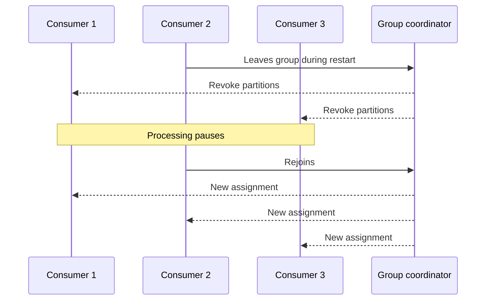

Most teams do not notice consumer rebalance behavior until a rollout goes noisy. Lag spikes, partitions bounce between instances, and the incident channel starts using vague language like "Kafka was unstable." Usually the cluster was not unstable. The group was rebalancing exactly as designed, and the application was not prepared for the interruption cost.

Part 1 is about measuring that cost honestly. Before tuning cooperative assignment or static membership, you need to understand what default eager rebalancing actually does to your workload.

## What Eager Rebalancing Feels Like in Practice

With the default eager-style behavior, Kafka can revoke work broadly before it assigns work again. That means a restart of one consumer can briefly interrupt healthy consumers too.

That is the baseline pain we want to capture. If you skip this measurement, Part 2 can never prove improvement.

## The Real Rollout Problem

This matters most during:

- rolling deploys
- container restarts caused by readiness failures
- autoscaling decisions that add and remove consumers
- crash loops that churn group membership

In all of those cases, the business symptom is the same: processing pauses longer than expected and lag takes time to recover even though the code change itself may not be expensive.

## Baseline Consumer Setup

### Prerequisites

- Docker Desktop
- Java 21
- Kafka CLI tools

### Local Stack

~~~yaml
services:
  zookeeper:
    image: confluentinc/cp-zookeeper:7.6.1
    environment:
      ZOOKEEPER_CLIENT_PORT: 2181

  kafka:
    image: confluentinc/cp-kafka:7.6.1
    depends_on: [zookeeper]
    ports: ["9092:9092"]
    environment:
      KAFKA_BROKER_ID: 1
      KAFKA_ZOOKEEPER_CONNECT: zookeeper:2181
      KAFKA_LISTENERS: PLAINTEXT://0.0.0.0:9092
      KAFKA_ADVERTISED_LISTENERS: PLAINTEXT://localhost:9092
      KAFKA_OFFSETS_TOPIC_REPLICATION_FACTOR: 1
~~~

~~~bash
docker compose up -d
kafka-topics --bootstrap-server localhost:9092 \
  --create \
  --topic orders \
  --partitions 6 \
  --replication-factor 1
~~~

Use a deliberately simple eager baseline:

~~~properties
group.id=orders-cg
partition.assignment.strategy=org.apache.kafka.clients.consumer.RangeAssignor
enable.auto.commit=false
auto.offset.reset=earliest
session.timeout.ms=10000
heartbeat.interval.ms=3000
~~~

The point here is not to optimize yet. It is to make the baseline easy to explain and easy to compare later.

## Instrument the Rebalance, Not Just the Lag

Lag alone is not enough. You want timestamps around revocation and reassignment so you can answer:

- when did processing stop
- how many partitions moved
- when did processing resume
- how long did it take to return to steady state

~~~java
consumer.subscribe(List.of("orders"), new ConsumerRebalanceListener() {
    @Override
    public void onPartitionsRevoked(Collection<TopicPartition> partitions) {
        log.info("revoked at={} partitions={}", Instant.now(), partitions);
    }

    @Override
    public void onPartitionsAssigned(Collection<TopicPartition> partitions) {
        log.info("assigned at={} partitions={}", Instant.now(), partitions);
    }
});
~~~

That log alone often explains more than a dozen vague deployment complaints.

## A Better Baseline Drill

Run the group under steady load, then restart one consumer while messages continue to arrive.

What you want to observe:

- lag before restart
- lag during the rebalance window
- rebalance duration
- recovery time after assignment completes

~~~bash
kafka-consumer-groups --bootstrap-server localhost:9092 \
  --group orders-cg \
  --describe
~~~

If the group is healthy before restart and lag still spikes sharply during the event, you now have evidence that the interruption cost comes from rebalance behavior rather than business logic.

## Why This Matters for Zero-Downtime Claims

A lot of teams say they want zero-downtime Kafka consumers when what they really mean is:

- deploys should not pause all useful work
- a single pod restart should not create avoidable lag spikes
- reassignment should disturb as little ownership as possible

That is not magical "no rebalance ever." It is disciplined reduction of unnecessary disruption.

## Failure Modes to Watch

### Stop-the-world reassignment under load

If the topic is busy, a full-group pause can cause lag to compound faster than the group can recover from it.

### Slow revoke handlers

If your application performs too much cleanup or offset work during revocation, the rebalance window stretches even longer.

### Repeated churn from readiness issues

One unstable instance can trigger repeated full-group disturbance. At that point the problem is no longer only Kafka tuning; it is deployment hygiene and application health behavior too.

> [!important]
> A noisy rebalance is often an interaction between Kafka defaults and application shutdown behavior. Review both.

## What Good Baseline Evidence Looks Like

By the end of Part 1, you should be able to show:

1. how long eager rebalancing pauses useful work in your setup
2. how much lag accumulates during one controlled restart
3. how much partition ownership changes

That is the evidence you need before moving to cooperative rebalancing or static membership. Without it, later tuning might feel better, but you will not know by how much or why.
