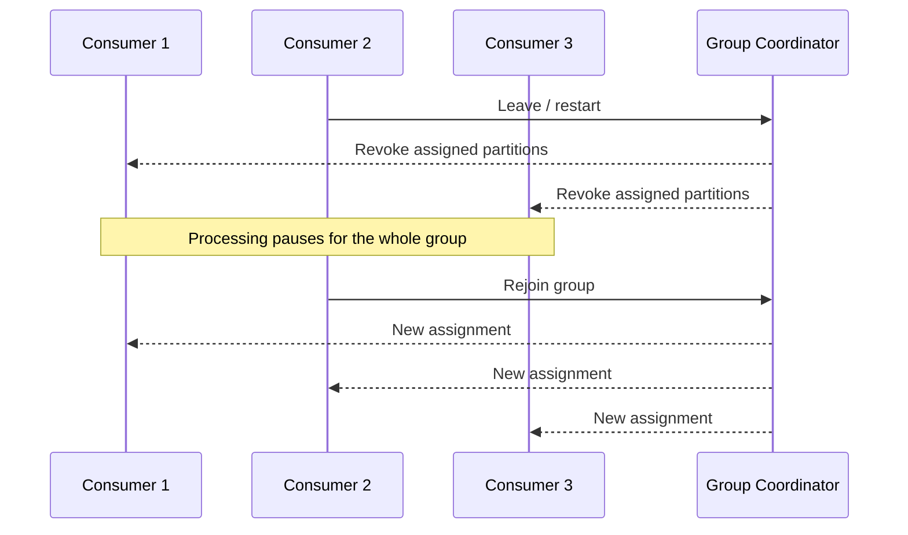

---
categories:
- Java
- Kafka
- Distributed Systems
date: 2026-06-04
seo_title: Consumer Group Rebalance Internals and Zero Downtime Tuning (Part 1)
seo_description: 'Hands-on guide: Consumer Group Rebalance Internals and Zero Downtime
  Tuning. Measure eager rebalance baseline.'
tags:
- java
- kafka
- distributed-systems
- streaming
- backend
title: Consumer Group Rebalance Internals and Zero Downtime Tuning (Part 1)
toc: true
toc_icon: cog
toc_label: In This Article
header:
  overlay_image: "/assets/images/java-advanced-generic-banner.svg"
  overlay_filter: 0.35
  show_overlay_excerpt: false
  caption: June Kafka Hands-On Series
---
Part goal: **Measure the eager rebalance baseline before tuning anything**.

---

## Problem 1: Why Rolling Deploys Cause Lag Spikes

Problem description:
During a rolling deploy, one consumer instance leaves the group and another joins.
With the default eager rebalance behavior, Kafka may revoke all partitions for the group before assigning them again.
That pause can show up as lag spikes, stalled processing, and noisy deploys.

What we are solving actually:
We are not trying to "remove rebalances."
We are trying to understand the baseline cost of eager rebalancing so we can measure improvement later.
If we do not capture that baseline first, we cannot prove whether cooperative rebalancing or static membership actually helped.

What we are doing actually:

1. Start with the default eager-style assignment behavior.
2. Run a small consumer group on a multi-partition topic.
3. Restart one consumer during active processing.
4. Measure how much work pauses, how lag grows, and how long the rebalance takes.

---

## Rebalance Timeline

This is the pain we want to capture in Part 1.
With eager rebalancing, revocation is broad and disruptive.
Even consumers that were healthy may stop briefly while ownership is recalculated.

---

## Run It Locally

Prerequisites:

- Docker Desktop
- Java 21
- Kafka CLI tools

Local stack:

~~~yaml
services:
  zookeeper:
    image: confluentinc/cp-zookeeper:7.6.1
    environment:
      ZOOKEEPER_CLIENT_PORT: 2181

  kafka:
    image: confluentinc/cp-kafka:7.6.1
    depends_on: [zookeeper]
    ports: ["9092:9092"]
    environment:
      KAFKA_BROKER_ID: 1
      KAFKA_ZOOKEEPER_CONNECT: zookeeper:2181
      KAFKA_LISTENERS: PLAINTEXT://0.0.0.0:9092
      KAFKA_ADVERTISED_LISTENERS: PLAINTEXT://localhost:9092
      KAFKA_OFFSETS_TOPIC_REPLICATION_FACTOR: 1
~~~

~~~bash
docker compose up -d
~~~

---

## Topic and Consumer Setup

Create a topic with enough partitions to make movement obvious:

~~~bash
kafka-topics --bootstrap-server localhost:9092 \
  --create \
  --topic orders \
  --partitions 6 \
  --replication-factor 1
~~~

Use a consumer configuration that keeps the baseline intentionally simple:

~~~properties
group.id=orders-cg
partition.assignment.strategy=org.apache.kafka.clients.consumer.RangeAssignor
enable.auto.commit=false
auto.offset.reset=earliest
session.timeout.ms=10000
heartbeat.interval.ms=3000
~~~

The important setting here is `RangeAssignor`.
It gives us a clean eager-rebalance baseline before we move to cooperative behavior in Part 2.

---

## Lab Steps

1. Run 3 consumers in one group.
2. Produce a steady stream of messages to `orders`.
3. Restart one consumer while the group is busy.
4. Measure pause duration and lag increase.

If you want application-level visibility, log partition revocation and assignment in a rebalance listener:

~~~java
consumer.subscribe(List.of("orders"), new ConsumerRebalanceListener() {
    @Override
    public void onPartitionsRevoked(Collection<TopicPartition> partitions) {
        log.info("revoked partitions={}", partitions); // Work pauses around this moment.
    }

    @Override
    public void onPartitionsAssigned(Collection<TopicPartition> partitions) {
        log.info("assigned partitions={}", partitions); // Processing resumes with new ownership.
    }
});
~~~

---

## What to Measure

Capture at least these signals:

- rebalance duration
- consumer lag before restart
- peak lag during rebalance
- time to return to steady-state lag
- number of revoked and reassigned partitions

These metrics turn "deploy felt noisy" into evidence you can compare later.

---

## Verify

~~~bash
kafka-consumer-groups --bootstrap-server localhost:9092 --group orders-cg --describe
~~~

Look for lag growth and partition movement around the restart window.
If your application exposes Micrometer or Prometheus metrics, snapshot them before, during, and after the restart.

---

## Failure Drill

Restart two consumers quickly and observe how much worse the stop-the-world reassignment becomes.
This failure drill matters because staggered rollouts are not the only thing that can trigger rebalances.
Crash loops and readiness flapping can create the same symptoms much faster.

---

## Debug Steps

Debug steps:

- confirm all consumers use the same `group.id`
- verify the topic has more than one partition, otherwise rebalance movement will look trivial
- log `onPartitionsRevoked` and `onPartitionsAssigned` timestamps
- compare lag immediately before restart, during rebalance, and after recovery

---

## What You Should Learn

- eager rebalancing can pause more work than the restarted instance alone
- rolling deploy pain is measurable through lag and rebalance duration
- you need this baseline before cooperative or static-membership tuning means anything
