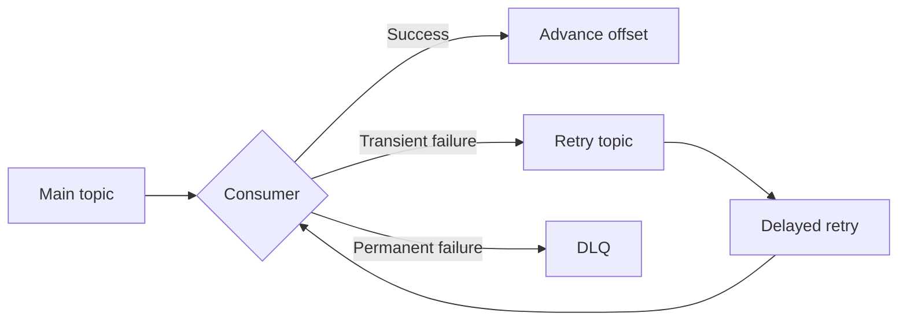

---
categories:
- Java
- Kafka
- Distributed Systems
date: 2026-06-05
seo_title: Retry Topics DLQ Design and Poison Message Governance (Part 1)
seo_description: 'Hands-on guide: Retry Topics DLQ Design and Poison Message Governance.
  Build retry topology.'
tags:
- java
- kafka
- distributed-systems
- streaming
- backend
title: Retry Topics DLQ Design and Poison Message Governance (Part 1)
toc: true
toc_icon: cog
toc_label: In This Article
header:
  overlay_image: "/assets/images/java-advanced-generic-banner.svg"
  overlay_filter: 0.35
  show_overlay_excerpt: false
  caption: June Kafka Hands-On Series
---
Retry design is one of the easiest places to create accidental harm in Kafka. A team starts with the right intention, "just retry the failure," and ends up with a topology that blocks healthy traffic, replays poison messages forever, or hides operational truth inside too many topics.

Part 1 is about building the first safe boundary: main topic, bounded retry path, and a dead-letter queue that acts as a quarantine rather than a graveyard.

## The Actual Problem

Kafka preserves order within a partition. That is usually what you want until one bad record sits at the head of the partition and everything behind it waits.

The design question is not "should we retry?" It is:

- which failures are genuinely transient
- how many retries are worth paying for
- when should the system give up and isolate the event
- what information must survive in the DLQ so the event can be repaired or replayed later

The important word there is bounded. If retries are unbounded, the topology is not resilient. It is just slower at admitting failure.

## A Better Real-World Example

Suppose an order consumer enriches events by calling a pricing service:

- a short network timeout is probably transient
- malformed JSON is not transient
- a business validation failure may require human repair rather than automated replay

Routing all three through the same retry loop creates noise, cost, and recovery confusion. The topology should reflect the difference.

## What a Boring but Safe Topology Looks Like

For a baseline, keep it small:

- `orders.main`
- `orders.retry.1m`
- `orders.dlq`

That is enough to prove the policy. You do not need five retry stages on day one unless the workload actually demands it.

### Main rule

Healthy traffic should keep moving even when one event is bad.

That means the retry and DLQ decisions must happen quickly and explicitly.

## Consumer Classification Logic

The routing logic should make the error policy obvious in code:

~~~java
try {
    process(event);
} catch (TimeoutException | ConnectException transientFailure) {
    publish("orders.retry.1m", withAttempt(event, attempt + 1));
} catch (MalformedPayloadException | ValidationException permanentFailure) {
    publish("orders.dlq", withFailureContext(event, permanentFailure));
}
~~~

That snippet is intentionally simple. The important part is not the exact exception classes. It is that the code distinguishes retryable from non-retryable failure instead of treating all exceptions as "try later."

## Preserve Enough Context for Repair

A DLQ message without context is just future pain. At minimum, carry:

- original topic
- partition and offset if available
- attempt count
- failure classification
- error summary
- original event key

If operators cannot understand why the event was quarantined, the DLQ is not doing its job.

> [!important]
> A dead-letter queue is not success with worse branding. It is an explicit handoff to investigation, repair, or controlled replay.

## Run It Locally

### Prerequisites

- Docker Desktop
- Java 21
- Kafka CLI tools

### Local Stack

~~~yaml
services:
  zookeeper:
    image: confluentinc/cp-zookeeper:7.6.1
    environment:
      ZOOKEEPER_CLIENT_PORT: 2181

  kafka:
    image: confluentinc/cp-kafka:7.6.1
    depends_on: [zookeeper]
    ports: ["9092:9092"]
    environment:
      KAFKA_BROKER_ID: 1
      KAFKA_ZOOKEEPER_CONNECT: zookeeper:2181
      KAFKA_LISTENERS: PLAINTEXT://0.0.0.0:9092
      KAFKA_ADVERTISED_LISTENERS: PLAINTEXT://localhost:9092
      KAFKA_OFFSETS_TOPIC_REPLICATION_FACTOR: 1
~~~

~~~bash
docker compose up -d
kafka-topics --bootstrap-server localhost:9092 --create --topic orders.main --partitions 3 --replication-factor 1
kafka-topics --bootstrap-server localhost:9092 --create --topic orders.retry.1m --partitions 3 --replication-factor 1
kafka-topics --bootstrap-server localhost:9092 --create --topic orders.dlq --partitions 3 --replication-factor 1
~~~

## A Useful Failure Drill

Publish:

- one malformed record
- one record that triggers a synthetic timeout
- several healthy records after both

Then verify:

- healthy records still progress
- transient failure lands in retry
- malformed record lands in DLQ

~~~bash
kafka-console-consumer --bootstrap-server localhost:9092 \
  --topic orders.dlq \
  --from-beginning
~~~

That exercise is more honest than simply proving the retry topic exists.

## Operational Decisions to Make Early

### How many attempts are allowed

Set the maximum attempt count before rollout. A retry topology without a fixed ceiling is an incident waiting to happen.

### Who owns the DLQ

If nobody owns triage, the DLQ becomes a quiet backlog of unresolved business failures.

### What counts as a healthy signal

Good signals include:

- low DLQ growth under normal conditions
- retry traffic that drains instead of accumulating
- stable processing throughput while retry traffic exists

## What This Part Should Leave You With

After Part 1, the team should be able to say:

1. which failures are retryable
2. where poison messages go
3. how healthy traffic is protected from one bad record

That is the baseline. More advanced retry backoff and governance can come later, but without this first boundary the system is just improvising under failure.
