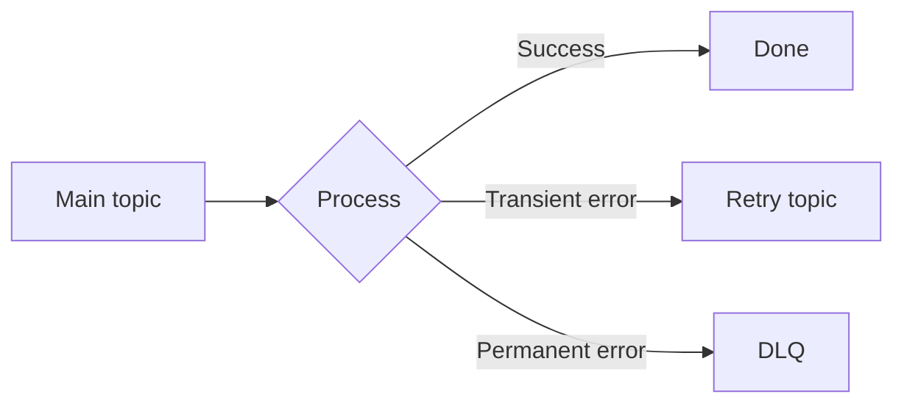

Part goal: **Build a bounded retry topology and isolate poison messages**.

---

## Problem 1: Prevent One Bad Event From Blocking Healthy Traffic

Problem description:
Kafka preserves partition order, which means one poison message can stall every healthy event behind it if retry handling is naive.

What we are solving actually:
We are solving bounded failure isolation.
The goal is to retry transient failures without turning permanent failures into infinite loops or partition starvation.

What we are doing actually:

1. Separate main, retry, and DLQ topics.
2. Route transient errors to controlled retry paths.
3. Quarantine permanent failures in the DLQ.

## Real-World Scenario

A poison event can block partition progress unless retries and DLQ are bounded and policy-driven.

---

## Run It Locally

### Prerequisites

- Docker Desktop
- Java 21
- Kafka CLI tools

### Local Stack

~~~yaml
services:
  zookeeper:
    image: confluentinc/cp-zookeeper:7.6.1
    environment:
      ZOOKEEPER_CLIENT_PORT: 2181

  kafka:
    image: confluentinc/cp-kafka:7.6.1
    depends_on: [zookeeper]
    ports: ["9092:9092"]
    environment:
      KAFKA_BROKER_ID: 1
      KAFKA_ZOOKEEPER_CONNECT: zookeeper:2181
      KAFKA_LISTENERS: PLAINTEXT://0.0.0.0:9092
      KAFKA_ADVERTISED_LISTENERS: PLAINTEXT://localhost:9092
      KAFKA_OFFSETS_TOPIC_REPLICATION_FACTOR: 1
~~~

~~~bash
docker compose up -d
~~~

---

## Lab Steps

1. Create main/retry/dlq topics.
2. Route transient errors to retry topics with attempt count.
3. Route permanent errors to DLQ.

---

## Runnable Code Block

~~~java
try {
    process(event);
} catch (TimeoutException e) {
    publish("orders.retry.1m", event.withAttempt(attempt + 1));
} catch (Exception fatal) {
    publish("orders.dlq", event.withError("PERMANENT"));
}
~~~

---

## Verify

~~~bash
kafka-console-consumer --bootstrap-server localhost:9092 --topic orders.dlq --from-beginning
~~~

---

## Failure Drill

Send one malformed payload + many valid events; verify only bad event reaches DLQ.

---

## Debug Steps

Debug steps:

- distinguish transient versus permanent exceptions explicitly in code
- make retry attempts bounded so poison messages cannot loop forever
- verify valid traffic continues flowing while one bad message is isolated
- inspect DLQ payloads to ensure enough context is preserved for investigation

## Operational Note

Retry topologies should be visible in architecture diagrams and incident docs.
If operators cannot explain which topic represents which retry stage, the topology is too clever for production use.

Clarity matters because debugging bad retries is already hard enough without ambiguous topic purpose.

## What You Should Learn

- retry design is about protecting healthy flow, not just “trying again”
- DLQ is a quarantine mechanism, not an error graveyard
- transient and permanent failures need different routing behavior

---

        ## Production Checklist

        Inspect retry topics and the DLQ together so you can confirm the record moves forward through the policy rather than bouncing forever.

        ## Incident Drill

        Publish one malformed record followed by valid records on the same key and verify healthy traffic continues while the poison message is isolated with context.

        ## Extra Debug Cues

        - carry attempt count and original topic metadata in headers
- set a maximum attempt count before the first message ever ships
- keep DLQ payloads rich enough for replay or manual repair

---

## Operator Prompt

For retry topics dlq design and poison message governance (part 1), keep one rollout question in the runbook: what metric tells us the topology is healthy, and what metric tells us to stop or roll back? Kafka systems usually fail operationally before they fail conceptually.
