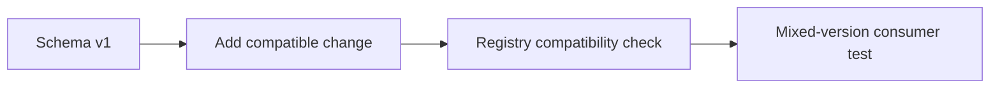

---
categories:
- Java
- Kafka
- Distributed Systems
date: 2026-06-06
seo_title: Schema Evolution with Avro and Protobuf Compatibility Contracts (Part 1)
seo_description: 'Hands-on guide: Schema Evolution with Avro and Protobuf Compatibility
  Contracts. Baseline compatibility workflow.'
tags:
- java
- kafka
- distributed-systems
- streaming
- backend
title: Schema Evolution with Avro and Protobuf Compatibility Contracts (Part 1)
toc: true
toc_icon: cog
toc_label: In This Article
header:
  overlay_image: "/assets/images/java-advanced-generic-banner.svg"
  overlay_filter: 0.35
  show_overlay_excerpt: false
  caption: June Kafka Hands-On Series
---
Part goal: **Establish a baseline schema-compatibility workflow before rollout automation**.

---

## Problem 1: Change Event Schemas Without Breaking Existing Consumers

Problem description:
Kafka event schemas evolve over time as products add fields, retire old ones, or reshape payloads.
Without explicit compatibility discipline, one producer change can break live consumers at deserialization time.

What we are solving actually:
We are solving safe evolution of shared contracts.
The goal is not just “version the schema”; it is making sure old and new producers and consumers can coexist during real deployments.

What we are doing actually:

1. Register a baseline schema version.
2. Introduce only compatibility-preserving changes first.
3. Test mixed-version producers and consumers before operational rollout.

---

## Run It Locally

### Prerequisites

- Docker Desktop
- Java 21
- Kafka CLI tools

### Local Stack

~~~yaml
services:
  zookeeper:
    image: confluentinc/cp-zookeeper:7.6.1
    environment:
      ZOOKEEPER_CLIENT_PORT: 2181

  kafka:
    image: confluentinc/cp-kafka:7.6.1
    depends_on: [zookeeper]
    ports: ["9092:9092"]
    environment:
      KAFKA_BROKER_ID: 1
      KAFKA_ZOOKEEPER_CONNECT: zookeeper:2181
      KAFKA_LISTENERS: PLAINTEXT://0.0.0.0:9092
      KAFKA_ADVERTISED_LISTENERS: PLAINTEXT://localhost:9092
      KAFKA_OFFSETS_TOPIC_REPLICATION_FACTOR: 1
~~~

~~~bash
docker compose up -d
~~~

---

## Lab Steps

1. Register v1 schema.
2. Produce and consume v1.
3. Add compatible v2 optional field.
4. Validate mixed-version consumers.

---

## Runnable Code Block

~~~proto
message PaymentCreated {
  string payment_id = 1;
  int64 amount_minor = 2;
  string currency = 3;
  string merchant_id = 4; // compatible add
}
~~~

The important first lesson is that “compatible” usually means additive and well-ordered.
Renumbering or changing existing field meaning is where teams create real breakage.

---

## Verify

~~~bash
curl -s http://localhost:8081/subjects/payment-value/versions/latest
~~~

Also consume both v1 and v2 payloads through the same reader to confirm deserialization behavior, not just registry acceptance.

---

## Failure Drill

Attempt to remove or renumber a field and confirm the compatibility check fails.
That failure is valuable because it turns a future production incident into an earlier CI or pre-merge event.

---

## Debug Steps

Debug steps:

- verify the registry subject and compatibility mode you think you are testing is actually the one being used
- test mixed-version producer and consumer combinations, not only latest-to-latest
- treat field renumbering or meaning changes as dangerous even if names look similar
- record a concrete list of allowed versus prohibited schema changes for the team

---

## What You Should Learn

- schema evolution is a contract-management problem, not just a serialization detail
- additive changes are the safest baseline starting point
- registry checks matter, but runtime mixed-version tests matter too

---

## Operator Prompt

For schema evolution with avro and protobuf compatibility contracts (part 1), keep one rollout question in the runbook: what metric tells us the topology is healthy, and what metric tells us to stop or roll back? Kafka systems usually fail operationally before they fail conceptually.

---

## Final Operations Note

One more practical rule helps this series topic stay useful in real systems: always pair the design with one rollback move and one "healthy again" signal. In Kafka, teams often know how to add topology complexity faster than they know how to back out safely, and that gap is exactly where routine changes turn into incidents.
