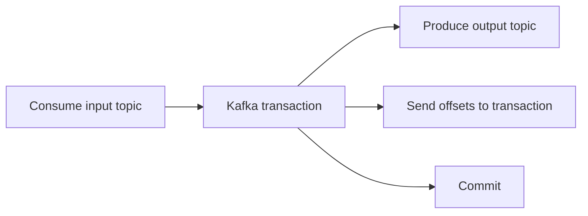

Exactly-once semantics is one of Kafka's most overloaded phrases. Teams hear it and assume the whole workflow is protected: input, output, database write, external API call, everything. That is where the real trouble starts.

Part 1 is about cutting through the slogan. Kafka can provide a strong scoped guarantee for consume-transform-produce flows, but the scope matters. The moment your workflow includes an external side effect, you need to reason about that boundary explicitly.

## Where Kafka's Guarantee Actually Lives

Kafka exactly-once semantics is strongest when the unit of work stays inside Kafka:

- consume records
- produce derived records
- commit the consumed offsets transactionally with the produced output

That means downstream consumers do not see partial results from an aborted transaction.

That is a real guarantee. It is just not the universal one people often repeat in architecture discussions.

## The First Misunderstanding to Kill Early

If the processor also writes to:

- a relational database
- Redis
- an HTTP downstream service
- an email or notification system

Kafka cannot make that external side effect atomic just because the Kafka side is transactional.

That is why "exactly once" needs a second sentence every time:

"Exactly once where?"

## A More Honest Example

Suppose a payment processor consumes `PaymentAuthorized`, updates a database table, and publishes `PaymentSettled`.

If the application:

1. writes to the database
2. crashes before completing the Kafka transaction

the database side effect may survive while the Kafka output does not. On restart, the input can be replayed and the DB write can happen again unless the application protects that step separately.

That is not Kafka failing. That is the workflow crossing Kafka's atomic boundary.

## Local Baseline

### Prerequisites

- Docker Desktop
- Java 21
- Kafka CLI tools

### Local Stack

~~~yaml
services:
  zookeeper:
    image: confluentinc/cp-zookeeper:7.6.1
    environment:
      ZOOKEEPER_CLIENT_PORT: 2181

  kafka:
    image: confluentinc/cp-kafka:7.6.1
    depends_on: [zookeeper]
    ports: ["9092:9092"]
    environment:
      KAFKA_BROKER_ID: 1
      KAFKA_ZOOKEEPER_CONNECT: zookeeper:2181
      KAFKA_LISTENERS: PLAINTEXT://0.0.0.0:9092
      KAFKA_ADVERTISED_LISTENERS: PLAINTEXT://localhost:9092
      KAFKA_OFFSETS_TOPIC_REPLICATION_FACTOR: 1
~~~

~~~bash
docker compose up -d
~~~

For the external side-effect example, create a table that records processed events:

~~~sql
create table processed_event (
  event_id varchar(64) primary key,
  processed_at timestamp not null default now()
);
~~~

That table is useful because it makes duplicate external work visible instead of theoretical.

## Transactional Producer Skeleton

This is the Kafka-only core:

~~~java
producer.beginTransaction();
for (ConsumerRecord<String, OrderEvent> record : records) {
    producer.send(transform(record));
}
producer.sendOffsetsToTransaction(offsets, consumer.groupMetadata());
producer.commitTransaction();
~~~

This code is good at what it is designed to do: making Kafka output and offset advancement move together.

What it does not do is protect the database write unless you design for that separately.

## A Better Failure Drill

Test three points:

1. crash before the external side effect
2. crash after the external side effect but before Kafka commit
3. crash after Kafka commit

The second case is the one most teams need to feel in practice. It is where the gap between Kafka-level exactly-once and business-level exactly-once becomes obvious.

~~~bash
psql -c "select event_id, count(*) from processed_event group by event_id having count(*) > 1;"
~~~

If the table shows duplicates after replay, the lesson has landed.

> [!important]
> Kafka EOS is a powerful building block. It becomes dangerous only when teams let the phrase replace system-boundary thinking.

## What to Document for Production

### Transaction identity

Your transactional IDs must be stable enough for the processor identity you intend to preserve across restarts.

### External effect policy

If the processor writes outside Kafka, write down how duplicates are prevented there:

- idempotency key
- dedupe table
- unique constraint
- compensating workflow

### Consumer isolation level

Readers that expect transactional behavior should use `read_committed`, otherwise the broker-side guarantee is weakened at the consumer boundary.

## What This Part Should Leave You With

By the end of Part 1, the team should be clear on:

1. what Kafka exactly-once semantics really covers
2. where it stops
3. why external side effects still need their own idempotency or compensation story

That clarity is more valuable than treating EOS as a blanket promise the system never actually made.
