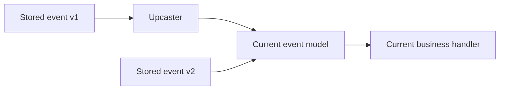

Long-lived event streams only stay clean in diagrams. In real systems, domains evolve. New fields appear, older payloads stay on retained topics, replay becomes necessary, and suddenly the current code is expected to understand facts produced by software that no longer exists.

Part 1 is about the baseline discipline: version the events, keep history readable, and make sure current business handlers are not forced to carry every old shape directly.

## What Versioning Is Trying to Protect

The point is not to collect version numbers for their own sake. The point is to keep old facts useful after the domain model has moved on.

There are two common failure modes:

- old events cannot be replayed because current code no longer understands them
- business logic becomes polluted with conditional branches for every historical payload version

Upcasting is one way to prevent the second problem. Instead of teaching all handlers every old schema, you transform older payloads into the current in-memory shape before the real business logic sees them.

That keeps the compatibility work near the boundary instead of spread across the whole application.

## When You Actually Need Upcasting

Not every versioned event stream needs a sophisticated upcaster chain. It becomes worth it when:

- replay matters
- retention is long
- the same stream supports multiple generations of code
- domain shapes have changed enough that direct deserialization into current models becomes awkward

If you only ever read near-real-time data with short retention, a lighter compatibility strategy may be enough.

## A Practical Example

Suppose `OrderCreated` began as:

~~~json
{ "eventType": "OrderCreated", "version": 1, "payload": { "orderId": "o1" } }
~~~

Later the domain needs:

- `customerId`
- order channel
- metadata map for downstream routing

You could make every downstream handler understand `v1`, `v2`, and `v3`. That usually creates permanent complexity in the wrong place.

The cleaner option is to turn older versions into the latest in-memory representation first.

## A Small Upcaster Example

~~~java
OrderCreatedV3 upcast(OrderCreatedV1 oldEvent) {
    return new OrderCreatedV3(
        oldEvent.orderId(),
        "unknown-customer",
        "STANDARD",
        Map.of()
    );
}
~~~

This is intentionally simple, but it shows the design intent:

- old facts remain usable
- current handlers stay focused on current logic
- historical compatibility lives in one explicit layer

> [!important]
> Upcasters should translate structure, not quietly invent business meaning. If a default value changes domain truth, make that decision explicit and reviewable.

## Run It Locally

### Prerequisites

- Docker Desktop
- Java 21
- Kafka CLI tools

### Local Stack

~~~yaml
services:
  zookeeper:
    image: confluentinc/cp-zookeeper:7.6.1
    environment:
      ZOOKEEPER_CLIENT_PORT: 2181

  kafka:
    image: confluentinc/cp-kafka:7.6.1
    depends_on: [zookeeper]
    ports: ["9092:9092"]
    environment:
      KAFKA_BROKER_ID: 1
      KAFKA_ZOOKEEPER_CONNECT: zookeeper:2181
      KAFKA_LISTENERS: PLAINTEXT://0.0.0.0:9092
      KAFKA_ADVERTISED_LISTENERS: PLAINTEXT://localhost:9092
      KAFKA_OFFSETS_TOPIC_REPLICATION_FACTOR: 1
~~~

~~~bash
docker compose up -d
~~~

## What to Verify

Produce a mixed stream of old and new versions, then replay from the earliest offset with only the latest business handler enabled.

~~~bash
kafka-console-consumer \
  --bootstrap-server localhost:9092 \
  --topic orders.events \
  --from-beginning
~~~

The proof you want is simple: old data still flows through current handlers without each handler carrying historical branching logic.

## Common Mistakes

### Treating upcasters like business-rule engines

If the translation layer starts making complex domain decisions, it becomes hard to trust and even harder to retire.

### Forgetting metadata

Version metadata must be explicit and durable enough for the boundary layer to know what it is reading.

### Never testing replay

If the first real replay is during a production recovery, the versioning strategy was never truly validated.

## What This Part Should Leave You With

After Part 1, the team should understand:

1. why retained event history needs an explicit compatibility story
2. why upcasting protects current handlers from old payload complexity
3. where the boundary should sit between historical translation and current business logic

That is the baseline for a stream that needs to remain useful long after its first schema version is gone.
