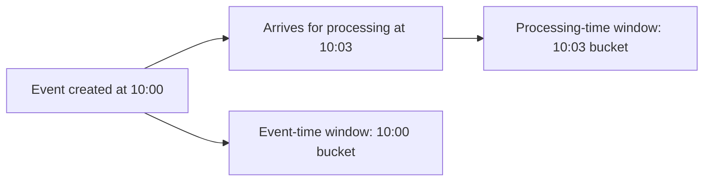

---
categories:
- Java
- Kafka
- Distributed Systems
date: 2026-06-10
seo_title: Event Time Versus Processing Time Tradeoffs in Stream Pipelines (Part 1)
seo_description: 'Hands-on guide: Event Time Versus Processing Time Tradeoffs in Stream
  Pipelines. Compare baseline windows.'
tags:
- java
- kafka
- distributed-systems
- streaming
- backend
title: Event Time Versus Processing Time Tradeoffs in Stream Pipelines (Part 1)
toc: true
toc_icon: cog
toc_label: In This Article
header:
  overlay_image: "/assets/images/java-advanced-generic-banner.svg"
  overlay_filter: 0.35
  show_overlay_excerpt: false
  caption: June Kafka Hands-On Series
---
Time semantics are one of the fastest ways to get a streaming system that is technically healthy but analytically wrong. The topology runs, the dashboard updates, and only later does someone notice that delayed or backfilled events were counted in the wrong window.

Part 1 is about making the time model explicit. Before tuning grace periods or late-event handling, the team has to agree on a more basic question: are we measuring when the event happened or when the system happened to process it.

## Two Different Clocks, Two Different Answers

Processing time asks:

"When did this application see the record?"

Event time asks:

"When did the underlying business event actually happen?"

Those clocks can diverge when there is:

- network delay
- broker backlog
- consumer lag
- replay
- backfill

If the team never names this choice, the system will still choose for you, usually by default.

## A Better Example Than "Late Events Exist"

Suppose you publish order events from retail stores with unstable connectivity:

- the store emits the sale at 10:00
- the message reaches Kafka at 10:02
- the consumer processes it at 10:03

If revenue per minute should reflect when the sale occurred, event time is the closer fit.
If the only thing you care about is operational system load right now, processing time may be sufficient.

The right answer depends on the question the pipeline exists to answer.

## Event-Time Extraction

For a baseline, make timestamp extraction explicit instead of relying on hidden defaults:

~~~java
Consumed<String, Event> consumed = Consumed.with(keySerde, eventSerde)
    .withTimestampExtractor((record, partitionTime) -> record.value().eventTimeEpochMs());
~~~

This small step matters because it moves time semantics into code the team can reason about and test.

## What to Test Early

Use the same event set in three ways:

1. in order
2. out of order
3. as a replay or backfill

If the results differ and the team cannot explain why, the time model is not yet clear enough for production.

## Local Setup

### Prerequisites

- Docker Desktop
- Java 21
- Kafka CLI tools

### Local Stack

~~~yaml
services:
  zookeeper:
    image: confluentinc/cp-zookeeper:7.6.1
    environment:
      ZOOKEEPER_CLIENT_PORT: 2181

  kafka:
    image: confluentinc/cp-kafka:7.6.1
    depends_on: [zookeeper]
    ports: ["9092:9092"]
    environment:
      KAFKA_BROKER_ID: 1
      KAFKA_ZOOKEEPER_CONNECT: zookeeper:2181
      KAFKA_LISTENERS: PLAINTEXT://0.0.0.0:9092
      KAFKA_ADVERTISED_LISTENERS: PLAINTEXT://localhost:9092
      KAFKA_OFFSETS_TOPIC_REPLICATION_FACTOR: 1
~~~

~~~bash
docker compose up -d
~~~

## A Useful Comparison Drill

Build two windowed aggregations from the same stream:

- one using processing time defaults
- one using explicit event-time extraction

Then publish delayed events and compare the outputs.

~~~bash
# compare output topics for processing-time and event-time pipelines
~~~

That test usually teaches more than a definition section because it produces two different answers from the same inputs.

> [!important]
> Late data is not an edge case if your system ever replays, backfills, or operates across unreliable producers. It is part of the normal correctness model.

## Where Teams Usually Get Burned

### Picking a window before picking a clock

Grace periods and lateness handling are downstream decisions. The first decision is which timestamp the business actually trusts.

### Mixing timestamp extraction with business parsing

Keep time extraction simple and explicit. If it gets tangled with validation and transformation logic, debugging late-event behavior becomes harder.

### Never testing replay

A topology that looks perfect under ordered live traffic can produce the wrong result the first time an old batch is replayed.

## What This Part Should Leave You With

After Part 1, the team should be able to answer:

1. whether the pipeline is anchored on event time or processing time
2. what kinds of delay or disorder it expects
3. how to prove the chosen time model with a controlled test

That clarity is the foundation for every later decision about windows, grace, and late-data policy.
