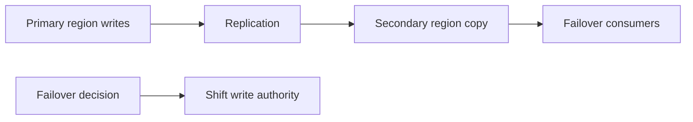

---
categories:
- Java
- Kafka
- Distributed Systems
date: 2026-06-11
seo_title: Multi Region Kafka Replication and Failover Patterns (Part 1)
seo_description: 'Hands-on guide: Multi Region Kafka Replication and Failover Patterns.
  Topology baseline and failover trigger.'
tags:
- java
- kafka
- distributed-systems
- streaming
- backend
title: Multi Region Kafka Replication and Failover Patterns (Part 1)
toc: true
toc_icon: cog
toc_label: In This Article
header:
  overlay_image: "/assets/images/java-advanced-generic-banner.svg"
  overlay_filter: 0.35
  show_overlay_excerpt: false
  caption: June Kafka Hands-On Series
---
Multi-region Kafka is easy to over-simplify. A diagram with arrows between regions can make the plan feel done, but the real work starts when one region is degraded and the system has to decide who owns writes, which copy is authoritative, and how consumers should behave during the transition.

Part 1 is about naming that operating model before any failover drill. Replication alone is not a failover strategy.

## The Question Behind the Topology

The first decision is not tooling. It is ownership.

Are you building:

- active-passive, where one region normally owns writes
- active-active, where write ownership is split or coordinated

The answer changes everything about failover complexity, duplicate risk, and recovery.

If the team cannot say which region is authoritative during normal operation, failover is already underspecified.

## What Failover Actually Has to Solve

A realistic failover plan is not just "send traffic somewhere else." It has to answer:

- when producers stop writing to the primary
- when the secondary is considered current enough to trust
- how consumers translate or re-establish progress
- how failback will avoid duplicate or missing work

That is why multi-region Kafka is as much a data-ownership problem as a routing problem.

## A Safer Baseline: Active-Passive

For Part 1, an active-passive model is the clearest baseline:

- primary region owns writes
- secondary region receives replicated data
- failover occurs only after an explicit trigger

This keeps the initial discussion honest. Active-active can be valid, but it is a worse teaching baseline because it hides more failure cases behind higher complexity.

## Local Representation

Even in a simple local drill, make the ownership model visible:

~~~text
Primary topic:   orders.events.primary
Secondary topic: orders.events.secondary
~~~

That naming is not the important part. The important part is that readers can see there are two copies and only one current writer.

## Local Setup

### Prerequisites

- Docker Desktop
- Java 21
- Kafka CLI tools

### Local Stack

~~~yaml
services:
  zookeeper:
    image: confluentinc/cp-zookeeper:7.6.1
    environment:
      ZOOKEEPER_CLIENT_PORT: 2181

  kafka:
    image: confluentinc/cp-kafka:7.6.1
    depends_on: [zookeeper]
    ports: ["9092:9092"]
    environment:
      KAFKA_BROKER_ID: 1
      KAFKA_ZOOKEEPER_CONNECT: zookeeper:2181
      KAFKA_LISTENERS: PLAINTEXT://0.0.0.0:9092
      KAFKA_ADVERTISED_LISTENERS: PLAINTEXT://localhost:9092
      KAFKA_OFFSETS_TOPIC_REPLICATION_FACTOR: 1
~~~

~~~bash
docker compose up -d
~~~

## The Most Important Drill in Part 1

Do one controlled failover exercise and write down:

- replication lag just before failover
- the trigger that declared primary unavailable
- whether producers switched cleanly
- whether consumers observed missing or duplicate work

~~~bash
kafka-topics --bootstrap-server localhost:9092 --list
~~~

The goal is not to prove the topology is perfect. The goal is to expose the gap between "secondary has data" and "secondary can safely take over."

> [!warning]
> Replication lag is not merely a throughput metric in multi-region designs. It is a correctness signal because it defines how much history the failover copy may be missing.

## Common Mistakes

### Treating failover as automatic before authority is defined

Automatic failover without an explicit ownership model can move the system into split-brain or duplicate-write territory very quickly.

### Ignoring consumer progress

Even if data is present in the secondary, consumer recovery may still be painful if offset translation or restart semantics were never tested.

### Forgetting failback

Many plans explain how to leave the primary and almost none explain how to return safely.

## What This Part Should Leave You With

After Part 1, the team should be able to state:

1. which region owns writes in the normal case
2. what signal justifies failover
3. what data-consistency risk exists during the switch

That is the minimum operating clarity required before replication and failover tooling can be trusted.
