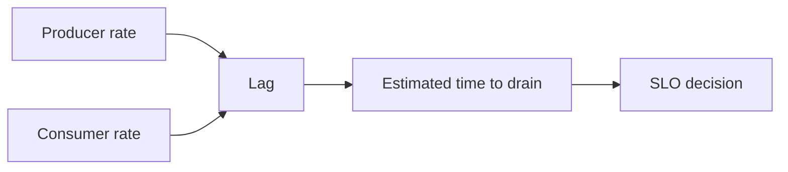

Kafka teams often have plenty of metrics and still struggle during incidents. They can see lag, throughput, and broker health, but they cannot answer the question that actually matters in the moment: is the system still within an acceptable operating window, or are we actively violating the promise the service makes to users.

Part 1 is about building observability around decisions, not just numbers. Lag only becomes useful when it is translated into business time, partition-level reality, and an explicit service objective.

## Why Raw Lag Is Not Enough

Ten thousand records of lag can mean:

- harmless backlog that drains in seconds
- an urgent incident
- one hot partition while the rest of the group looks fine

Without context, lag is a noisy integer. Operators need to know what it means for processing delay and user-visible impact.

That is the shift this post is aiming for: from metric collection to operational judgment.

## Start With the Service Objective

Before you design the dashboard, write the promise down.

For example:

- 99% of order events are processed within 60 seconds
- no partition should remain stalled beyond 5 minutes without alerting

Those are not universal numbers. They are examples of the kind of target that turns monitoring into something actionable.

## The Metrics That Matter Together

A useful baseline dashboard combines:

- per-partition lag
- consumer throughput
- lag growth slope
- rebalance activity
- error rate or failure classification

Looking at aggregate lag alone is how teams miss the partition that is already failing while the average still looks manageable.

## Turning Lag Into a Better Signal

One practical derived metric is estimated time to drain:

~~~java
double lagSeconds = recordsLagMax / Math.max(consumeRatePerSecond, 1.0);
if (lagSeconds > 120) {
    alert();
}
~~~

This is not perfect, but it is much closer to an operational answer than lag on its own.

## Local Setup

### Prerequisites

- Docker Desktop
- Java 21
- Kafka CLI tools

### Local Stack

~~~yaml
services:
  zookeeper:
    image: confluentinc/cp-zookeeper:7.6.1
    environment:
      ZOOKEEPER_CLIENT_PORT: 2181

  kafka:
    image: confluentinc/cp-kafka:7.6.1
    depends_on: [zookeeper]
    ports: ["9092:9092"]
    environment:
      KAFKA_BROKER_ID: 1
      KAFKA_ZOOKEEPER_CONNECT: zookeeper:2181
      KAFKA_LISTENERS: PLAINTEXT://0.0.0.0:9092
      KAFKA_ADVERTISED_LISTENERS: PLAINTEXT://localhost:9092
      KAFKA_OFFSETS_TOPIC_REPLICATION_FACTOR: 1
~~~

~~~bash
docker compose up -d
~~~

## A Better Validation Drill

Throttle one consumer and watch what happens:

~~~bash
kafka-consumer-groups --bootstrap-server localhost:9092 \
  --group orders-cg \
  --describe
~~~

Now ask three questions:

1. does the dashboard identify the affected partition quickly
2. does the alert speak in time or only in record count
3. does the operator know the next action from the dashboard and runbook

If the answer to any of those is no, the observability model is still incomplete.

> [!important]
> A dashboard that shows everything but guides nothing is still immature observability.

## Common Mistakes

### Alerting on totals instead of shape

A single hot partition can be lost inside healthy group averages.

### Separating lag from throughput

Lag without consumption rate hides whether the backlog is growing, stable, or draining.

### No runbook attached to the signal

If the graph says "bad" but the team still debates whether to scale, pause producers, or restart consumers, the signal is not operationally complete.

## What This Part Should Leave You With

After Part 1, the team should be able to define:

1. an SLO in business time
2. the metrics that explain whether the SLO is at risk
3. the first dashboard and alert set that supports a real operator decision

That baseline is what makes later tuning and automation meaningful instead of decorative.
