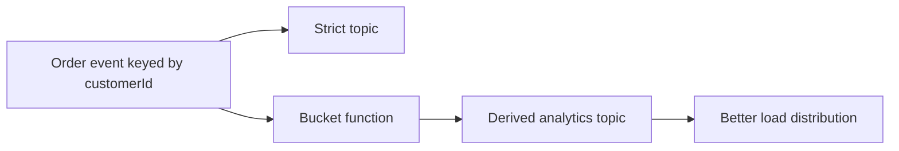

In Part 1, the point was to measure the hotspot honestly before trying to be clever. Part 2 is where we make a more nuanced move: keep strict ordering where the business actually needs it, and relax it only on the paths that benefit more from distribution than from exact per-entity sequencing.

That distinction matters because teams often swing too hard in one direction. Either they keep one overly strict key everywhere and accept chronic skew, or they hash everything aggressively and quietly break workflows that depended on ordering.

## The Real Trade-Off in Part 2

Bucketing is useful only when the stream can tolerate weaker ordering.

That usually means:

- primary transaction streams keep the strict business key
- analytics or derived streams can use a bucketed key
- downstream consumers know they are no longer reading a strictly ordered per-entity stream

The important thing is not the bucket algorithm itself. It is the explicit decision about where order still matters.

## Where Bucketing Makes Sense

A typical example:

- `orders.lifecycle` drives state transitions and must keep strict ordering per `customerId`
- `orders.analytics` feeds dashboards, counters, or batch-oriented enrichment and can tolerate weaker sequencing

If both topics use the same strict key, the analytical path inherits the same hotspot pain even though it may not need the same guarantee.

## A Safer Bucketing Pattern

Do not replace the original business identity. Add a routing key for the derived stream.

~~~java
int bucket = Math.floorMod(order.customerId().hashCode(), 8);
String routingKey = order.customerId() + "#" + bucket;

producer.send(new ProducerRecord<>("orders.analytics", routingKey, payload));
~~~

This keeps the original identity inside the event payload while letting the derived topic spread load more evenly.

## What to Measure Against Part 1

Part 2 only makes sense if you compare it with the Part 1 baseline:

- maximum partition lag
- skew ratio between busiest and median partition
- end-to-end latency on the derived stream
- downstream correctness under weaker ordering

If the distribution improves but the consumer logic breaks, the mitigation was not worth it.

> [!warning]
> Bucketing is not a free performance trick. It is a semantics change. If downstream readers still assume strict per-entity ordering, you have only moved the incident.

## Local Setup

### Prerequisites

- Docker Desktop
- Java 21
- Kafka CLI tools

### Local Stack

~~~yaml
services:
  zookeeper:
    image: confluentinc/cp-zookeeper:7.6.1
    environment:
      ZOOKEEPER_CLIENT_PORT: 2181

  kafka:
    image: confluentinc/cp-kafka:7.6.1
    depends_on: [zookeeper]
    ports: ["9092:9092"]
    environment:
      KAFKA_BROKER_ID: 1
      KAFKA_ZOOKEEPER_CONNECT: zookeeper:2181
      KAFKA_LISTENERS: PLAINTEXT://0.0.0.0:9092
      KAFKA_ADVERTISED_LISTENERS: PLAINTEXT://localhost:9092
      KAFKA_OFFSETS_TOPIC_REPLICATION_FACTOR: 1
~~~

~~~bash
docker compose up -d
~~~

## The Right Validation Drill

Replay the same skewed workload from Part 1 into both:

- the strict ordered topic
- the bucketed derived topic

Then compare the consumer group behavior on the analytics side:

~~~bash
kafka-consumer-groups --bootstrap-server localhost:9092 \
  --group analytics-cg \
  --describe
~~~

What you want to see is lower skew without creating an ambiguous contract for analytics consumers.

## Operational Guidance

### Keep the strict stream authoritative

If one stream still owns correctness-sensitive state transitions, document it clearly. The bucketed stream should not quietly become the source of truth.

### Choose a manageable bucket count

Too few buckets will not spread enough. Too many creates more partitions or keys to reason about than the use case earns.

### Explain the weaker guarantee in consumer docs

If the downstream team does not know the stream is bucketed, they will rediscover it the hard way during replay or debugging.

## What This Part Should Leave You With

After Part 2, the team should be able to answer:

1. which stream keeps strict ordering
2. which stream can accept bucketed routing
3. whether the measured skew improvement is worth the semantic trade

That is the right way to use bucketing: as a targeted mitigation on the right stream, not as a blanket fix for every hotspot.
