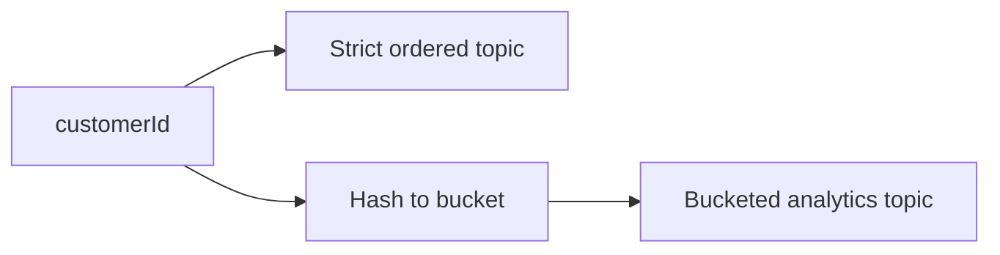

---
categories:
- Java
- Kafka
- Distributed Systems
date: 2026-06-13
seo_title: Kafka Partition Strategy for Ordering and Hotspot Mitigation (Part 2)
seo_description: 'Hands-on guide: Kafka Partition Strategy for Ordering and Hotspot
  Mitigation. Harden with key bucketing.'
tags:
- java
- kafka
- distributed-systems
- streaming
- backend
title: Kafka Partition Strategy for Ordering and Hotspot Mitigation (Part 2)
toc: true
toc_icon: cog
toc_label: In This Article
header:
  overlay_image: "/assets/images/java-advanced-generic-banner.svg"
  overlay_filter: 0.35
  show_overlay_excerpt: false
  caption: June Kafka Hands-On Series
---
Part goal: **Harden the strategy with key bucketing where strict ordering is not required**.

---

## Problem 1: Reduce Hotspots Without Breaking the Wrong Kind of Ordering

Problem description:
Some streams need strict per-entity ordering, while others only need good distribution for analytics or secondary processing.

What we are solving actually:
We are solving selective relaxation of ordering.
The goal is to keep strict keys for ordering-critical flows and use bucketing only where more even spread is worth the trade.

What we are doing actually:

1. Keep strict keys on the primary ordered stream.
2. Use bucketed keys on the stream that can tolerate relaxed ordering.
3. Compare skew and lag before and after bucketing.

## Real-World Scenario

A single high-volume tenant overloads one partition, creating lag spikes and delayed processing for that key.

---

## Run It Locally

### Prerequisites

- Docker Desktop
- Java 21
- Kafka CLI tools

### Local Stack

~~~yaml
services:
  zookeeper:
    image: confluentinc/cp-zookeeper:7.6.1
    environment:
      ZOOKEEPER_CLIENT_PORT: 2181

  kafka:
    image: confluentinc/cp-kafka:7.6.1
    depends_on: [zookeeper]
    ports: ["9092:9092"]
    environment:
      KAFKA_BROKER_ID: 1
      KAFKA_ZOOKEEPER_CONNECT: zookeeper:2181
      KAFKA_LISTENERS: PLAINTEXT://0.0.0.0:9092
      KAFKA_ADVERTISED_LISTENERS: PLAINTEXT://localhost:9092
      KAFKA_OFFSETS_TOPIC_REPLICATION_FACTOR: 1
~~~

~~~bash
docker compose up -d
~~~

---

## Lab Steps

1. Keep strict key for ordering-critical stream.
2. Add bucketed key for analytics stream.
3. Compare skew ratio before/after.

---

## Runnable Code Block

~~~java
int bucket = Math.floorMod(order.customerId().hashCode(), 8);
String key = order.customerId() + "#" + bucket;
producer.send(new ProducerRecord<>("orders.analytics", key, payload));
~~~

---

## Verify

~~~bash
# observe per-partition lag in both topics
kafka-consumer-groups --bootstrap-server localhost:9092 --group analytics-cg --describe
~~~

---

## Failure Drill

Replay same load profile and verify lag spread is more uniform.

---

## Debug Steps

Debug steps:

- document clearly which topic keeps strict ordering and which one does not
- compare max partition lag and skew ratio before and after bucketing
- validate consumer logic against the weaker ordering guarantee on the bucketed stream
- avoid bucket counts that are too low to matter or too high to manage

## Operational Note

Bucketing should be a product and platform decision together.
It changes the behavior of downstream consumers, so the gain in distribution should be weighed against the cost of weaker replay and ordering semantics.

## What You Should Learn

- bucketing is a targeted mitigation, not a universal answer
- the right place to relax ordering is the stream that can tolerate it operationally
- skew reduction should be measured, not assumed

---

## Operator Prompt

For kafka partition strategy for ordering and hotspot mitigation (part 2), keep one rollout question in the runbook: what metric tells us the topology is healthy, and what metric tells us to stop or roll back? Kafka systems usually fail operationally before they fail conceptually.

---

## Final Operations Note

One more practical rule helps this series topic stay useful in real systems: always pair the design with one rollback move and one "healthy again" signal. In Kafka, teams often know how to add topology complexity faster than they know how to back out safely, and that gap is exactly where routine changes turn into incidents.
