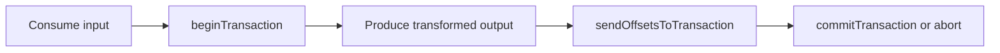

Part goal: **Use Kafka transactions for consume-transform-produce atomically**.

---

## Problem 1: Avoid Partial Visibility When Reading, Writing, and Committing Offsets

Problem description:
A processor that consumes input, writes transformed output, and commits offsets can leave the system inconsistent if it crashes between those steps.

What we are solving actually:
We are solving atomicity across output publication and offset progress.
Without transactions, downstream topics can contain partial work or consumers can advance offsets without corresponding output.

What we are doing actually:

1. Begin a Kafka transaction.
2. Produce output records.
3. Send consumer offsets to the same transaction.
4. Commit or abort the whole unit together.

## Real-World Scenario

Network retries during peak load can duplicate records unless producer semantics are configured correctly.

---

## Run It Locally

### Prerequisites

- Docker Desktop
- Java 21
- Kafka CLI tools

### Local Stack

~~~yaml
services:
  zookeeper:
    image: confluentinc/cp-zookeeper:7.6.1
    environment:
      ZOOKEEPER_CLIENT_PORT: 2181

  kafka:
    image: confluentinc/cp-kafka:7.6.1
    depends_on: [zookeeper]
    ports: ["9092:9092"]
    environment:
      KAFKA_BROKER_ID: 1
      KAFKA_ZOOKEEPER_CONNECT: zookeeper:2181
      KAFKA_LISTENERS: PLAINTEXT://0.0.0.0:9092
      KAFKA_ADVERTISED_LISTENERS: PLAINTEXT://localhost:9092
      KAFKA_OFFSETS_TOPIC_REPLICATION_FACTOR: 1
~~~

~~~bash
docker compose up -d
~~~

---

## Lab Steps

1. Consume input topic.
2. Start transaction.
3. Produce output + offsets atomically.
4. Commit transaction.

---

## Runnable Code Block

~~~java
producer.initTransactions();
producer.beginTransaction();
producer.send(new ProducerRecord<>("orders.out", key, transformed));
producer.sendOffsetsToTransaction(offsets, groupMeta);
producer.commitTransaction();
~~~

---

## Verify

~~~bash
# read committed only
kafka-console-consumer --bootstrap-server localhost:9092 --topic orders.out --from-beginning --isolation-level read_committed
~~~

---

## Failure Drill

Kill app before commitTransaction and verify no partial output visibility.

---

## Debug Steps

Debug steps:

- use `read_committed` consumers when verifying transaction behavior
- test crash timing before commit, after output send, and around offset commit
- confirm the consumer group metadata used for `sendOffsetsToTransaction` is correct
- remember that transaction success still depends on consumer idempotency around external side effects

## Operational Note

This pattern is strongest when the processor owns only Kafka-side state transitions.
As soon as external databases or side effects are mixed in, transactional guarantees need another layer of design and compensating controls.

That boundary should be explained explicitly in team docs.
It prevents “exactly once” from becoming a misleading label for a wider workflow.

## What You Should Learn

- transactions make output and offset progression one atomic decision
- verification requires committed-read semantics, not default consumption behavior
- partial visibility bugs only disappear when the full consume-transform-produce unit is transactional

---

        ## Production Checklist

        Verify both broker configuration and consumer isolation level. Transactional semantics are easy to misread when downstream readers still use default isolation.

        ## Incident Drill

        Restart the processor with the wrong transactional identity and inspect the resulting fencing or duplicate risk. That is the boundary operators have to understand before incident day.

        ## Extra Debug Cues

        - keep the transactional ID stable for one processor identity
- check fencing events during rolling deploys
- verify all downstream validation reads use `read_committed`

---

## Operator Prompt

For idempotent producers and kafka transactions in practice (part 2), keep one rollout question in the runbook: what metric tells us the topology is healthy, and what metric tells us to stop or roll back? Kafka systems usually fail operationally before they fail conceptually.
