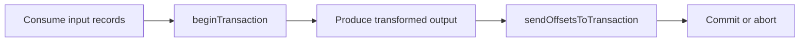

Part 1 established the narrow guarantee of idempotent producers. Part 2 is where the picture becomes more useful: consume input, produce derived output, and advance offsets as one Kafka transaction so downstream readers do not see partial progress.

This is the part of the model that often justifies the phrase "exactly once" in Kafka conversations, but only if we stay precise about where the atomic boundary begins and ends.

## What Part 2 Adds Beyond Idempotence

Idempotence protected a producer retry path. Transactions go further by tying together:

- produced output records
- the offsets of the consumed input

That matters for stream processors because a crash between "output sent" and "offset committed" can otherwise create duplicate visible work or partial visibility.

If the transaction aborts, neither the output nor the offset progression should become visible to `read_committed` readers.

## The Failure Mode We Are Actually Fixing

Imagine a processor that reads `orders.in` and writes `orders.out`.

Without transactions:

1. output may be published
2. process crashes
3. offsets never commit
4. restart reprocesses the same input
5. downstream may now see duplicate derived output

With transactions, output publication and offset advancement become one broker-side decision.

## A Minimal Transactional Skeleton

~~~java
producer.initTransactions();

producer.beginTransaction();
producer.send(new ProducerRecord<>("orders.out", key, transformed));
producer.sendOffsetsToTransaction(offsets, groupMeta);
producer.commitTransaction();
~~~

This code is not the whole application, but it shows the important shape clearly:

- open a transaction
- write derived output
- attach consumer progress
- commit or abort together

## Verification Needs the Right Reader

This part is easy to mis-test. If your verification consumer reads with default isolation, you can draw the wrong conclusion about what was visible when.

Use committed reads:

~~~bash
kafka-console-consumer \
  --bootstrap-server localhost:9092 \
  --topic orders.out \
  --from-beginning \
  --isolation-level read_committed
~~~

That way, you are actually verifying the property you care about.

> [!important]
> Transactions are only meaningful if the consumers observing the result respect transactional visibility.

## The Right Failure Drill

Crash the processor at three points:

1. before output send
2. after output send but before commit
3. after commit

The second case is the one that proves the value of Part 2. It shows whether partially completed work leaks to readers or stays hidden until the transaction is complete.

## Where the Boundary Still Stops

Part 2 improves Kafka-to-Kafka workflows. It does not automatically solve:

- database side effects
- HTTP calls
- external caches
- email or notification sends

If the processor touches outside systems, that outer boundary still needs its own correctness design.

That is why this part is strongest for consume-transform-produce pipelines that remain mostly inside Kafka.

## Local Setup

### Prerequisites

- Docker Desktop
- Java 21
- Kafka CLI tools

### Local Stack

~~~yaml
services:
  zookeeper:
    image: confluentinc/cp-zookeeper:7.6.1
    environment:
      ZOOKEEPER_CLIENT_PORT: 2181

  kafka:
    image: confluentinc/cp-kafka:7.6.1
    depends_on: [zookeeper]
    ports: ["9092:9092"]
    environment:
      KAFKA_BROKER_ID: 1
      KAFKA_ZOOKEEPER_CONNECT: zookeeper:2181
      KAFKA_LISTENERS: PLAINTEXT://0.0.0.0:9092
      KAFKA_ADVERTISED_LISTENERS: PLAINTEXT://localhost:9092
      KAFKA_OFFSETS_TOPIC_REPLICATION_FACTOR: 1
~~~

~~~bash
docker compose up -d
~~~

## Operational Guidance

### Keep transactional IDs stable

Transactional identity has to map to a meaningful processor identity. If it changes carelessly across restarts, you invite fencing confusion and harder incident analysis.

### Test rolling deploy behavior

Transactions are not only a code-path feature. They interact with process identity and rollout behavior too.

### Explain the guarantee boundary in team docs

Otherwise "Kafka transactions" gets casually translated into "the whole workflow is safe now," which is rarely true.

## What This Part Should Leave You With

After Part 2, the team should understand:

1. how transactions make output and input progress one atomic Kafka decision
2. why `read_committed` matters for verification
3. why this still is not a universal end-to-end exactly-once guarantee

That is the right mental model before moving into broader correctness claims.
