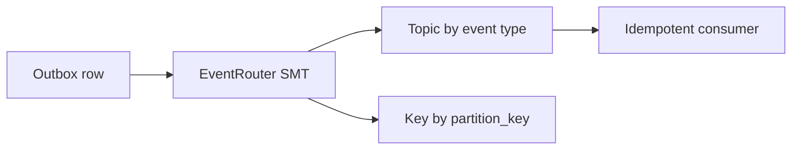

Part goal: **Harden the outbox contract with a better envelope and routing strategy**.

---

## Problem 1: Turn Raw Outbox Rows Into Useful Event Contracts

Problem description:
A basic outbox row is enough to publish events, but production systems also need event versioning, partition keys, routing discipline, and idempotent consumers.

What we are solving actually:
We are solving event-contract quality after reliability.
Once the dual-write gap is closed, the next risk is publishing hard-to-route or hard-to-dedupe events that create downstream operational pain.

What we are doing actually:

1. Enrich the outbox schema with version and partition metadata.
2. Use Debezium EventRouter to map database rows into event topics cleanly.
3. Add consumer-side dedupe to absorb replay and connector restart scenarios.

## Real-World Scenario

An order write succeeds, but app crashes before publish; outbox+CDC is needed to close this dual-write gap.

---

## Run It Locally

### Prerequisites

- Docker Desktop
- Java 21
- Kafka CLI tools

### Local Stack

~~~yaml
services:
  zookeeper:
    image: confluentinc/cp-zookeeper:7.6.1
    environment:
      ZOOKEEPER_CLIENT_PORT: 2181

  kafka:
    image: confluentinc/cp-kafka:7.6.1
    depends_on: [zookeeper]
    ports: ["9092:9092"]
    environment:
      KAFKA_BROKER_ID: 1
      KAFKA_ZOOKEEPER_CONNECT: zookeeper:2181
      KAFKA_LISTENERS: PLAINTEXT://0.0.0.0:9092
      KAFKA_ADVERTISED_LISTENERS: PLAINTEXT://localhost:9092
      KAFKA_OFFSETS_TOPIC_REPLICATION_FACTOR: 1
~~~

~~~bash
docker compose up -d
~~~

---

## Lab Steps

1. Add `event_version` and `partition_key` columns.
2. Use Debezium EventRouter SMT.
3. Route by event_type and key by partition_key.
4. Add idempotent consumer table.

---

## Runnable Code Block

~~~json
{
  "transforms": "outbox",
  "transforms.outbox.type": "io.debezium.transforms.outbox.EventRouter",
  "transforms.outbox.route.by.field": "event_type",
  "transforms.outbox.table.field.event.key": "partition_key"
}
~~~

---

## Verify

~~~bash
kafka-console-consumer --bootstrap-server localhost:9092 --topic orders.event.OrderCreated --from-beginning --property print.key=true
~~~

---

## Failure Drill

Restart connector and replay event; dedupe table should prevent duplicate side effects.

---

## Debug Steps

Debug steps:

- verify topic routing and event keys match downstream ordering expectations
- make event version part of the contract before schema drift becomes a problem
- test connector restart and replay behavior with idempotent consumer logic enabled
- inspect whether the outbox envelope carries enough metadata for debugging and audit

## Operational Note

A well-designed outbox envelope keeps future migrations cheaper.
Teams that skip version, routing, or correlation metadata usually pay for that decision during the first large replay or downstream contract split.

## What You Should Learn

- reliable publishing is only part one; event shape and routing quality matter too
- EventRouter helps convert raw CDC rows into usable event streams
- replay safety depends on metadata discipline and consumer idempotency

---

## Operator Prompt

For outbox plus cdc with debezium for reliable event publishing (part 2), keep one rollout question in the runbook: what metric tells us the topology is healthy, and what metric tells us to stop or roll back? Kafka systems usually fail operationally before they fail conceptually.

---

## Final Operations Note

One more practical rule helps this series topic stay useful in real systems: always pair the design with one rollback move and one "healthy again" signal. In Kafka, teams often know how to add topology complexity faster than they know how to back out safely, and that gap is exactly where routine changes turn into incidents.
