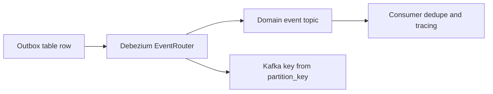

---
categories:
- Java
- Kafka
- Distributed Systems
date: 2026-06-15
seo_title: Outbox Plus CDC with Debezium for Reliable Event Publishing (Part 2)
seo_description: 'Hands-on guide: Outbox Plus CDC with Debezium for Reliable Event
  Publishing. Envelope + EventRouter hardening.'
tags:
- java
- kafka
- distributed-systems
- streaming
- backend
title: Outbox Plus CDC with Debezium for Reliable Event Publishing (Part 2)
toc: true
toc_icon: cog
toc_label: In This Article
header:
  overlay_image: "/assets/images/java-advanced-generic-banner.svg"
  overlay_filter: 0.35
  show_overlay_excerpt: false
  caption: June Kafka Hands-On Series
---
Part 1 closed the dual-write gap. Part 2 is about the next problem teams hit almost immediately: the events are now reliably published, but the contract is still too raw. Routing is awkward, metadata is thin, and consumers have little help when they need to deduplicate or debug replay.

This is where the outbox pattern starts maturing from "reliable publish" into "operationally useful event stream."

## Reliability Is Not the Same as Event Quality

An outbox row can be durable and still be hard to live with downstream.

Common weaknesses:

- no event version
- no clear partition key
- no correlation metadata
- raw CDC topic naming that leaks table structure into event design

Those gaps do not usually break day one. They hurt during replay, debugging, or when the event contract needs to evolve.

Part 2 is about adding that missing shape.

## A Better Envelope

The outbox row should carry enough information for routing and downstream control without turning into an everything-table.

A good baseline includes:

- event id
- aggregate id
- event type
- event version
- partition key
- payload
- created timestamp
- correlation id if the system already uses one

This gives consumers and operators enough context to reason about the event without reverse-engineering database state.

## Why EventRouter Helps

Raw CDC output is valuable for transport, but not always a clean event contract. Debezium EventRouter can convert outbox rows into a more useful topic and key shape.

~~~json
{
  "transforms": "outbox",
  "transforms.outbox.type": "io.debezium.transforms.outbox.EventRouter",
  "transforms.outbox.route.by.field": "event_type",
  "transforms.outbox.table.field.event.key": "partition_key"
}
~~~

That does two important things:

- routes by a meaningful event type instead of raw table shape
- preserves the partition key needed for downstream ordering

## Why Consumer Idempotency Still Matters

Outbox plus CDC improves reliability, but consumers still need to survive replay and restart behavior.

Connector restarts, reprocessing, or operational recovery may cause an event to be seen again. That is why a consumer-side dedupe table or idempotency key remains useful even in a well-built outbox flow.

The right mental model is:

- outbox protects the publish boundary
- consumer idempotency protects the side-effect boundary

## Local Setup

### Prerequisites

- Docker Desktop
- Java 21
- Kafka CLI tools

### Local Stack

~~~yaml
services:
  zookeeper:
    image: confluentinc/cp-zookeeper:7.6.1
    environment:
      ZOOKEEPER_CLIENT_PORT: 2181

  kafka:
    image: confluentinc/cp-kafka:7.6.1
    depends_on: [zookeeper]
    ports: ["9092:9092"]
    environment:
      KAFKA_BROKER_ID: 1
      KAFKA_ZOOKEEPER_CONNECT: zookeeper:2181
      KAFKA_LISTENERS: PLAINTEXT://0.0.0.0:9092
      KAFKA_ADVERTISED_LISTENERS: PLAINTEXT://localhost:9092
      KAFKA_OFFSETS_TOPIC_REPLICATION_FACTOR: 1
~~~

~~~bash
docker compose up -d
~~~

## What to Verify in Part 2

A stronger verification target than "message arrived" is:

1. topic naming now reflects event meaning
2. keying matches downstream ordering needs
3. envelope metadata is enough for debugging and replay
4. consumer dedupe absorbs a connector restart or replay safely

~~~bash
kafka-console-consumer \
  --bootstrap-server localhost:9092 \
  --topic orders.event.OrderCreated \
  --from-beginning \
  --property print.key=true
~~~

That one check already shows whether the event stream became more usable.

> [!important]
> If replay is part of your recovery story, replay metadata is part of the event contract, not optional decoration.

## Common Mistakes

### Leaving the outbox too raw

You solved the dual-write gap, but downstream teams now inherit a contract that is difficult to route or evolve.

### Forgetting version too long

Once multiple consumers exist, adding version late becomes more painful than adding it early.

### Assuming CDC reliability removes consumer-side dedupe needs

It does not. Reliability and side-effect idempotency solve different problems.

## What This Part Should Leave You With

After Part 2, the team should understand:

1. why a reliable outbox still needs a disciplined event envelope
2. how EventRouter improves topic and key shape
3. why replay safety still depends on downstream idempotency

That is the step that turns outbox from a transport fix into a durable eventing pattern.
