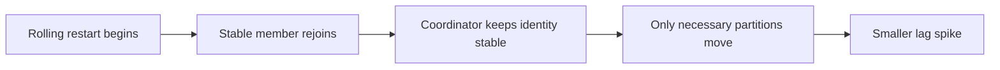

---
categories:
- Java
- Kafka
- Distributed Systems
date: 2026-06-16
seo_title: Consumer Group Rebalance Internals and Zero Downtime Tuning (Part 2)
seo_description: 'Hands-on guide: Consumer Group Rebalance Internals and Zero Downtime
  Tuning. Cooperative and static membership.'
tags:
- java
- kafka
- distributed-systems
- streaming
- backend
title: Consumer Group Rebalance Internals and Zero Downtime Tuning (Part 2)
toc: true
toc_icon: cog
toc_label: In This Article
header:
  overlay_image: "/assets/images/java-advanced-generic-banner.svg"
  overlay_filter: 0.35
  show_overlay_excerpt: false
  caption: June Kafka Hands-On Series
---
Part goal: **Reduce rebalance disruption with cooperative assignment and static membership**.

---

## Problem 1: How Do We Make Rebalances Less Disruptive?

Problem description:
In Part 1 we measured how eager rebalancing creates broad partition revocation and noticeable lag spikes.
Now we want to reduce that disruption during rolling deploys and restarts.

What we are solving actually:
We are solving for less partition churn and more stable identity during restarts.
Cooperative assignment reduces how much work must move at once, and static membership helps Kafka recognize that a restarting instance is still the same logical group member.

What we are doing actually:

1. Switch from eager assignment to `CooperativeStickyAssignor`.
2. Give each consumer a stable `group.instance.id`.
3. Re-run the same restart drill from Part 1.
4. Compare rebalance duration, lag spikes, and partition churn against the baseline.

---

## Why This Helps

This is the practical goal.
We are not aiming for "no rebalance ever."
We are aiming for smaller, more incremental movement when the group changes.

---

## Run It Locally

Use the same local stack and topic from Part 1 so the comparison stays fair.

The key configuration changes are these:

~~~properties
group.id=orders-cg
partition.assignment.strategy=org.apache.kafka.clients.consumer.CooperativeStickyAssignor
group.instance.id=orders-c1
enable.auto.commit=false
auto.offset.reset=earliest
session.timeout.ms=10000
heartbeat.interval.ms=3000
~~~

Each consumer instance must have a unique but stable `group.instance.id`.
In Kubernetes, this usually maps well to a StatefulSet pod identity.

---

## Lab Steps

1. Switch to CooperativeStickyAssignor.
2. Add stable `group.instance.id` per consumer instance.
3. Re-run the rolling restart scenario from Part 1.
4. Compare lag spike size and total reassignment work.

---

## Deployment Identity Example

~~~text
orders-c1 -> pod/orders-consumer-0
orders-c2 -> pod/orders-consumer-1
orders-c3 -> pod/orders-consumer-2
~~~

The point is stability, not uniqueness alone.
If the identity changes on every restart, Kafka treats the consumer like a brand-new member and you lose most of the static-membership benefit.

---

## Verify

~~~bash
kafka-consumer-groups --bootstrap-server localhost:9092 --group orders-cg --describe
~~~

Watch whether unaffected consumers keep more of their existing partitions.
The fewer partitions that move, the more likely your restart stayed close to zero-downtime behavior.

---

## Failure Drill

Restart one instance under load and compare the lag spike against Part 1.
Then misconfigure one pod with a changing `group.instance.id` and observe how quickly the benefit disappears.

---

## Common Pitfalls

- using cooperative assignment but still generating a fresh member id on every deploy
- changing multiple variables at once so results are impossible to compare
- assuming cooperative assignment removes the need for readiness and rollout guardrails
- testing only at idle load instead of under meaningful throughput

---

## Debug Steps

Debug steps:

- verify every consumer uses `CooperativeStickyAssignor`
- verify each instance has a stable, unique `group.instance.id`
- compare partition movement count against the Part 1 baseline
- measure whether lag returns to steady state faster after restart

---

## What You Should Learn

- cooperative assignment reduces the blast radius of rebalances
- static membership gives the group a more stable view of restarting consumers
- together they make rolling restarts far less disruptive, but they still need rollout discipline
