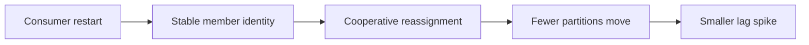

Part 1 gave us the baseline cost of eager rebalancing. Part 2 is about reducing the blast radius without pretending rebalances disappear entirely. The goal is narrower and more practical: move fewer partitions, preserve more member identity, and make rolling restarts look less like stop-the-world events.

The two main tools here are cooperative assignment and static membership. They solve related problems, but they are not the same thing.

## What Each Mechanism Actually Helps

Cooperative assignment reduces how much ownership changes at once.

Static membership helps Kafka understand that a restarting instance is still the same logical member rather than a totally new participant.

Together, they can make a big difference during:

- rolling deploys
- short restarts
- temporary node churn

The point is not "no rebalance ever." The point is less unnecessary disturbance.

## The Configuration Change That Matters

Move from the Part 1 eager baseline to:

~~~properties
group.id=orders-cg
partition.assignment.strategy=org.apache.kafka.clients.consumer.CooperativeStickyAssignor
group.instance.id=orders-c1
enable.auto.commit=false
auto.offset.reset=earliest
session.timeout.ms=10000
heartbeat.interval.ms=3000
~~~

Two details matter a lot:

- all consumers must actually use the cooperative assignor
- each member must keep a unique but stable `group.instance.id`

If the identity changes on every deploy, static membership gives you very little.

## A Better Mental Model for `group.instance.id`

Do not think of it as "just another config."
Think of it as the persistent name of the consumer instance.

For example:

~~~text
orders-c1 -> pod/orders-consumer-0
orders-c2 -> pod/orders-consumer-1
orders-c3 -> pod/orders-consumer-2
~~~

That is why StatefulSet-style identities fit this feature well.

## How to Compare Part 2 With Part 1

The same restart drill from Part 1 should now answer:

- did fewer partitions move
- did lag spike less sharply
- did recovery return to steady state faster

Those are better signals than simply asking whether the group rebalanced.

## Local Setup

Use the same local stack and topic shape from Part 1 so the comparison stays fair.

If you change the topology and the rebalance strategy at the same time, the results become much harder to trust.

## The Right Failure Drill

Restart one instance under load, then deliberately break the identity model by giving one restarting member a fresh `group.instance.id`.

That is a good test because it shows whether the team really understands where the benefit came from.

You should see the protection shrink quickly once identity stability disappears.

## Where Teams Still Get Burned

### Cooperative assignor without rollout discipline

This reduces disruption, but it does not excuse bad readiness probes, abrupt shutdowns, or crash-looping pods.

### Static membership with unstable infrastructure identity

If the platform hands out a different logical identity every time, Kafka cannot preserve continuity.

### Measuring only lag and not partition movement

Lag matters, but the number of revoked and reassigned partitions often explains the lag better than the lag chart alone.

> [!important]
> Part 2 works best when the application shutdown path is also clean. Kafka can reduce reassignment pain, but it cannot fix chaotic member lifecycle behavior by itself.

## What This Part Should Leave You With

After Part 2, the team should understand:

1. how cooperative assignment reduces rebalance churn
2. why static membership depends on stable instance identity
3. how to compare this setup honestly against the eager baseline from Part 1

That is what gets you closer to zero-downtime behavior in practice: less churn, better identity continuity, and cleaner rollout discipline.
