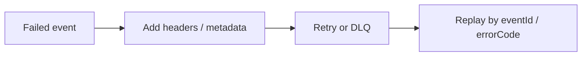

Part goal: **Add metadata and replay controls so retry behavior stays governable**.

---

## Problem 1: Make Retries and DLQ Entries Traceable

Problem description:
A retry topology is much less useful when operators cannot tell how many attempts happened, what failed, or which messages are safe to replay.

What we are solving actually:
We are solving observability and control of failed-event handling.
Without metadata, the DLQ becomes a pile of opaque records and replay turns into guesswork.

What we are doing actually:

1. Attach structured metadata such as attempt count and error code.
2. Enforce max-attempt rules consistently.
3. Build replay filters using event identity and failure class.

## Real-World Scenario

A poison event can block partition progress unless retries and DLQ are bounded and policy-driven.

---

## Run It Locally

### Prerequisites

- Docker Desktop
- Java 21
- Kafka CLI tools

### Local Stack

~~~yaml
services:
  zookeeper:
    image: confluentinc/cp-zookeeper:7.6.1
    environment:
      ZOOKEEPER_CLIENT_PORT: 2181

  kafka:
    image: confluentinc/cp-kafka:7.6.1
    depends_on: [zookeeper]
    ports: ["9092:9092"]
    environment:
      KAFKA_BROKER_ID: 1
      KAFKA_ZOOKEEPER_CONNECT: zookeeper:2181
      KAFKA_LISTENERS: PLAINTEXT://0.0.0.0:9092
      KAFKA_ADVERTISED_LISTENERS: PLAINTEXT://localhost:9092
      KAFKA_OFFSETS_TOPIC_REPLICATION_FACTOR: 1
~~~

~~~bash
docker compose up -d
~~~

---

## Lab Steps

1. Add headers: event_id, attempt, error_code, first_failure_at.
2. Enforce max attempts.
3. Build replay filter by event_id and error class.

---

## Runnable Code Block

~~~json
{
  "eventId": "evt-88",
  "attempt": 3,
  "errorCode": "SCHEMA_VALIDATION_FAILED"
}
~~~

---

## Verify

~~~bash
# inspect DLQ volume
kafka-run-class kafka.tools.GetOffsetShell --broker-list localhost:9092 --topic orders.dlq
~~~

---

## Failure Drill

Replay only fixed error class; ensure unrepaired poison messages remain quarantined.

---

## Debug Steps

Debug steps:

- verify attempt counters increment correctly across retry hops
- keep event ids stable so replay and dedupe tools can reason about one logical message
- replay only a repaired failure class instead of draining the whole DLQ blindly
- monitor DLQ growth by error code so repeated failure modes are visible

## Operational Note

Metadata discipline pays off most during incident recovery.
When the DLQ already tells you what failed, how often, and when, replay decisions get faster and much safer.

That makes the metadata schema part of the recovery design, not just an implementation detail.

## What You Should Learn

- retry metadata turns failure handling into an operable system instead of a black box
- replay should be filterable and selective, not all-or-nothing
- max-attempt policy is only useful when it is visible in the event record itself

---

        ## Production Checklist

        Inspect retry topics and the DLQ together so you can confirm the record moves forward through the policy rather than bouncing forever.

        ## Incident Drill

        Publish one malformed record followed by valid records on the same key and verify healthy traffic continues while the poison message is isolated with context.

        ## Extra Debug Cues

        - carry attempt count and original topic metadata in headers
- set a maximum attempt count before the first message ever ships
- keep DLQ payloads rich enough for replay or manual repair

---

## Operator Prompt

For retry topics dlq design and poison message governance (part 2), keep one rollout question in the runbook: what metric tells us the topology is healthy, and what metric tells us to stop or roll back? Kafka systems usually fail operationally before they fail conceptually.
