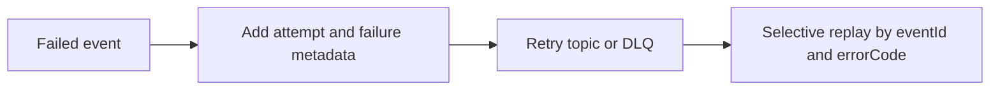

Part 1 built the bounded retry topology. Part 2 is about making that topology governable. A retry system that cannot explain why a message failed, how many times it has failed, or whether it is safe to replay is still fragile, even if it has a retry topic and a DLQ.

This is where metadata stops being "nice to have" and becomes part of the recovery design.

## The New Question in Part 2

After you have main, retry, and DLQ topics, the next operational question is:

"Can we tell what happened to one logical message without guessing?"

That requires a few things to be explicit:

- stable event identity
- attempt count
- failure classification
- original topic or stage
- first-failure time

Without that metadata, DLQ recovery quickly becomes an archaeology exercise.

## Why Replay Needs More Discipline Than "Try Again"

Blind replay is how teams reintroduce incidents they thought they had contained.

Safer replay means:

- replaying one repaired failure class rather than the whole DLQ
- preserving event identity so dedupe still works
- knowing whether the original failure was transient, permanent, or environmental

If the metadata cannot support that decision, the retry system is underdesigned.

## A Better Failure Envelope

Even a compact metadata model helps a lot:

~~~json
{
  "eventId": "evt-88",
  "attempt": 3,
  "errorCode": "SCHEMA_VALIDATION_FAILED",
  "firstFailureAt": "2026-06-17T10:22:00Z"
}
~~~

You do not need to make every failed record enormous. You do need enough context to support replay, triage, and audit.

## What Stable Identity Buys You

If `eventId` changes on every retry hop, replay control becomes much weaker. Stable identity gives you:

- selective replay
- dedupe support downstream
- clearer incident narratives

The whole failure path becomes easier to reason about when one logical event still looks like one logical event.

## Local Setup

### Prerequisites

- Docker Desktop
- Java 21
- Kafka CLI tools

### Local Stack

~~~yaml
services:
  zookeeper:
    image: confluentinc/cp-zookeeper:7.6.1
    environment:
      ZOOKEEPER_CLIENT_PORT: 2181

  kafka:
    image: confluentinc/cp-kafka:7.6.1
    depends_on: [zookeeper]
    ports: ["9092:9092"]
    environment:
      KAFKA_BROKER_ID: 1
      KAFKA_ZOOKEEPER_CONNECT: zookeeper:2181
      KAFKA_LISTENERS: PLAINTEXT://0.0.0.0:9092
      KAFKA_ADVERTISED_LISTENERS: PLAINTEXT://localhost:9092
      KAFKA_OFFSETS_TOPIC_REPLICATION_FACTOR: 1
~~~

~~~bash
docker compose up -d
~~~

## The Right Drill for Part 2

Take one failure class that you know how to repair and replay only that subset. Leave the rest quarantined.

That proves something much more valuable than "the DLQ exists." It proves the team can use the DLQ surgically.

~~~bash
kafka-run-class kafka.tools.GetOffsetShell \
  --broker-list localhost:9092 \
  --topic orders.dlq
~~~

## Operational Guidance

### Track DLQ growth by reason, not only by volume

Ten failures of one type tell a different story than ten unrelated failures.

### Keep headers and payload metadata aligned

If the same event has contradictory retry state in different places, tooling and operators will not know which is authoritative.

### Design replay as an intentional path

If replay requires ad hoc scripts every time, it is still too fragile.

> [!important]
> A replay path should be selective by default. "Drain the whole DLQ back into main" is usually a sign that the failure model is too crude.

## What This Part Should Leave You With

After Part 2, the team should understand:

1. which metadata makes retry and DLQ behavior traceable
2. why stable event identity matters for replay and dedupe
3. how to replay narrowly instead of reopening the whole failure set

That is what turns retry handling from a hidden subsystem into something operators can actually trust.
