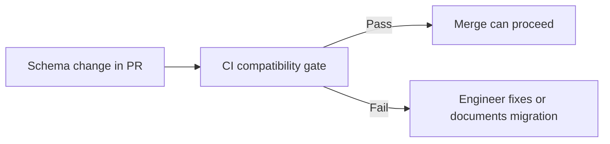

---
categories:
- Java
- Kafka
- Distributed Systems
date: 2026-06-18
seo_title: Schema Evolution with Avro and Protobuf Compatibility Contracts (Part 2)
seo_description: 'Hands-on guide: Schema Evolution with Avro and Protobuf Compatibility
  Contracts. CI compatibility gates.'
tags:
- java
- kafka
- distributed-systems
- streaming
- backend
title: Schema Evolution with Avro and Protobuf Compatibility Contracts (Part 2)
toc: true
toc_icon: cog
toc_label: In This Article
header:
  overlay_image: "/assets/images/java-advanced-generic-banner.svg"
  overlay_filter: 0.35
  show_overlay_excerpt: false
  caption: June Kafka Hands-On Series
---
Part 1 made schema safety explicit. Part 2 is where we stop trusting memory and review culture alone. Compatibility policy has to move into CI, because once delivery pressure rises, any rule that depends entirely on human attention will eventually be bypassed.

This part is not about teaching people what backward compatibility means. It is about enforcing the policy before the change reaches a merge button.

## What CI Is Actually Protecting

The point of schema checks in CI is not bureaucracy. It is to move detection earlier than runtime and earlier than human fatigue.

A useful gate can answer:

- does this change violate the declared compatibility mode
- does the subject naming in the PR match real production subjects
- is there a migration note when the syntax passes but the semantics are risky

This is the difference between "we believe we follow schema discipline" and "the repo actually enforces it."

## Why Automation Is Not Enough by Itself

A registry check can tell you whether a rule was violated syntactically. It usually cannot tell you whether the field meaning was repurposed in a way that will confuse downstream consumers.

That is why the stronger pattern is:

- automated compatibility enforcement
- required migration note for risky changes
- human review for semantic meaning

CI handles repeatable rules. People still have to evaluate meaning.

## What a Useful Gate Looks Like

Even if the exact vendor tooling differs, the policy is recognizable:

~~~text
CI gates:
- backward compatibility
- forward compatibility when the rollout requires it
- prohibition on field renumbering or unsafe narrowing
- migration note for semantically risky changes
~~~

The key is that the build fails loudly when the contract is broken.

## The Test That Builds Confidence

Do not just run the command and call it done. Keep one intentionally incompatible change around as a repeatable proof that the gate still catches what it claims to catch.

That simple drill does two things:

- verifies the pipeline is checking the right subjects and rules
- prevents the safety net from quietly drifting into irrelevance

## Local Setup

### Prerequisites

- Docker Desktop
- Java 21
- Kafka CLI tools

### Local Stack

~~~yaml
services:
  zookeeper:
    image: confluentinc/cp-zookeeper:7.6.1
    environment:
      ZOOKEEPER_CLIENT_PORT: 2181

  kafka:
    image: confluentinc/cp-kafka:7.6.1
    depends_on: [zookeeper]
    ports: ["9092:9092"]
    environment:
      KAFKA_BROKER_ID: 1
      KAFKA_ZOOKEEPER_CONNECT: zookeeper:2181
      KAFKA_LISTENERS: PLAINTEXT://0.0.0.0:9092
      KAFKA_ADVERTISED_LISTENERS: PLAINTEXT://localhost:9092
      KAFKA_OFFSETS_TOPIC_REPLICATION_FACTOR: 1
~~~

~~~bash
docker compose up -d
~~~

## The Right Verification for Part 2

Use a deliberately incompatible schema change in a test branch or local CI path and confirm the build blocks it.

~~~bash
# run schema compatibility check in CI or locally
# exact command depends on registry tooling
~~~

The meaningful proof is not "the job exists." It is "a bad change cannot slip through quietly."

## Common Mistakes

### Gating only one compatibility direction

That may be fine, or it may be incomplete, depending on how old and new readers and writers coexist during rollout.

### Allowing manual registry edits outside review

Once production subjects can change outside the controlled path, the CI gate stops being authoritative.

### Assuming syntactic safety equals semantic safety

A field can remain technically compatible while still changing meaning in a way that hurts consumers.

> [!important]
> Schema CI should be a merge guard, not an advisory report. If the policy matters, the build has to own the consequence.

## What This Part Should Leave You With

After Part 2, the team should understand:

1. why schema safety has to become an automated gate
2. what automation can and cannot verify
3. why migration notes still matter for semantic risk

That is how schema discipline survives real delivery pressure instead of disappearing at the first rushed release.
