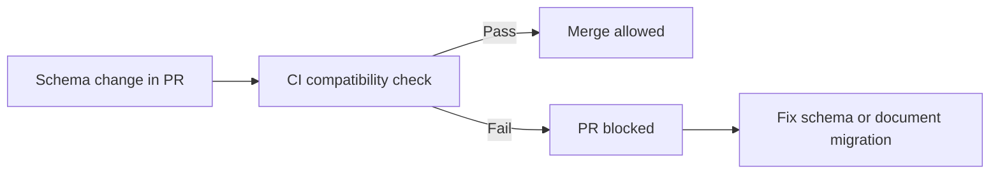

Part goal: **Move schema safety checks from tribal knowledge into CI gates**.

---

## Problem 1: Catch Incompatible Schemas Before They Merge

Problem description:
Even teams that understand schema evolution still ship breaking changes when review is rushed or compatibility rules live only in memory.

What we are solving actually:
We are solving enforcement, not education.
A schema policy that is written down but not checked automatically will eventually be bypassed under delivery pressure.

What we are doing actually:

1. Add schema checks to CI.
2. Fail the build on incompatible changes.
3. Require human migration notes when a change needs careful rollout context.

---

## Run It Locally

### Prerequisites

- Docker Desktop
- Java 21
- Kafka CLI tools

### Local Stack

~~~yaml
services:
  zookeeper:
    image: confluentinc/cp-zookeeper:7.6.1
    environment:
      ZOOKEEPER_CLIENT_PORT: 2181

  kafka:
    image: confluentinc/cp-kafka:7.6.1
    depends_on: [zookeeper]
    ports: ["9092:9092"]
    environment:
      KAFKA_BROKER_ID: 1
      KAFKA_ZOOKEEPER_CONNECT: zookeeper:2181
      KAFKA_LISTENERS: PLAINTEXT://0.0.0.0:9092
      KAFKA_ADVERTISED_LISTENERS: PLAINTEXT://localhost:9092
      KAFKA_OFFSETS_TOPIC_REPLICATION_FACTOR: 1
~~~

~~~bash
docker compose up -d
~~~

---

## Lab Steps

1. Add schema check job in CI.
2. Block incompatible changes.
3. Require migration note for every schema PR.

---

## Runnable Code Block

~~~text
CI gates:
- backward compatibility
- forward compatibility (if required)
- prohibited field renumber/type narrowing
~~~

The exact tooling depends on your registry and serializer stack, but the principle is constant:
schema changes must fail automatically when they violate policy.

---

## Verify

~~~bash
# run schema check command in pipeline
# (tooling depends on registry vendor)
~~~

Verification is not just “the command runs.”
You want proof that a deliberately bad change fails loudly and blocks the merge path.

---

## Failure Drill

Inject an intentional incompatible schema change in a test PR and verify the build fails.
This is the fastest way to confirm that policy is truly enforced rather than merely documented.

---

## Common Pitfalls

- checking only backward compatibility when the rollout model needs more
- treating CI as enough while skipping migration notes for risky semantic changes
- allowing manual registry edits outside the reviewed workflow
- letting one-off exceptions accumulate until the policy becomes meaningless

---

## Debug Steps

Debug steps:

- keep an intentionally incompatible test change around as a repeatable CI safety check
- verify the subject naming convention in CI matches the real production subject layout
- distinguish syntactic compatibility from semantic meaning changes in review notes
- make build failures actionable so engineers know exactly which rule was broken

---

## What You Should Learn

- schema compatibility needs automated enforcement, not just shared understanding
- CI turns compatibility from a best practice into a contract
- migration notes still matter because semantic risk is bigger than syntax alone

---

## Operator Prompt

For schema evolution with avro and protobuf compatibility contracts (part 2), keep one rollout question in the runbook: what metric tells us the topology is healthy, and what metric tells us to stop or roll back? Kafka systems usually fail operationally before they fail conceptually.

---

## Final Operations Note

One more practical rule helps this series topic stay useful in real systems: always pair the design with one rollback move and one "healthy again" signal. In Kafka, teams often know how to add topology complexity faster than they know how to back out safely, and that gap is exactly where routine changes turn into incidents.
