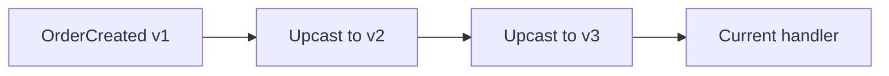

---
categories:
- Java
- Kafka
- Distributed Systems
date: 2026-06-20
seo_title: Event Versioning and Upcasting Strategy in Long Lived Domains (Part 2)
seo_description: 'Hands-on guide: Event Versioning and Upcasting Strategy in Long
  Lived Domains. Upcaster chain implementation.'
tags:
- java
- kafka
- distributed-systems
- streaming
- backend
title: Event Versioning and Upcasting Strategy in Long Lived Domains (Part 2)
toc: true
toc_icon: cog
toc_label: In This Article
header:
  overlay_image: "/assets/images/java-advanced-generic-banner.svg"
  overlay_filter: 0.35
  show_overlay_excerpt: false
  caption: June Kafka Hands-On Series
---
Part 1 made the case for version boundaries and a current in-memory model. Part 2 is about building the upcaster chain so that historical data can keep flowing without contaminating the whole application with version branches.

The important shift here is architectural. We are not just adding one conversion method. We are choosing where history gets normalized.

## What an Upcaster Chain Buys You

As versions accumulate, you usually want the business handler to see one current model, not six historical shapes.

That means older versions should be converted step by step until they reach the latest form.

This chain keeps evolution explicit and testable.

## Why One-Step Jumps Are Often Harder to Trust

It is tempting to transform `v1` directly into `v3` and skip the intermediate shape. Sometimes that is fine. Often it makes reasoning harder because:

- version transitions become less explicit
- test coverage is less granular
- it becomes harder to retire or reorder one evolution step cleanly

A chain is not automatically better in every codebase, but for long-lived domains it often makes version history much easier to audit.

## A Simple Upcaster Example

~~~java
OrderCreatedV2 upcastV1(OrderCreatedV1 old) {
    return new OrderCreatedV2(old.orderId(), "STANDARD");
}
~~~

That snippet is deliberately small. The more important design rule is this:

- upcasters should translate structure and explicit defaults
- they should not quietly absorb domain-policy decisions that deserve their own review

## Replay Is the Real Test

The strongest reason to build the chain well is replay.

If you can:

- read the topic from the earliest offset
- keep only the latest handlers active
- still process historical events successfully

then the compatibility layer is doing its job.

If replay fails because one old version was never normalized properly, the whole strategy was only partially implemented.

## Local Setup

### Prerequisites

- Docker Desktop
- Java 21
- Kafka CLI tools

### Local Stack

~~~yaml
services:
  zookeeper:
    image: confluentinc/cp-zookeeper:7.6.1
    environment:
      ZOOKEEPER_CLIENT_PORT: 2181

  kafka:
    image: confluentinc/cp-kafka:7.6.1
    depends_on: [zookeeper]
    ports: ["9092:9092"]
    environment:
      KAFKA_BROKER_ID: 1
      KAFKA_ZOOKEEPER_CONNECT: zookeeper:2181
      KAFKA_LISTENERS: PLAINTEXT://0.0.0.0:9092
      KAFKA_ADVERTISED_LISTENERS: PLAINTEXT://localhost:9092
      KAFKA_OFFSETS_TOPIC_REPLICATION_FACTOR: 1
~~~

~~~bash
docker compose up -d
~~~

## The Right Failure Drill

Disable one upcaster in the chain and replay historical data from the beginning.

That test is valuable because it reveals exactly how dependent the system is on explicit historical normalization.

A clean failure here is not embarrassing. It is informative. It proves the replay path is real enough to catch missing compatibility logic early.

> [!important]
> If replay is part of the recovery or migration story, upcaster tests are not optional. They are part of the production safety net.

## Common Mistakes

### Letting handlers understand every version directly

That spreads historical complexity across the whole codebase and makes future cleanup harder.

### Hiding semantic changes inside the upcaster

Defaulting a missing field is one thing. Reinterpreting business meaning without review is another.

### Forgetting retention implications

The longer the event history lives, the longer the compatibility burden lasts.

## What This Part Should Leave You With

After Part 2, the team should understand:

1. how an upcaster chain centralizes historical compatibility
2. why replay is the real proof of the design
3. where the chain should stop and the current handler should begin

That is what makes long-lived streams survivable as the domain changes around them.
