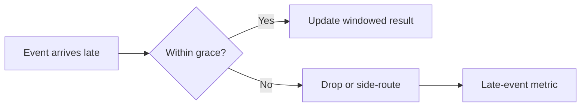

Part 1 forced the time model into the open. Part 2 is about what happens after that: once you choose event time, you still have to decide how much lateness you are willing to absorb, how long a window remains correctable, and what the system should do with data that arrives too late to include safely.

This is where a time model turns into a policy.

## The Practical Decision Behind Grace

Grace is not just a technical window parameter. It is a statement about how long the system is willing to wait for truth to catch up.

For example:

~~~text
Window policy:
- size: 5m
- grace: 2m
- later than grace: drop and count explicitly
~~~

That policy should reflect business expectations:

- is late correction more important than low latency
- can dashboards tolerate revision
- do downstream consumers accept amended aggregates

If those questions are not answered, grace becomes an arbitrary number copied from another project.

## What Grace Changes

Longer grace:

- accepts more delayed events
- increases the period in which results may still change
- can make downstream consumers handle late corrections longer

Shorter grace:

- stabilizes output sooner
- drops more late data
- demands stronger visibility into what was excluded

Neither setting is "correct" in the abstract. It depends on what your pipeline owes to its consumers.

## The Failure You Want to Make Explicit

The worst outcome is not simply that a late event was dropped. The worst outcome is that the system dropped or corrected data and nobody knew which policy caused it.

That is why a late-event counter or audit metric matters as much as the grace value itself.

## Local Setup

### Prerequisites

- Docker Desktop
- Java 21
- Kafka CLI tools

### Local Stack

~~~yaml
services:
  zookeeper:
    image: confluentinc/cp-zookeeper:7.6.1
    environment:
      ZOOKEEPER_CLIENT_PORT: 2181

  kafka:
    image: confluentinc/cp-kafka:7.6.1
    depends_on: [zookeeper]
    ports: ["9092:9092"]
    environment:
      KAFKA_BROKER_ID: 1
      KAFKA_ZOOKEEPER_CONNECT: zookeeper:2181
      KAFKA_LISTENERS: PLAINTEXT://0.0.0.0:9092
      KAFKA_ADVERTISED_LISTENERS: PLAINTEXT://localhost:9092
      KAFKA_OFFSETS_TOPIC_REPLICATION_FACTOR: 1
~~~

~~~bash
docker compose up -d
~~~

## The Right Validation Drill

Send a batch of out-of-order events in three groups:

1. comfortably within grace
2. just at the boundary
3. clearly beyond grace

Then inspect:

- corrected aggregate output
- explicit late-event counters
- whether the result behavior matches the written policy

~~~bash
# inspect late-event counter and corrected aggregate output
~~~

That test is better than arguing about grace in the abstract because it forces the policy to produce observable outcomes.

> [!important]
> If the system drops late events, that fact should be visible in metrics and runbooks. Silent lateness loss is a correctness problem, not just an observability gap.

## Common Mistakes

### Choosing grace before defining the consumer expectation

If nobody knows whether the result is allowed to change after publication, the grace setting is floating without a contract.

### Treating late drops as harmless

Some late data is business-critical. If it must be excluded, that should be an explicit and reviewable decision.

### Never testing replay and backfill together

Those are exactly the moments when lateness policy becomes real instead of theoretical.

## What This Part Should Leave You With

After Part 2, the team should understand:

1. what grace means in operational and business terms
2. how the pipeline behaves for in-grace and out-of-grace events
3. why late-event visibility is part of the contract

That is what turns time semantics from an internal detail into a stream-processing policy the team can defend.
