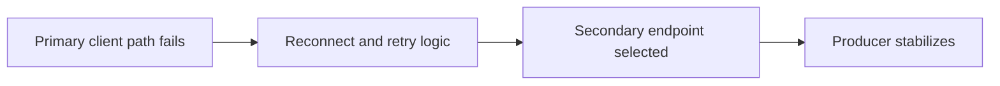

Part 1 defined data ownership and failover authority. Part 2 moves closer to the client edge, because even a well-reasoned multi-region plan can still behave badly if producers and consumers do not fail over in a predictable way.

This is where client behavior becomes part of resilience design rather than a passive detail.

## The Client-Side Problem

From the application's perspective, failover is not a diagram. It is a sequence of retry, reconnect, DNS or endpoint choice, and eventually new steady state.

That means client behavior has to be designed around questions like:

- how quickly should producers stop waiting on the failed region
- how aggressively should they reconnect
- how is the secondary chosen
- what signal tells operators that clients have stabilized rather than only switched endpoints

~~~properties
bootstrap.servers=primary:9092,secondary:9092
reconnect.backoff.ms=200
~~~

Those values are not magic defaults. They are part of the recovery behavior you are choosing.

## Why This Part Follows the Ownership Discussion

Client failover only makes sense once the team already knows:

- which region is allowed to accept writes
- under what condition the switch is legitimate

Otherwise the client layer can fail over faster than the operating model can justify, which creates a new class of inconsistency.

## What to Measure During Client Failover

A real drill should capture:

- producer publish latency during the switch
- error rate before and after endpoint change
- stabilization time once the new region is in use
- the observed data gap relative to replication lag at the moment of failover

Those measurements turn "the client eventually recovered" into something operationally useful.

The important word here is stabilizes. A noisy client that keeps flapping between endpoints can be worse than a slower but controlled failover.

## Local Setup

### Prerequisites

- Docker Desktop
- Java 21
- Kafka CLI tools

### Local Stack

~~~yaml
services:
  zookeeper:
    image: confluentinc/cp-zookeeper:7.6.1
    environment:
      ZOOKEEPER_CLIENT_PORT: 2181

  kafka:
    image: confluentinc/cp-kafka:7.6.1
    depends_on: [zookeeper]
    ports: ["9092:9092"]
    environment:
      KAFKA_BROKER_ID: 1
      KAFKA_ZOOKEEPER_CONNECT: zookeeper:2181
      KAFKA_LISTENERS: PLAINTEXT://0.0.0.0:9092
      KAFKA_ADVERTISED_LISTENERS: PLAINTEXT://localhost:9092
      KAFKA_OFFSETS_TOPIC_REPLICATION_FACTOR: 1
~~~

~~~bash
docker compose up -d
~~~

## The Right Drill for Part 2

Force the primary endpoint path to fail and observe how fast producers stop erroring and settle onto the secondary path.

Do not stop the exercise at "messages resumed." Also ask:

- was there duplicate risk during retries
- did backoff keep the client stable
- could operators tell the difference between temporary noise and a clean switchover

~~~bash
# observe publish latency and failover transition in logs and metrics
~~~

> [!important]
> A failover design is incomplete if it specifies region ownership but leaves client retry and endpoint behavior to defaults no one has tested.

## Common Mistakes

### Letting clients fail over faster than the governance model

That can create writes in the wrong place before authority is actually transferred.

### Optimizing for raw RTO while ignoring stability

A fast but flappy recovery path can be harder to operate than a slightly slower one that converges cleanly.

### Forgetting to measure the data gap

Client success alone does not tell you how much replicated history the secondary may still have been missing.

## What This Part Should Leave You With

After Part 2, the team should understand:

1. how client retry and endpoint choices shape failover behavior
2. what "stabilized on the secondary" actually means
3. why client failover has to stay aligned with the ownership model from Part 1

That is what turns a regional failover plan into a client behavior the team can actually trust under stress.
