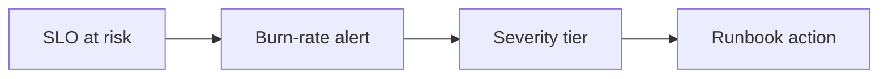

Part 1 defined the SLO and the baseline dashboard. Part 2 is about making that observability actionable under stress. The goal now is not just seeing lag. It is alerting early enough, at the right severity, with a runbook that tells operators what kind of response the signal is asking for.

That is where burn-rate thinking becomes useful.

## Why Burn Rate Fits Better Than Static Thresholds

A single threshold on lag often fails in both directions:

- it pages too late when a fast-moving incident is about to violate the SLO
- it pages too often for harmless backlog that is still draining within the allowed window

Burn-rate style alerting asks a better question:

"At the current rate, how quickly are we consuming the error budget for this Kafka processing SLO?"

That makes the alert more closely tied to service risk instead of raw metric magnitude.

## A More Useful Alert Shape

For example:

~~~text
Alert tiers:
P1: breach imminent
P2: sustained lag growth
P3: localized anomaly
~~~

This is much more useful than one undifferentiated "consumer lag high" page.

The goal is to distinguish:

- imminent customer-facing breach
- sustained degradation that needs action soon
- local anomalies that deserve inspection before they escalate

## Why the Runbook Has to Sit Beside the Alert

An alert without a next step is still incomplete observability.

For each tier, operators should know the first move:

- inspect partition skew
- check rebalance churn
- compare produce rate with consume rate
- decide whether to scale, pause, or investigate one misbehaving consumer

If the page only says "lag high," the team still has to invent a response under pressure.

That last step is the whole point.

## Local Setup

### Prerequisites

- Docker Desktop
- Java 21
- Kafka CLI tools

### Local Stack

~~~yaml
services:
  zookeeper:
    image: confluentinc/cp-zookeeper:7.6.1
    environment:
      ZOOKEEPER_CLIENT_PORT: 2181

  kafka:
    image: confluentinc/cp-kafka:7.6.1
    depends_on: [zookeeper]
    ports: ["9092:9092"]
    environment:
      KAFKA_BROKER_ID: 1
      KAFKA_ZOOKEEPER_CONNECT: zookeeper:2181
      KAFKA_LISTENERS: PLAINTEXT://0.0.0.0:9092
      KAFKA_ADVERTISED_LISTENERS: PLAINTEXT://localhost:9092
      KAFKA_OFFSETS_TOPIC_REPLICATION_FACTOR: 1
~~~

~~~bash
docker compose up -d
~~~

## The Right Drill for Part 2

Inject a synthetic slowdown and see whether the alert arrives early enough to avoid the SLO breach, not just whether an alert arrives at all.

Then review the runbook with the alert in hand and ask:

- is the severity right
- is the first action obvious
- can the operator tell whether this is a hot partition, a fleet-wide slowdown, or a rebalance event

That is how you test whether the observability system is decision-oriented.

> [!important]
> A good Kafka alert tells the operator not only that the service is degrading, but also what kind of degradation is most likely happening.

## Common Mistakes

### Reusing one alert for every lag problem

That collapses very different incidents into the same page and makes triage slower.

### Alerting without action tiers

If every lag event looks like a top-severity outage, the signal will burn trust quickly.

### Forgetting localized failures

A single hot partition or one poisoned consumer can hide under healthy fleet averages until it becomes much harder to recover.

## What This Part Should Leave You With

After Part 2, the team should understand:

1. why burn-rate style thinking is better than static lag thresholds alone
2. how alert severity should map to likely operator actions
3. why dashboards and runbooks need to function as one operating surface

That is how Kafka observability becomes useful during incidents instead of merely descriptive after them.
