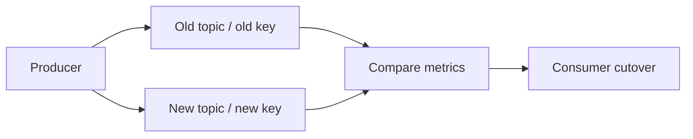

---
categories:
- Java
- Kafka
- Distributed Systems
date: 2026-06-25
seo_title: Kafka Partition Strategy for Ordering and Hotspot Mitigation (Part 3)
seo_description: 'Hands-on guide: Kafka Partition Strategy for Ordering and Hotspot
  Mitigation. Operational migration runbook.'
tags:
- java
- kafka
- distributed-systems
- streaming
- backend
title: Kafka Partition Strategy for Ordering and Hotspot Mitigation (Part 3)
toc: true
toc_icon: cog
toc_label: In This Article
header:
  overlay_image: "/assets/images/java-advanced-generic-banner.svg"
  overlay_filter: 0.35
  show_overlay_excerpt: false
  caption: June Kafka Hands-On Series
---
Part goal: **Turn the new partition strategy into a safe migration runbook**.

---

## Problem 1: Migrate to a New Key Strategy Without Losing Events or Semantics

Problem description:
Changing key strategy in production can improve hotspot behavior, but it can also create gaps, duplicate processing, or confusing ordering semantics during cutover.

What we are solving actually:
We are solving migration safety.
The new strategy is only valuable if we can compare it under real traffic and cut over without corrupting downstream behavior.

What we are doing actually:

1. Dual-write old and new strategies.
2. Compare lag, skew, and ordering signals side by side.
3. Cut consumers over only after the new path is stable.

## Real-World Scenario

A single high-volume tenant overloads one partition, creating lag spikes and delayed processing for that key.

---

## Run It Locally

### Prerequisites

- Docker Desktop
- Java 21
- Kafka CLI tools

### Local Stack

~~~yaml
services:
  zookeeper:
    image: confluentinc/cp-zookeeper:7.6.1
    environment:
      ZOOKEEPER_CLIENT_PORT: 2181

  kafka:
    image: confluentinc/cp-kafka:7.6.1
    depends_on: [zookeeper]
    ports: ["9092:9092"]
    environment:
      KAFKA_BROKER_ID: 1
      KAFKA_ZOOKEEPER_CONNECT: zookeeper:2181
      KAFKA_LISTENERS: PLAINTEXT://0.0.0.0:9092
      KAFKA_ADVERTISED_LISTENERS: PLAINTEXT://localhost:9092
      KAFKA_OFFSETS_TOPIC_REPLICATION_FACTOR: 1
~~~

~~~bash
docker compose up -d
~~~

---

## Lab Steps

1. Dual-write old/new key strategy.
2. Compare ordering/lag metrics.
3. Cut consumers to new topic.
4. Remove old topic after retention window.

---

## Runnable Code Block

~~~text
Metrics to gate cutover:
- max partition lag
- skew ratio (max/avg)
- ordering violation count
~~~

---

## Verify

~~~bash
# snapshot lag before cutover
kafka-consumer-groups --bootstrap-server localhost:9092 --all-groups --describe
~~~

---

## Failure Drill

Force producer restart during dual-write and verify no data gap in either topic.

---

## Debug Steps

Debug steps:

- verify dual-write covers the entire cutover window and not just a sample period
- compare ordering violation counts as well as lag metrics
- keep rollback to the old topic straightforward until the new path is trusted
- remove the old path only after retention and replay needs are satisfied

## Operational Note

Migration plans fail most often when the old path is removed too quickly.
Keeping the rollback path cheap and obvious is part of the design, not an afterthought for the release checklist.

## What You Should Learn

- migration is a measurement problem as much as an implementation problem
- dual-write is useful only when the comparison metrics are explicit
- safe cutover depends on observability, rollback, and patience

---

## Operator Prompt

For kafka partition strategy for ordering and hotspot mitigation (part 3), keep one rollout question in the runbook: what metric tells us the topology is healthy, and what metric tells us to stop or roll back? Kafka systems usually fail operationally before they fail conceptually.

---

## Final Operations Note

One more practical rule helps this series topic stay useful in real systems: always pair the design with one rollback move and one "healthy again" signal. In Kafka, teams often know how to add topology complexity faster than they know how to back out safely, and that gap is exactly where routine changes turn into incidents.
