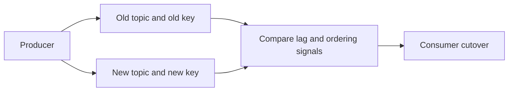

Part 1 measured the hotspot. Part 2 showed where a weaker ordering strategy might be acceptable. Part 3 is the production question: how do you move from one partitioning strategy to another without losing trust in the stream during the cutover.

Changing a keying model is not a small refactor. It changes routing, replay behavior, and sometimes the effective semantics of downstream consumers. That is why the migration has to be treated as an observable rollout, not a one-step switch.

## The Migration Problem Is Bigger Than Throughput

If the new strategy spreads load better but introduces confusing ordering behavior during cutover, the migration can still fail operationally.

A safe cutover has to protect:

- data continuity
- ordering expectations
- rollback clarity
- side-by-side measurement long enough to trust the new path

Dual-write is not the goal. It is the evidence-gathering phase before the real cutover.

## What to Compare Before You Move Consumers

The new topic should earn trust with explicit metrics:

- max partition lag
- skew ratio between busiest and average partitions
- ordering-violation count where relevant
- consumer recovery behavior under restarts or replay

If only the throughput improves but the semantics become harder to defend, you do not yet have a safe migration.

## Why Dual-Write Needs a Clear End Condition

Dual-writing forever is not a strategy. It is extra cost and extra ambiguity.

The migration phase should answer:

- what signals tell us the new strategy is healthy
- what conditions force rollback
- how long the old topic stays available for replay and confidence

That turns the migration from "we think the new key is better" into a controlled operational decision.

## Local Setup

### Prerequisites

- Docker Desktop
- Java 21
- Kafka CLI tools

### Local Stack

~~~yaml
services:
  zookeeper:
    image: confluentinc/cp-zookeeper:7.6.1
    environment:
      ZOOKEEPER_CLIENT_PORT: 2181

  kafka:
    image: confluentinc/cp-kafka:7.6.1
    depends_on: [zookeeper]
    ports: ["9092:9092"]
    environment:
      KAFKA_BROKER_ID: 1
      KAFKA_ZOOKEEPER_CONNECT: zookeeper:2181
      KAFKA_LISTENERS: PLAINTEXT://0.0.0.0:9092
      KAFKA_ADVERTISED_LISTENERS: PLAINTEXT://localhost:9092
      KAFKA_OFFSETS_TOPIC_REPLICATION_FACTOR: 1
~~~

~~~bash
docker compose up -d
~~~

## A Better Runbook Shape

For a safe rollout:

1. dual-write old and new paths
2. compare explicit signals under real traffic
3. cut over one consumer path at a time
4. keep rollback to the old path simple and cheap
5. retire the old topic only after replay and retention needs are satisfied

That sequence is intentionally conservative because key migration touches both performance and correctness.

## Example Cutover Gates

~~~text
Metrics to gate cutover:
- max partition lag within agreed envelope
- skew ratio improved and stable
- no unexpected ordering violation count
- rollback path still available
~~~

The important thing is not the exact numbers here. It is that the team defines them before the cutover starts.

> [!important]
> If rollback to the old partitioning model is hard, the migration is not ready. Safe reversibility is part of the design.

## Common Mistakes

### Treating side-by-side output as proof by itself

Dual-write without comparison metrics only doubles the traffic. It does not prove the new strategy is safe.

### Retiring the old path too quickly

That removes the cheapest rollback and replay safety net before confidence is earned.

### Forgetting downstream semantics

A better key distribution may still break a consumer that quietly depended on stricter order than anyone documented.

## What This Part Should Leave You With

After Part 3, the team should understand:

1. why partition-strategy migration is a controlled rollout problem
2. which metrics have to gate consumer cutover
3. why rollback and retention are part of the migration plan

That is what makes a new key strategy production-worthy: not only better balance, but a safe path to getting there.
