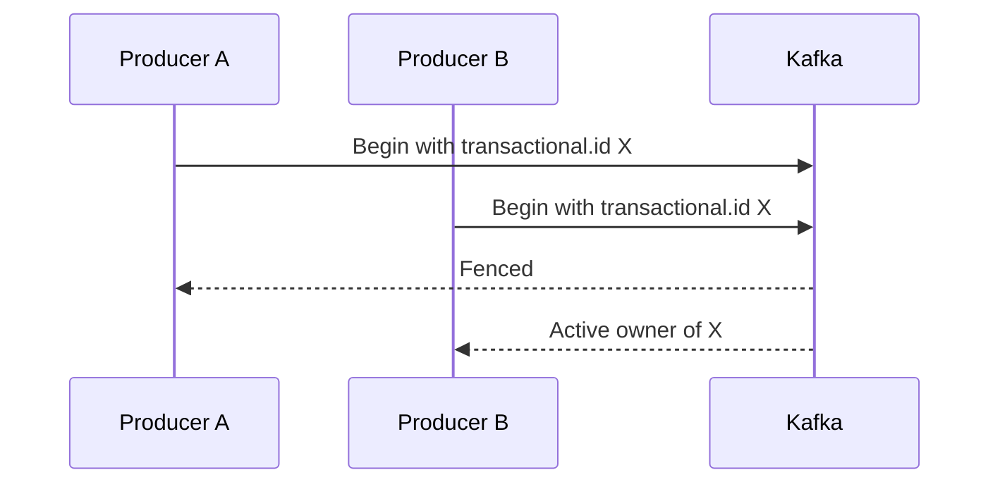

Part 1 covered producer idempotence. Part 2 made Kafka-to-Kafka processing atomic. Part 3 is where teams usually get surprised in production: transactional identity, fencing, and timeout behavior during deploys and failure recovery.

At this stage, the issue is not "did we enable transactions." It is "can we operate them without split-brain producers, zombie instances, or transactions that outlive their safe window."

## Why Fencing Is Not an Error to Silence

Kafka fences producers for a reason. If two live instances try to use the same `transactional.id`, only one of them can remain authoritative.

That is a correctness feature, not operational noise. If the losing producer keeps limping forward after fencing, the application design is wrong.

## The Identity Rule That Matters Most

`transactional.id` should be:

- stable enough to map to a real processor identity
- unique enough to avoid accidental collisions

If it is generated randomly on every restart, transactions lose continuity. If it is shared carelessly across multiple live instances, fencing will happen exactly as it should.

This is why transactional identity usually belongs in deployment design, not only in code.

## Timeout Tuning Is Also a Correctness Decision

A transaction timeout that is too short can abort legitimate work under load.
A timeout that is too long can keep broken or stalled transactions hanging around longer than you want during recovery.

~~~properties
transactional.id=orders-tx-producer-1
transaction.timeout.ms=60000
~~~

The right number should reflect:

- the longest valid transactional work you expect
- how quickly the system should recover from stuck producers
- the rollout and failure behavior of the surrounding platform

## What a Safe Runbook Should Say

By Part 3, the team should be able to answer:

- what happens if a producer is fenced
- whether that condition is fatal or retryable
- how transactional identity is assigned during rollout
- what timeout means operationally in the current system

If those answers are not documented, transactions are still only half-adopted.

## Local Setup

### Prerequisites

- Docker Desktop
- Java 21
- Kafka CLI tools

### Local Stack

~~~yaml
services:
  zookeeper:
    image: confluentinc/cp-zookeeper:7.6.1
    environment:
      ZOOKEEPER_CLIENT_PORT: 2181

  kafka:
    image: confluentinc/cp-kafka:7.6.1
    depends_on: [zookeeper]
    ports: ["9092:9092"]
    environment:
      KAFKA_BROKER_ID: 1
      KAFKA_ZOOKEEPER_CONNECT: zookeeper:2181
      KAFKA_LISTENERS: PLAINTEXT://0.0.0.0:9092
      KAFKA_ADVERTISED_LISTENERS: PLAINTEXT://localhost:9092
      KAFKA_OFFSETS_TOPIC_REPLICATION_FACTOR: 1
~~~

~~~bash
docker compose up -d
~~~

## The Right Failure Drill

Start two instances with the same `transactional.id` and verify the older or losing instance is fenced and exits the transaction path decisively.

That test is useful because it makes the ownership model concrete. It is also a good rehearsal for rollout mistakes, which are where many real fencing incidents begin.

> [!important]
> A fenced producer should be treated as no longer authoritative. Retrying blindly under the same assumption usually makes the recovery story worse, not better.

## Common Mistakes

### Treating fencing as transient warning noise

If the producer was fenced, something about ownership is wrong. That deserves operational attention.

### Setting timeouts with no reference to real workloads

Timeouts copied from examples are not a reliability strategy.

### Ignoring deployment overlap

Slow shutdown plus fast startup can create exactly the sort of overlapping ownership that transactional fencing is designed to catch.

## What This Part Should Leave You With

After Part 3, the team should understand:

1. why fencing is a correctness mechanism
2. how transactional identity should map to real instance ownership
3. why transaction timeout tuning belongs in the operational model, not only the producer config

That is what turns transactional Kafka from a feature flag into something a production team can actually run safely.
