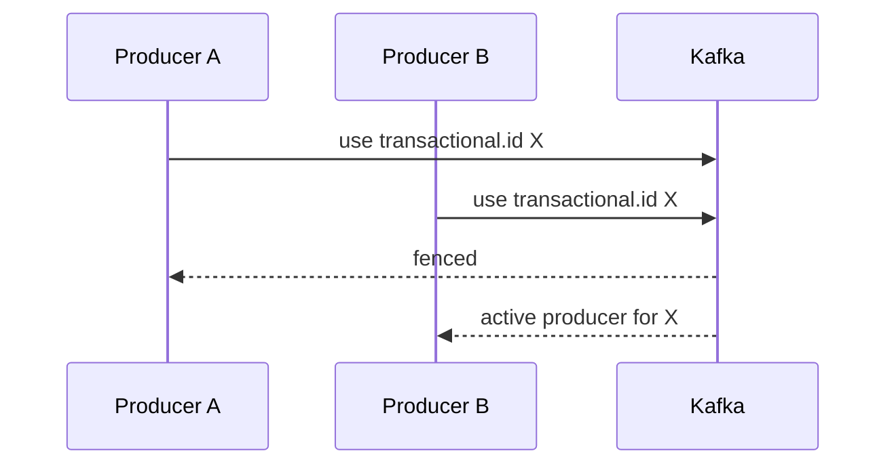

---
categories:
- Java
- Kafka
- Distributed Systems
date: 2026-06-26
seo_title: Idempotent Producers and Kafka Transactions in Practice (Part 3)
seo_description: 'Hands-on guide: Idempotent Producers and Kafka Transactions in Practice.
  Fencing and timeout operations.'
tags:
- java
- kafka
- distributed-systems
- streaming
- backend
title: Idempotent Producers and Kafka Transactions in Practice (Part 3)
toc: true
toc_icon: cog
toc_label: In This Article
header:
  overlay_image: "/assets/images/java-advanced-generic-banner.svg"
  overlay_filter: 0.35
  show_overlay_excerpt: false
  caption: June Kafka Hands-On Series
---
Part goal: **Operate transactional producers safely with fencing and timeout discipline**.

---

## Problem 1: Prevent Split-Brain Producers and Stuck Transactions

Problem description:
Transactional producers rely on stable identity.
If two live instances share the same `transactional.id`, Kafka must fence the old one to preserve correctness.

What we are solving actually:
We are solving operational safety of transactional producers.
The hard part is not enabling transactions; it is handling fencing, timeouts, and instance identity correctly during deployment and recovery.

What we are doing actually:

1. Assign stable `transactional.id` values intentionally.
2. Treat fencing as fatal for the losing producer.
3. Tune transaction timeouts to match the real SLA and failure model.

## Real-World Scenario

Network retries during peak load can duplicate records unless producer semantics are configured correctly.

---

## Run It Locally

### Prerequisites

- Docker Desktop
- Java 21
- Kafka CLI tools

### Local Stack

~~~yaml
services:
  zookeeper:
    image: confluentinc/cp-zookeeper:7.6.1
    environment:
      ZOOKEEPER_CLIENT_PORT: 2181

  kafka:
    image: confluentinc/cp-kafka:7.6.1
    depends_on: [zookeeper]
    ports: ["9092:9092"]
    environment:
      KAFKA_BROKER_ID: 1
      KAFKA_ZOOKEEPER_CONNECT: zookeeper:2181
      KAFKA_LISTENERS: PLAINTEXT://0.0.0.0:9092
      KAFKA_ADVERTISED_LISTENERS: PLAINTEXT://localhost:9092
      KAFKA_OFFSETS_TOPIC_REPLICATION_FACTOR: 1
~~~

~~~bash
docker compose up -d
~~~

---

## Lab Steps

1. Configure stable `transactional.id`.
2. Handle fenced producer as fatal.
3. Tune transaction timeout by SLA.

---

## Runnable Code Block

~~~properties
transactional.id=orders-tx-producer-1
transaction.timeout.ms=60000
~~~

---

## Verify

~~~bash
# observe abort/commit metrics from producer app logs and monitoring
~~~

---

## Failure Drill

Start two instances with same transactional.id; verify older producer gets fenced.

---

## Debug Steps

Debug steps:

- monitor fenced-producer exceptions as correctness signals, not transient warnings
- make transactional ids stable enough to identify ownership but unique enough to avoid accidental collisions
- align `transaction.timeout.ms` with the longest legitimate transaction path
- rehearse restart scenarios where one instance is slow to shut down and another starts early

## Operational Note

Most fencing incidents trace back to deployment or identity-management mistakes rather than Kafka itself.
That is why runbook quality matters almost as much as the producer code.

A small amount of deployment discipline usually removes a surprising amount of transactional instability.

## What You Should Learn

- fencing is a correctness feature, not a nuisance
- transactional producer identity must be designed, not improvised
- timeout tuning should reflect real processing behavior and rollout practices

---

        ## Production Checklist

        Verify both broker configuration and consumer isolation level. Transactional semantics are easy to misread when downstream readers still use default isolation.

        ## Incident Drill

        Restart the processor with the wrong transactional identity and inspect the resulting fencing or duplicate risk. That is the boundary operators have to understand before incident day.

        ## Extra Debug Cues

        - keep the transactional ID stable for one processor identity
- check fencing events during rolling deploys
- verify all downstream validation reads use `read_committed`

---

## Operator Prompt

For idempotent producers and kafka transactions in practice (part 3), keep one rollout question in the runbook: what metric tells us the topology is healthy, and what metric tells us to stop or roll back? Kafka systems usually fail operationally before they fail conceptually.
