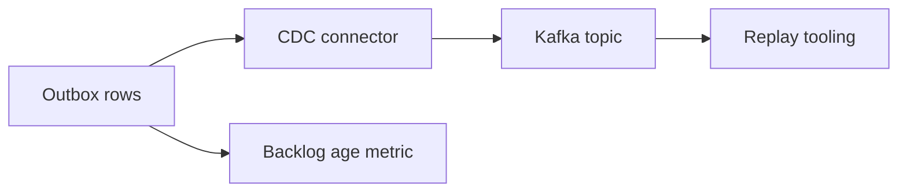

Part goal: **Operate outbox plus CDC with backlog governance and replay discipline**.

---

## Problem 1: Keep Outbox Publishing Healthy After Day One

Problem description:
Even a correct outbox design can fail operationally if backlog ages grow, connectors stall silently, or replay procedures are improvised during incidents.

What we are solving actually:
We are solving operational governance of the pattern.
The pattern is only production-ready when teams can observe backlog health, replay safely, and retire old outbox rows without losing traceability.

What we are doing actually:

1. Monitor outbox backlog and connector lag continuously.
2. Define replay workflows by event id or time range.
3. Archive or purge outbox rows with a deliberate retention policy.

## Real-World Scenario

An order write succeeds, but app crashes before publish; outbox+CDC is needed to close this dual-write gap.

---

## Run It Locally

### Prerequisites

- Docker Desktop
- Java 21
- Kafka CLI tools

### Local Stack

~~~yaml
services:
  zookeeper:
    image: confluentinc/cp-zookeeper:7.6.1
    environment:
      ZOOKEEPER_CLIENT_PORT: 2181

  kafka:
    image: confluentinc/cp-kafka:7.6.1
    depends_on: [zookeeper]
    ports: ["9092:9092"]
    environment:
      KAFKA_BROKER_ID: 1
      KAFKA_ZOOKEEPER_CONNECT: zookeeper:2181
      KAFKA_LISTENERS: PLAINTEXT://0.0.0.0:9092
      KAFKA_ADVERTISED_LISTENERS: PLAINTEXT://localhost:9092
      KAFKA_OFFSETS_TOPIC_REPLICATION_FACTOR: 1
~~~

~~~bash
docker compose up -d
~~~

---

## Lab Steps

1. Monitor outbox oldest-row age.
2. Alert on connector lag/restarts.
3. Build replay script by event_id range.
4. Archive sent outbox rows by retention policy.

---

## Runnable Code Block

~~~bash
# backlog health query
psql -c "select count(*) pending, max(now()-created_at) oldest_age from outbox_event;"
~~~

---

## Verify

~~~bash
# replay filtered events (example)
kafka-console-consumer --bootstrap-server localhost:9092 --topic orders.event.OrderCreated --from-beginning | grep evt- | head
~~~

---

## Failure Drill

Pause connector for 10 minutes, build backlog, resume, and measure drain time + consumer correctness.

---

## Debug Steps

Debug steps:

- alert on oldest outbox-row age, not just total row count
- test connector pause and recovery so drain-time behavior is known in advance
- keep replay targeted by event id or safe filters instead of replaying everything blindly
- tie retention policy to audit and recovery requirements before purging rows

## Operational Note

Replay safety depends on restraint as much as tooling.
The ability to replay everything is powerful, but the ability to replay only the right slice is what protects downstream systems during real incidents.

## What You Should Learn

- outbox success depends on backlog observability and replay procedures, not just design purity
- connector lag and oldest-row age are core operating metrics
- retention and replay policy should be defined before the first real incident

---

## Operator Prompt

For outbox plus cdc with debezium for reliable event publishing (part 3), keep one rollout question in the runbook: what metric tells us the topology is healthy, and what metric tells us to stop or roll back? Kafka systems usually fail operationally before they fail conceptually.

---

## Final Operations Note

One more practical rule helps this series topic stay useful in real systems: always pair the design with one rollback move and one "healthy again" signal. In Kafka, teams often know how to add topology complexity faster than they know how to back out safely, and that gap is exactly where routine changes turn into incidents.
