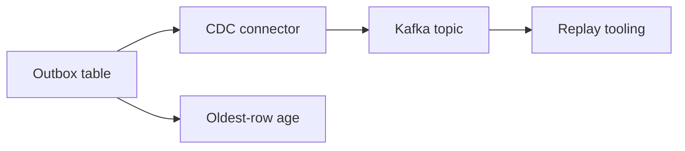

---
categories:
- Java
- Kafka
- Distributed Systems
date: 2026-06-27
seo_title: Outbox Plus CDC with Debezium for Reliable Event Publishing (Part 3)
seo_description: 'Hands-on guide: Outbox Plus CDC with Debezium for Reliable Event
  Publishing. Operational governance and replay.'
tags:
- java
- kafka
- distributed-systems
- streaming
- backend
title: Outbox Plus CDC with Debezium for Reliable Event Publishing (Part 3)
toc: true
toc_icon: cog
toc_label: In This Article
header:
  overlay_image: "/assets/images/java-advanced-generic-banner.svg"
  overlay_filter: 0.35
  show_overlay_excerpt: false
  caption: June Kafka Hands-On Series
---
Part 1 made outbox reliable. Part 2 made the emitted event contract more usable. Part 3 is about living with the pattern after launch: backlog growth, connector lag, replay discipline, and the retention decisions that quietly determine whether the pattern stays healthy or becomes a source of operational drag.

An outbox design is not finished when the first event reaches Kafka. It is finished when the team knows how to observe it, replay it, and clean it up safely.

## The Core Operating Signals

For day-two operations, a few metrics matter much more than people expect:

- oldest outbox-row age
- connector lag or stall behavior
- replay volume and replay outcome
- outbox table growth relative to retention policy

Oldest-row age is especially useful because a row count alone can be misleading. A large table may still be healthy if rows are moving quickly. A small table with very old rows is often a more urgent sign of trouble.

## Why Replay Needs Restraint

The ability to replay everything is not the same as having a good replay model.

Safer replay usually means:

- replay by event id, time window, or explicit filter
- verify consumer idempotency before replay
- observe downstream impact during the replay itself

That is how replay stays a repair tool instead of becoming a second incident.

## Retention Is Part of the Design

The outbox cannot grow forever. At some point, rows need to be archived or purged.

That decision has to balance:

- audit needs
- replay needs
- operational storage cost
- the time window in which delayed publication or recovery is still plausible

If retention is ignored until the table is huge, the cleanup becomes riskier and more political than it needed to be.

## Local Setup

### Prerequisites

- Docker Desktop
- Java 21
- Kafka CLI tools

### Local Stack

~~~yaml
services:
  zookeeper:
    image: confluentinc/cp-zookeeper:7.6.1
    environment:
      ZOOKEEPER_CLIENT_PORT: 2181

  kafka:
    image: confluentinc/cp-kafka:7.6.1
    depends_on: [zookeeper]
    ports: ["9092:9092"]
    environment:
      KAFKA_BROKER_ID: 1
      KAFKA_ZOOKEEPER_CONNECT: zookeeper:2181
      KAFKA_LISTENERS: PLAINTEXT://0.0.0.0:9092
      KAFKA_ADVERTISED_LISTENERS: PLAINTEXT://localhost:9092
      KAFKA_OFFSETS_TOPIC_REPLICATION_FACTOR: 1
~~~

~~~bash
docker compose up -d
~~~

## A Useful Health Query

~~~bash
psql -c "select count(*) pending, max(now()-created_at) oldest_age from outbox_event;"
~~~

That query is not the whole observability story, but it is a good operational baseline because it shows both backlog size and backlog age.

## The Right Failure Drill

Pause the connector for a fixed period, let backlog accumulate, then resume and measure:

- how quickly the backlog drains
- whether downstream consumers remain correct during catch-up
- whether replay and retention rules still make sense under stress

This is the kind of drill that turns "we use outbox" into "we know how it behaves when the connector stops working."

> [!important]
> Outbox health is not only about publish success. It is about how long committed truth can remain unpublished before the system's promises start to weaken.

## Common Mistakes

### Alerting on row count but not row age

That misses the difference between healthy throughput and silent stalling.

### Treating replay as an emergency-only improvised step

If replay has never been rehearsed, the first real incident will be slower and riskier than it should be.

### Purging rows before recovery needs are understood

That saves storage right up until the day a replay is actually needed.

## What This Part Should Leave You With

After Part 3, the team should understand:

1. which signals prove the outbox path is healthy after launch
2. why replay needs filtering and discipline
3. how retention policy affects the pattern's long-term operability

That is what turns outbox plus CDC from a clever implementation into a durable operating model.
