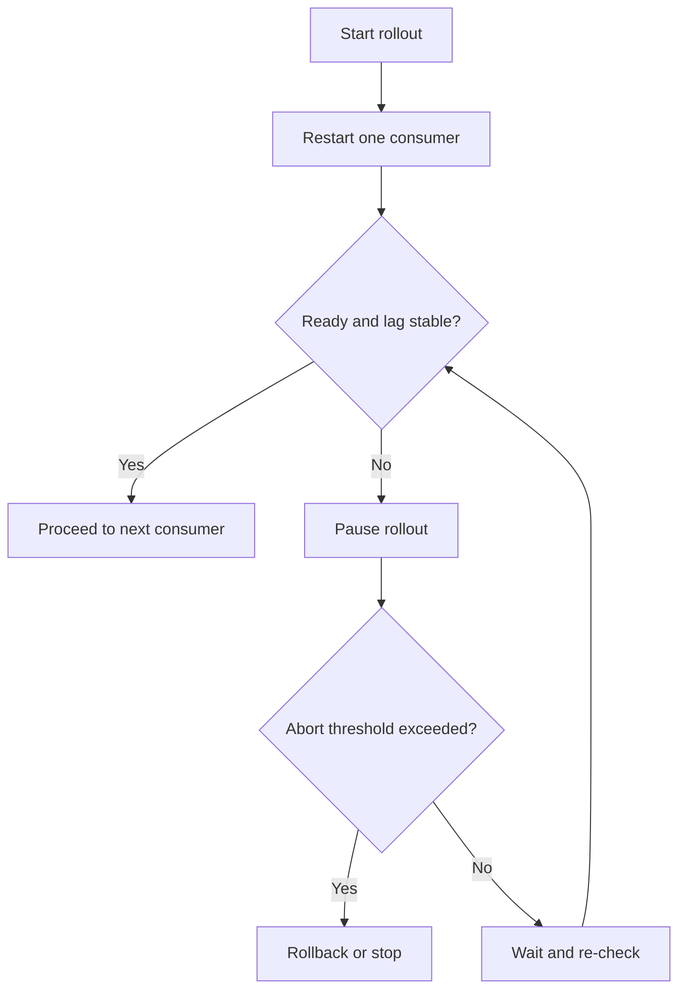

Part 1 measured eager rebalance pain. Part 2 reduced disruption with cooperative assignment and static membership. Part 3 is where that tuning becomes operationally real: rollout sequencing, lag gates, readiness discipline, and abort conditions that prevent a deployment from turning into group churn.

This is where zero-downtime claims either become believable or collapse under deployment habits.

## Why Tuning Alone Is Not Enough

You can choose the right assignor and still cause trouble if production rollouts:

- restart too many consumers at once
- begin while lag is already elevated
- rely on shallow readiness checks
- overlap with autoscaling or other membership churn

That is why deployment discipline is part of rebalance design, not an afterthought.

The rollout loop is simple on purpose. Operators need something they can trust under pressure.

## The Guardrails That Matter Most

Before rollout:

- lag should be near normal baseline
- no consumer should already be unhealthy
- autoscaling or other concurrent group changes should be paused if possible
- readiness should mean "able to poll and process safely," not only "process started"

During rollout:

- move one instance at a time
- wait for readiness and lag stabilization
- compare rebalance duration and lag slope with the known baseline

These are not ceremonial checks. They are the difference between controlled change and unnecessary churn.

## Example Abort Conditions

~~~text
Rollback trigger example:
- rebalance duration exceeds safe threshold repeatedly
- lag growth slope stays above agreed limit
- restarted consumer fails readiness in the allowed window
- partition movement exceeds expected envelope
~~~

The exact values should come from the earlier measurements in this series, not from copied generic numbers.

## Local Setup

### Prerequisites

- Docker Desktop
- Java 21
- Kafka CLI tools

### Local Stack

~~~yaml
services:
  zookeeper:
    image: confluentinc/cp-zookeeper:7.6.1
    environment:
      ZOOKEEPER_CLIENT_PORT: 2181

  kafka:
    image: confluentinc/cp-kafka:7.6.1
    depends_on: [zookeeper]
    ports: ["9092:9092"]
    environment:
      KAFKA_BROKER_ID: 1
      KAFKA_ZOOKEEPER_CONNECT: zookeeper:2181
      KAFKA_LISTENERS: PLAINTEXT://0.0.0.0:9092
      KAFKA_ADVERTISED_LISTENERS: PLAINTEXT://localhost:9092
      KAFKA_OFFSETS_TOPIC_REPLICATION_FACTOR: 1
~~~

~~~bash
docker compose up -d
~~~

## The Right Drill for Part 3

Simulate a slow-starting consumer during rollout and verify that the deployment gate pauses progression instead of continuing optimistically.

Then repeat with background lag already elevated before the rollout begins.

Those drills are more valuable than a clean happy-path restart because they test whether the guardrails can actually stop a bad deployment in time.

> [!important]
> A consumer that becomes "ready" before it is truly participating in stable consumption can make the whole rollout look healthier than it really is.

## Common Mistakes

### Equating process readiness with consumer readiness

If the instance has started but is not polling reliably yet, the deployment signal is still premature.

### Letting autoscaling and rollout happen together

That mixes two sources of group churn and makes behavior harder to interpret.

### Using thresholds with no baseline context

An abort rule is only useful if it reflects what normal stabilization actually looks like in your environment.

## What This Part Should Leave You With

After Part 3, the team should understand:

1. why deployment sequencing is part of rebalance safety
2. which gates should control rollout progression
3. how to define an abort path that is grounded in real baseline behavior

That is what turns rebalance tuning into a runbook a production team can use confidently.
